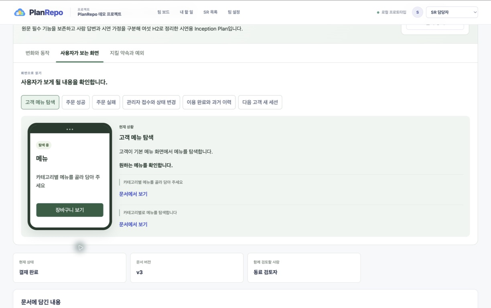

# PlanRepo

요구사항 초안을 AI와 다듬고, 문서와 시각화를 함께 검토해 승인하는 Inception Plan 프로토타입입니다.

## 테이블오더 1분 시연

아래 미리보기나 **영상 재생**을 누르면 재생 화면이 열립니다. 완성 문서, 업무 흐름, 화면 시각화와 최종 승인 결과를 60초로 담았습니다.

**[▶ 영상 재생](https://cdn.jsdelivr.net/gh/maruachi/planrepo-ddthon@5f9b7535ce9d2345892f9c7debe2ff096aa32dbd/aidlc-docs/examples/table-order/table-order-demo-60s-results.mp4)** · [MP4 원본](aidlc-docs/examples/table-order/table-order-demo-60s-results.mp4)

영상 파일은 `aidlc-docs/examples/table-order/table-order-demo-60s-results.mp4`입니다. 재생 링크는 이 저장소의 영상을 jsDelivr로 제공합니다.

프로젝트 설명과 실행 안내는 `aidlc-docs/README.md`에서 확인합니다. 시연 과정과 검증 결과는 `aidlc-docs/examples/table-order/README.md`에 있습니다.
