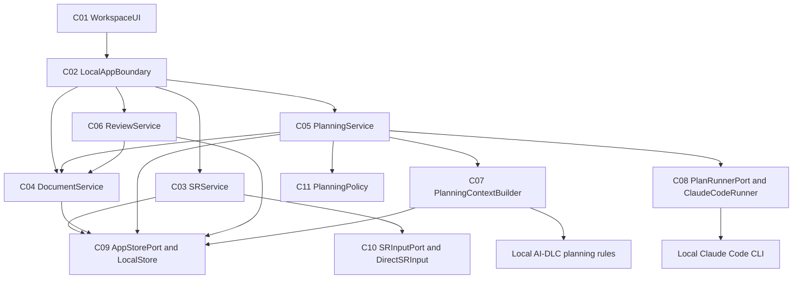
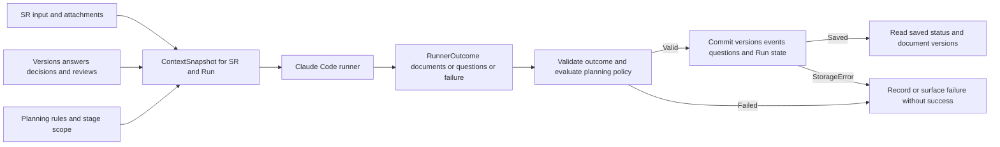

# PlanRepo 애플리케이션 설계 통합본

상태: 필수 설계 문서 생성·일관성 검증 및 Q1 A 승인 완료. 실제 코드 구현·CLI 실행·런타임 검증은 아직 수행하지 않았다.

근거: [승인된 요구사항](../requirements/requirements.md), [승인된 스토리](../user-stories/stories.md), [페르소나](../user-stories/personas.md), [승인된 실행 계획](../plans/execution-plan.md), [설계 작업 계획](../plans/application-design-plan.md).

## 설계 결정 요약

브라우저와 하나의 로컬 서버로 앱을 구성하고 SR·문서·계획·리뷰를 서버 내부 서비스로 나눈다. Git에 독립적인 저장소, 실제 Claude Code CLI 실행, 직접/향후 외부 SR 입력을 각각 인터페이스 경계로 둔다. 이는 배포 서비스를 늘리지 않는 로컬 MVP 설계다.

문서 버전은 과거 본문을 보존하고 결정·수정 요청은 본문 변화 없는 사건으로도 기록한다. 리뷰는 특정 버전을 고정 참조하며 다음 계획 진행을 막거나 AI-DLC 자체 승인을 대신하지 않는다. 생성 요청은 실행 ID를 반환하고, UI는 저장된 실행 상태를 다시 읽는다. CLI 결과는 문서 또는 질문으로 검증·저장한 뒤 정상 결과로 표시한다. 제품의 실행은 코드 구현 직전 계획에서 끝난다.

이 문서는 아래 네 상세 문서의 현재 내용을 통합했다. 각 상세 문서를 수정할 때 관련 부분과 본 통합본을 함께 갱신한다.

| 문서 | 내용 |
|---|---|
| [components.md](components.md) | 11개 논리 컴포넌트, 책임·데이터 소유·UI 경계 |
| [component-methods.md](component-methods.md) | 언어 독립 메서드·타입·오류와 참조 계약 |
| [services.md](services.md) | 생성·실패·결정·편집·복원·리뷰·완료의 서비스 흐름 |
| [component-dependency.md](component-dependency.md) | 의존성 행렬·통신 방식·호출도·데이터 흐름 |

## 요구사항과 스토리 추적

| 요구사항 | 스토리 | 주요 책임과 검증할 설계 |
|---|---|---|
| FR-01 | US-01, US-02, US-06 | C01/C02/C03/C09/C10; 필수 입력·선택 첨부·SR 보관·보드/상세 |
| FR-02 | US-02, US-11 | C01/C03/C05/C06/C11; 고정 6열, WorkflowState 하나의 원본, 회차·리뷰 분리 |
| FR-03 | US-03, US-04 | C05/C07/C08/C09; 실제 CLI, 문맥·범위·성공/실패·저장 확인 |
| FR-04 | US-03, US-05, US-13 | C05/C07/C11; 질문·응답·결정과 자체 승인, 코드 구현 전 종료 |
| FR-05 | US-01, US-03, US-06, US-07, US-08, US-10 | C03/C04/C05/C09; Git 독립 영속 저장·재열람 |
| FR-06 | US-03, US-05, US-06, US-07, US-08, US-09, US-10, US-11, US-12 | C04/C05/C06/C09; 새 버전, 본문 불변 사건, 비교·복원, 버전 대상 참조 |
| FR-07 | US-11, US-12 | C01/C06/C04/C09 및 C11 비차단 판단; 역할 전환·대상 버전 리뷰 |
| FR-08 | US-13, US-14 | C05.completePlanning, C11 판단, C03.markImplemented; 수동 외부 구현 상태 |
| FR-09 | US-01 및 입력 경계 제약 | C10/C03; 공통 SRDraft, Jira 없이 직접 입력 |
| NFR-01 | US-01–US-14 | 단일 로컬 서버·세 작업 단위, 실제 생성·비교·복원 유지 |
| NFR-02 | US-01, US-03, US-06, US-11, US-12 | C01/C02/C08/C09; 로그인 없는 macOS 로컬 앱·기존 CLI 인증 |
| NFR-03 | US-01–US-14 | C01/C02/C05; 키보드 조작, 입력 오류·실행 상태 표시 |
| NFR-04 | US-01, US-03, US-05–US-12 | C04/C05/C06/C09; 과거 버전·사건 보존과 일관된 저장 |
| NFR-05 | 통합 시나리오와 US-04 | 7개 서비스 흐름을 연결한 핵심 경로 1개 및 CLI 실패 확인 |
| NFR-06 | US-01, US-03 및 코드 검토 제약 | C08/C10 포트와 어댑터로 실행·입력을 SR/문서 책임에서 분리 |

추적표는 전체 FR 9개·NFR 6개와 US-01–US-14를 포함한다. P-01 작성자는 생성·문서·계획·리뷰 요청·수동 완료를 수행하고 P-02 리뷰어는 원래 대상 버전 열람·비교·검토 결과를 수행한다. 실제 계정이나 권한 체계를 추가하지 않는다.

## 후속 단계로 넘기는 구체화 항목

| 항목 | 담당 단계·잠정 단위 | 완료 전에 정할 내용 |
|---|---|---|
| 컴포넌트·스토리의 작업 단위 배정 | Units Generation | U1 저장/문서, U2 계획/CLI, U3 리뷰/완료의 최종 책임과 공유 UI·전송 계약 |
| 저장 모델과 변경 일관성 | U1 Functional Design, NFR Requirements/Design | 정확한 스키마·참조·최신 버전 처리·commit 구현과 저장 위치 |
| 언어·프레임워크·실행 설정 | U1 NFR Requirements | 로컬 서버·UI·저장 기술 선택. 이후 단위는 재사용 |
| stage·회차·승인·종료 정책 | U2 Functional Design | 고정 열과 하위 stage 매핑, 반복 회차 시작/증가 시점, 승인 대상 묶음·질문 응답 조건, 구현 대기 진입 |
| CLI 문맥·실행·출력 계약 | U2 Functional Design, NFR Requirements/Design | SR/Run별 실행 공간, 입력 전달·정규화 결과 스키마, 실제 CLI 옵션·허용 기능·중단/오류 처리 |
| 생성 중 편집과 이전 버전 결정 | U1/U2 Functional Design | 실행 입력 버전 보관, 새 버전 최신 반영 정책, 오래된 결정의 적용 범위. 무조건 덮어쓰기 금지 |
| 리뷰 상태와 결과 형식 | U3 Functional Design | 대상 버전 1개 기준의 상태·코멘트, 새 버전과 원래 리뷰 대상 표시 |
| 키보드·화면 배치·전송 스키마 | 각 단위 Functional/NFR Design 및 코드 계획 | 필수 입력과 문서/비교/진행/리뷰 조작, 오류 메시지와 조회·명령 계약 |
| 구현 증거 | Code Generation 및 Build and Test | 실제 CLI 성공·실패, 저장·복원·본문 불변 사건·비차단 리뷰와 전체 핵심 흐름 1개 |

위 항목은 이 단계에서 요구한 고수준 경계를 구현 설계로 발전시키는 작업이다. 미해결 제품 범위 질문은 없으며 CLI 설치·인증·실행 가능 여부는 구현에서 확인해야 하는 환경 사실이다.

## 문서 수준 검증 결과

컴포넌트 ID와 메서드의 대응, 서비스 호출과 의존성 행렬·호출도의 일치 및 순환 부재를 확인했다. Runner가 저장소를 직접 변경하지 않고, 리뷰가 진행 정책을 변경하지 않으며, 문서 준비와 실행 결과가 같은 저장 단위로 연결되는지 검토했다. Markdown 표·코드 블록·로컬 링크와 두 Mermaid 다이어그램의 제한된 문법 구조를 검증하고 텍스트 대안을 제공했다. 브라우저 렌더링이나 런타임 테스트 통과를 주장하지 않는다.

## 확장 준수 평가

| 확장 | Enabled | 평가 | 사유 |
|---|---|---|---|
| Security Baseline | No | N/A | Q11 B로 비활성화; 전체 규칙 로드·적용 생략 |
| Resiliency Baseline | No | N/A | Q12 B로 비활성화; 전체 규칙 로드·적용 생략 |
| Property-Based Testing | No | N/A | Q13 C로 비활성화; 전체 규칙 로드·적용 생략 |

활성 확장 규칙이나 확장 차단 항목은 없다. 승인된 제품 NFR은 적용하며 운영 보안·복원력 검증 완료로 해석하지 않는다.

## 산출물 검토

[설계 검토 질문](application-design-approval-questions.md)의 Q1 A 승인을 확인했다. Units Generation으로 진행하며 분해 계획은 별도로 검토한다.

## 상세 설계 통합

### 컴포넌트와 책임

상태: 설계 산출물 Q1 A 승인 완료.

근거: [요구사항](../requirements/requirements.md), [스토리](../user-stories/stories.md), [승인된 실행 계획](../plans/execution-plan.md).

#### 구조 결정

브라우저 UI와 하나의 로컬 애플리케이션 서버로 구성한다. 서버 내부의 논리 모듈로 SR·문서·계획·리뷰 기능을 나누며, 각 컴포넌트는 별도 프로세스나 배포 서비스가 아니다. 로컬 서버가 실제 Claude Code CLI 프로세스를 호출하고 자체 저장소를 사용한다. 언어·프레임워크·DB 제품·통신 라이브러리는 이후 NFR Requirements에서 선택한다.

| ID | 컴포넌트 | 책임 | 제공 인터페이스 및 소유 영역 |
|---|---|---|---|
| C01 | WorkspaceUI | 6열 칸반, SR 상세, 문서·질문·결정·이력·비교·리뷰 화면, 역할 전환, 생성 상태 표시 및 키보드 조작 | 화면·입력 상태. C02의 조회·명령 사용; 저장된 사실의 원본은 서버 |
| C02 | LocalAppBoundary | UI 요청을 서비스 조회·명령으로 변환하고 결과·오류를 응답 | 전송 계약 및 입력 형태 검증. URL·직렬화 방식은 후속 설계 |
| C03 | SRService | 직접 SR 생성, 보드·상세 조회, 구현 완료의 수동 선언 | SR 초기 입력과 외부 구현 완료 행위. 계획 단계 전이의 소유자는 C05 |
| C04 | DocumentService | 문서·버전 열람, 편집·비교·복원, 이력 조회 및 AI 생성 결과의 문서 변경 준비 | 문서와 버전의 의미. 변경 시 과거 버전을 보존하고 관련 사건 연결 |
| C05 | PlanningService | 다음 계획 진행, 실행 문맥·상태·결과 저장, 질문 응답·승인·수정 요청 및 구현 대기 전환 조율 | WorkflowState, Run, QuestionSet, Answer, PlanningDecision; 실제 실행은 C08 |
| C06 | ReviewService | 특정 문서 버전의 리뷰 요청·열람·결과 기록 | Review와 대상 VersionRef. 카드의 계획 단계나 AI-DLC 승인을 변경하지 않음 |
| C07 | PlanningContextBuilder | 현재 SR 입력·첨부·문서·응답·결정·관련 리뷰와 AI-DLC 규칙으로 실행 문맥 구성 | 읽기 전용 ContextSnapshot 및 SR/실행별 참조. 계획용 규칙 선택·범위 제한 지침 포함 |
| C08 | PlanRunnerPort / ClaudeCodeRunner | 계획 실행 추상 계약과 실제 로컬 Claude Code CLI 어댑터 | ContextSnapshot → RunnerOutcome. 실행 상태·오류·문서/질문 결과 반환; 앱 저장소 직접 변경 금지 |
| C09 | AppStorePort / LocalStore | SR·문서·버전·사건·진행·실행·리뷰의 Git 독립 영속 저장 | ReadQuery와 ChangeSet. 여러 관련 레코드의 일관된 저장 단위 제공 |
| C10 | SRInputPort / DirectSRInput | 직접 입력을 공통 SR 입력 계약으로 정규화하고 향후 외부 입력 경계를 제공 | SRDraft. Jira 연결은 인터페이스만 고려하며 실제 Jira 어댑터·인증·네트워크 호출 없음 |
| C11 | PlanningPolicy | 제품이 허용하는 계획 단계·다음 행동·승인 조건·완료 지점을 판단 | 부작용 없는 진행 판단 및 규칙 참조 목록. 정확한 상태 전이와 회차 계산은 Functional Design |

각 Port와 어댑터는 하나의 책임 경계로 센다. 이 표의 11개 컴포넌트는 논리 책임이며 11개 패키지나 배포 단위를 요구하지 않는다. 기능별 서비스 내부에 간단한 함수·모듈로 구현할 수 있다.

#### 데이터 소유와 연결

| 개념 | 의미·연결 | 변경 소유자 |
|---|---|---|
| SR | 제목·요구 설명·선택적 마크다운 및 source 정보 | C03 |
| Document / DocumentVersion | SR에 속하는 문서와 보존되는 본문 스냅샷. 최신 포인터와 과거 버전 식별자를 구분 | C04; C05는 C04가 준비한 AI 결과를 같은 저장 단위에 포함 |
| HistoryEvent | AI 생성·진행, 편집, 복원, 응답, 결정·수정 요청, 리뷰, 수동 완료의 종류·내용·대상 기록 | 행위를 수행하는 서비스; 영속 저장은 C09 |
| WorkflowState / Run | 제품 칸반 단계·하위 stage·반복 회차 및 개별 CLI 실행 상태 | C05, 판단은 C11 |
| QuestionSet / Answer | 생성 단계·실행에 속하는 질문과 사용자의 응답. 문서가 있는 경우 버전도 연결 | C05 |
| PlanningDecision | 문서 버전과 stage 실행을 대상으로 한 승인·수정 요청. 본문 변화 없이도 사건 기록 | C05 |
| Review | 요청한 문서 버전을 고정 참조하는 검토와 결과. 이후 버전의 승인으로 확장하지 않음 | C06 |
| RoleSelection | 같은 로컬 사용자의 작성자/리뷰어 시연 역할 | C01. 계정·권한이나 실제 사람 신원으로 사용하지 않음 |

VersionRef는 srId·documentId·versionId를 함께 의미한다. 모든 대상 조회·변경은 소속 SR과 문서를 확인한다. 한 리뷰는 한 VersionRef를 대상으로 한다. 여러 문서를 검토할 때는 문서별 요청으로 표현하는 MVP 설계안이며 UI에서 묶는 방식은 후속 설계에서 정한다.

이력은 문서 본문과 분리한 사건으로도 저장한다. 승인처럼 본문이 바뀌지 않는 행동 때문에 가짜 본문 변경을 만들 필요가 없으며, 사용자는 관련 버전과 결정 사건을 함께 확인한다. 복원은 선택한 과거 본문으로 새 버전을 만들고 복원 원본을 참조한다.

#### 사용자 화면의 책임

보드는 SR 목록·요구사항 분석·Inception·Construction·구현 대기·구현 완료를 고정 열로 보여준다. 상세 화면에서 문서, 질문/결정, 이력/비교/복원, 리뷰를 다룬다. 리뷰 정보와 실행 정보는 카드의 계획 위치와 별도로 표시한다. 드래그만으로 필수 상태 변경을 수행하게 하지 않고 버튼과 키보드 경로를 제공한다.

생성 결과를 성공으로 표시하는 근거는 C05가 결과 검증과 C09 저장을 마친 상태이다. 질문만 생성한 정상 실행도 가능하며, 질문 응답 대기는 계획 단계 완료와 다르다. 정확한 화면 배치와 상태명은 후속 설계에서 정한다.

#### 포함하지 않는 책임

PlanRepo 안에서 코드 구현·빌드·커밋·PR을 실행하는 컴포넌트, 실제 Jira 클라이언트, 다중 사용자 인증 서비스, 운영 클라우드 자원을 추가하지 않는다. CLI는 계획 문서 생성에만 사용한다. 프롬프트 범위 지침뿐 아니라 실행 디렉터리·허용 기능·결과 수집 계약을 NFR 설계에서 구체화하고 구현 시 실제 동작으로 검증한다.

칸반 위치의 원본은 WorkflowState 한곳으로 둔다. C03이 SR 생성 시 초기 상태를 만들고, C05가 계획 진행부터 구현 대기까지 변경하며, C03.markImplemented가 구현 대기에서 구현 완료로의 수동 전환만 수행한다. SR 조회 결과에 표시하는 단계는 이 값을 읽은 표현이며 별도 상태 원본을 만들지 않는다.

### 컴포넌트 메서드와 계약

상태: 설계 산출물 Q1 A 승인 완료. 아래 시그니처는 언어 독립 의사 표기이며 실제 코드/API 스키마가 아니다.

근거: [컴포넌트](components.md), [요구사항](../requirements/requirements.md).

#### 공통 타입과 계약

`List<T>`는 목록, `Optional<T>`는 값이 없을 수 있음을 뜻한다. `Result<T>`는 성공 값 또는 오류 종류·설명을 반환하는 계약이다. ID의 실제 자료형, 필수 필드 전체, enum 값, HTTP 상태 코드는 Functional Design 및 구현 계약에서 확정한다.

| 타입 | 고수준 내용 |
|---|---|
| SRId, DocumentId, RunId, QuestionSetId, ReviewId, StageRef | 각각의 저장 객체 또는 SR 내 계획 단계 식별자 |
| VersionRef | srId, documentId, versionId; 서로 같은 소속인지 확인하는 대상 참조 |
| ActorContext | user 역할(작성자/리뷰어 시연) 또는 AI/시스템 출처. 인증된 사용자 신원은 아님 |
| SRDraft / SR / SRSummary / SRDetail | 생성 입력 / 저장 SR / 보드 카드 정보 / 연결 문서·진행·리뷰를 포함한 상세 조회 값 |
| DocumentView / VersionSummary / HistoryEvent / DiffView | 선택 본문 / 버전 식별·출처 / 사건 및 대상·내용 / 비교한 두 버전 식별과 차이 |
| WorkflowState / WorkflowView | 저장된 단계·회차·입력/승인 상황 / UI 진행 표시와 가능한 행동 |
| PlanningAction / ActionEvaluation | 진행 의도 / 허용 여부·이유·실행할 계획 작업 또는 구현 대기 전환 판단 |
| QuestionSet / AnswerSubmission / DecisionInput | 실행/단계별 질문 / 질문 ID와 응답 / 대상 버전·단계와 결정 종류·내용 |
| RunView | SR와 실행 ID, 실행 상태, 생성 결과 참조 또는 실패 설명. 실행 성공과 단계 완료를 구분 |
| ContextSnapshot | SR 입력·첨부·선택된 문서 버전·응답·결정·리뷰 대상·stage·규칙 및 계획 전용 실행 범위 |
| RunnerOutcome | 정상 결과(문서 목록, 질문 목록, 다음 행동 제안) 또는 실행/결과 수집 실패. 정상 결과가 곧 승인·단계 완료는 아님 |
| GeneratedArtifact / DocumentChanges | 문서 식별·제목·본문 등 정규화된 결과 / 저장할 새 버전·최신 포인터·AI 생성 사건의 변경 묶음 |
| ReviewDraft / ReviewResultInput / ReviewView | 대상 VersionRef와 요청 / 검토 내용·결과 / 원래 대상과 현재 버전의 관계를 포함한 조회 값 |
| ReadQuery / ReadResult / ChangeSet / CommitReceipt | 타입이 구분된 조회 / 결과 / 관련 레코드와 참조 검증을 포함한 일관된 변경 단위 / 저장된 객체 식별자 |
| RuleBundle / RunSpecification / ExecutionScope | stage별 적용 규칙 / 허용된 계획 실행 요청 / 작업 공간·수집 대상·기능 제한의 실행 계약 |
| ViewModel / LocalQuery / LocalCommand / LocalResponse | 화면 표시 값 / 서비스 조회 / 명시적 사용자 행동 / 성공·검증·실패 응답 |

문자열·본문 등을 뜻하는 Text, Markdown과 Boolean도 의사 타입이다. `ChangeSet`은 임의의 SQL이나 클라이언트가 보내는 저장 명령이 아니라 서버 내부의 도메인 변경 값이다. UI는 이를 직접 제출하지 않는다.

#### 제공 메서드

| 컴포넌트 | 시그니처 | 입력·출력 및 목적 |
|---|---|---|
| C01 WorkspaceUI | render(view: ViewModel) → UI | 보드·상세·문서·이력·리뷰·진행 표시 |
| C01 WorkspaceUI | submit(command: LocalCommand) → Result<LocalResponse> | 사용자 입력을 C02에 전달하고 결과·오류 표시 |
| C01 WorkspaceUI | selectRole(role: ActorContext) → UI | 작성자/리뷰어 시연 역할 전환 |
| C02 LocalAppBoundary | query(request: LocalQuery) → Result<LocalResponse> | 대상 서비스의 조회 계약으로 전달 |
| C02 LocalAppBoundary | command(request: LocalCommand, actor: ActorContext) → Result<LocalResponse> | 생성·편집·진행·결정·리뷰·완료 명령을 명시적 서비스 메서드에 연결 |
| C03 SRService | create(input: SRDraft, actor: ActorContext) → Result<SR> | 필수 입력과 선택 첨부를 정규화하고 SR 및 생성 사건 저장 |
| C03 SRService | listBoard() → Result<List<SRSummary>> | 저장된 단계·회차·실행·리뷰 요약을 고정 열에 배치할 값 반환 |
| C03 SRService | getDetail(srId: SRId) → Result<SRDetail> | SR 입력과 문서·진행·리뷰 연결 정보 조회 |
| C03 SRService | markImplemented(srId: SRId, actor: ActorContext) → Result<SR> | 구현 대기 SR의 수동 완료 선언 및 사건 기록 |
| C04 DocumentService | listDocuments(srId: SRId) → Result<List<DocumentView>> | SR 소속 문서와 최신 참조 조회 |
| C04 DocumentService | readVersion(target: VersionRef) → Result<DocumentView> | 정확한 대상 버전의 본문 조회 |
| C04 DocumentService | listVersions(srId: SRId, documentId: DocumentId) → Result<List<VersionSummary>> | 문서별 저장 버전 목록 |
| C04 DocumentService | listHistory(srId: SRId, documentId: Optional<DocumentId>) → Result<List<HistoryEvent>> | SR 전체 또는 문서 관련 AI·사람 사건 조회 |
| C04 DocumentService | edit(target: VersionRef, body: Markdown, actor: ActorContext) → Result<DocumentView> | 편집 출발 버전을 참조하여 새 본문 버전과 사건 저장 |
| C04 DocumentService | compare(left: VersionRef, right: VersionRef) → Result<DiffView> | 같은 문서의 선택한 두 버전을 읽고 변경점 반환; 저장 없음 |
| C04 DocumentService | restore(source: VersionRef, actor: ActorContext) → Result<DocumentView> | 과거 본문으로 새 버전 생성, 복원 출처와 사건 저장 |
| C04 DocumentService | prepareGenerated(srId: SRId, runId: RunId, artifacts: List<GeneratedArtifact>) → Result<DocumentChanges> | AI 문서 결과의 소속·형식을 확인하고 저장할 변경 묶음 준비; 이 메서드 자체는 저장하지 않음 |
| C05 PlanningService | getWorkflow(srId: SRId) → Result<WorkflowView> | 저장 진행과 질문·결정·가능한 행동 조회 |
| C05 PlanningService | advance(srId: SRId, action: PlanningAction, actor: ActorContext) → Result<RunView> | 정책 확인, 실행 기록 생성, 비동기 계획 작업 시작 후 실행 조회용 ID 반환 |
| C05 PlanningService | getRun(srId: SRId, runId: RunId) → Result<RunView> | 진행 중·정상 결과·실패 표시를 위한 저장 상태 조회 |
| C05 PlanningService | answer(srId: SRId, questionSetId: QuestionSetId, input: AnswerSubmission, actor: ActorContext) → Result<WorkflowView> | 질문 소속 확인 후 응답과 사건 기록; 다음 실행 문맥에 포함 |
| C05 PlanningService | decide(srId: SRId, input: DecisionInput, actor: ActorContext) → Result<WorkflowView> | 문서/단계 대상 승인·수정 요청과 사건 기록; 본문 변경 불필요 |
| C05 PlanningService | completePlanning(srId: SRId, actor: ActorContext) → Result<WorkflowView> | 정책이 계획 종료를 허용하면 구현 대기로 전환하고 진행 사건 저장 |
| C05 PlanningService | finishRun(srId: SRId, runId: RunId, outcome: RunnerOutcome) → Result<RunView> | 내부 전용. 결과 검증 후 문서·질문·실행·사건을 함께 저장하거나 실패 기록 |
| C06 ReviewService | request(srId: SRId, input: ReviewDraft, actor: ActorContext) → Result<ReviewView> | 계획 중 문서의 정확한 버전을 대상으로 리뷰 요청·사건 저장 |
| C06 ReviewService | listReviews(srId: SRId) → Result<List<ReviewView>> | SR의 리뷰 대상·진행·결과 조회 |
| C06 ReviewService | getReview(srId: SRId, reviewId: ReviewId) → Result<ReviewView> | 원래 대상 버전과 결과 조회 |
| C06 ReviewService | submitResult(srId: SRId, reviewId: ReviewId, input: ReviewResultInput, actor: ActorContext) → Result<ReviewView> | 대상 버전을 유지한 검토 결과 또는 수정 요청과 사건 저장 |
| C07 PlanningContextBuilder | build(srId: SRId, runId: RunId, spec: RunSpecification) → Result<ContextSnapshot> | C09에서 해당 SR 문맥을 읽고 stage 규칙·계획 범위와 결합 |
| C07 PlanningContextBuilder | loadRules(spec: RunSpecification) → Result<RuleBundle> | 로컬 AI-DLC 규칙 중 계획 작업에 해당하는 규칙 선택. 제품 실행 범위를 함께 명시 |
| C08 PlanRunnerPort | execute(context: ContextSnapshot, scope: ExecutionScope) → Result<RunnerOutcome> | 비동기 내부 작업. macOS Claude Code CLI를 기존 인증으로 실행하고 결과를 정규화하여 반환 |
| C09 AppStorePort | read(query: ReadQuery) → Result<ReadResult> | SR·문서·버전·사건·실행·리뷰에 대한 타입별 조회 |
| C09 AppStorePort | commit(changes: ChangeSet) → Result<CommitReceipt> | 관련 데이터와 참조를 일관되게 저장. 일부만 성공으로 공개하지 않는 저장 경계 |
| C10 SRInputPort | normalize(input: SRDraft) → Result<SRDraft> | 직접 입력의 제목·설명·선택 첨부를 공통 형식으로 정규화 |
| C11 PlanningPolicy | evaluate(state: WorkflowState, action: PlanningAction) → Result<ActionEvaluation> | 현재 단계·질문·자체 결정으로 진행 가능 여부 판단; 리뷰 완료 여부는 필수 조건에 넣지 않음 |
| C11 PlanningPolicy | evaluateOutcome(state: WorkflowState, outcome: RunnerOutcome) → Result<WorkflowState> | 정상 결과가 의미하는 입력/승인 대기와 계획 상태를 판단. AI의 제안만으로 사용자 승인 생성 금지 |

서비스 메서드는 사용하는 저장 값과 의미를 정의하며 공통 Result 오류는 입력 오류, 대상 없음/소속 불일치, 진행 조건 미충족, CLI 실행·결과 오류, 저장 오류를 구분한다. 정확한 메시지·코드·HTTP 매핑은 후속 설계에서 결정한다.

#### 계약 불변 조건

1. VersionRef·RunId·QuestionSetId·ReviewId는 요청 SR에 속해야 한다. 본문 편집·복원은 이전 버전을 덮어쓰지 않는다.
2. 질문은 실행/단계를 대상으로 저장할 수 있어야 한다. 문서 생성 전 질문에 응답할 때 존재하지 않는 버전을 강요하지 않는다. 문서 결정과 리뷰는 실제 대상 버전을 참조한다.
3. advance는 장시간 CLI 완료까지 UI 응답을 붙잡지 않고 RunView를 반환한다. C05가 내부 작업을 이어가며 UI는 getRun으로 상태를 다시 읽는다. 조회 주기·프로세스 중단 처리 세부는 NFR 설계에서 정한다.
4. 정상 RunnerOutcome도 결과 형식·대상 검증과 저장이 끝나야 실행 성공으로 공개한다. 문서가 없는 질문 결과와 실제 생성 실패를 구분하며 실행 성공을 단계 승인으로 해석하지 않는다.
5. completePlanning은 코드 실행을 호출하지 않는 상태 변경이다. markImplemented는 사용자의 완료 선언이며 검증된 빌드 결과가 아니다.
6. CLI 결과는 문서·질문·다음 계획 제안의 입력 데이터로만 처리한다. C11의 허용된 계획 범위를 넘는 명령을 실행 결과에서 재실행하지 않는다.
7. AppStorePort.commit의 일관된 변경은 필수 저장 요구를 위한 계약이다. 구체적인 트랜잭션 방식은 저장 기술 선택 후 정하고 분산 트랜잭션 시스템을 요구하지 않는다.

정확한 회차 계산, stage별 승인 수와 문서 묶음, 편집 도중 생성 결과 도착 시 처리, 상태명·저장 스키마·CLI 옵션은 Functional Design/NFR Design에서 이 계약을 구체화한다.

### 서비스와 조율 흐름

상태: 설계 산출물 Q1 A 승인 완료. [컴포넌트](components.md)와 [메서드 계약](component-methods.md)을 함께 적용한다.

#### 서비스 구성

| 서비스 | 책임과 조율 | 저장 단위 |
|---|---|---|
| C03 SRService | C10 정규화 → 필수 입력 확인 → C09 저장; 보드·상세 조회; 구현 대기의 수동 완료 선언 | SR·초기 WorkflowState·생성 사건, 또는 수동 완료 WorkflowState와 사건 |
| C04 DocumentService | 대상 버전 읽기 → 편집/복원/비교 → 필요한 경우 새 버전과 사건 준비·저장 | 새 버전·최신 포인터·편집 또는 복원 사건. 비교·열람은 쓰기 없음 |
| C05 PlanningService | C11 판단 → C07 문맥 → C08 실제 실행 → 결과 검증 → C04 생성 문서 변경 준비 → C09 저장 | Run 상태, 새 문서 버전·AI 사건, 질문 및 허용된 진행 상태를 일관되게 반영 |
| C06 ReviewService | SR 계획 단계·대상 확인 → C04 정확한 본문 조회 → 요청/결과와 사건 저장 | 대상 버전을 고정한 Review 및 검토 사건; WorkflowState 변경 없음 |

C03–C06은 하나의 로컬 서버 내부 서비스다. 별도 메시지 브로커나 네트워크 서비스 간 호출을 요구하지 않는다. 장시간 CLI는 C05가 시작한 로컬 비동기 작업으로 실행하고 C08은 프로세스 실행과 결과 변환만 담당한다.

#### 흐름 1. SR 생성과 다시 열기

1. 사용자가 제목·요구 설명과 선택적 마크다운을 입력한다. C01 → C02 → C03.create로 전달한다.
2. C03이 C10.normalize로 공통 SRDraft를 얻고 필수 입력을 확인한다. 오류는 입력을 수정할 수 있는 결과로 반환한다.
3. C09.commit으로 SR와 생성 사건을 보관한다. 초기 칸반 표시는 SR 목록이며 초기 WorkflowState 구성 계약은 U1과 U2가 공유한다.
4. C03.listBoard/getDetail과 C04 문서 조회로 저장된 값을 읽는다. Jira 또는 Git 연결 없이 동작한다.

#### 흐름 2. 계획 진행과 실제 CLI 결과

1. C05.advance가 저장된 SR·WorkflowState를 읽고 C11.evaluate로 자체 질문·승인 조건과 허용된 계획 작업을 확인한다. 리뷰 미완료만으로 진행을 거부하지 않는다.
2. 실행 기록을 저장한 뒤 UI에 RunView를 반환한다. 내부 작업은 C07.build로 해당 SR의 입력·첨부·문서 버전·응답·결정·관련 리뷰와 규칙을 묶는다. 문맥 준비 실패도 해당 실행 실패로 기록한다.
3. C08.execute가 기존 인증을 사용하는 실제 macOS Claude Code CLI를 호출한다. 실행 공간·입력·결과는 SR와 Run에 연결한다. 계획 범위만 허용하는 실행 계약의 구체적 명령과 기능 제한은 U2 NFR Design에서 검증 가능한 방식으로 정한다.
4. C08은 정규화한 RunnerOutcome을 C05 내부 작업에 반환한다. stdout 종료나 exit code만으로 사용자에게 문서 생성 성공을 표시하지 않는다.
5. C05.finishRun이 결과 형식·문서/질문의 소속·허용 범위를 확인한다. C11.evaluateOutcome으로 입력 대기·검토 대기 등의 의미를 결정하고 AI의 다음 행동 제안이 사용자 승인을 대신하지 않도록 한다.
6. 생성 문서가 있으면 C04.prepareGenerated로 새 버전과 AI 사건을 준비한다. 문서 목록이 비어 있고 유효한 질문만 있는 결과도 별도로 처리한다. 의미 없는 빈 결과나 잘못된 출력은 실패로 취급한다. 정확한 판정 스키마는 U2 Functional Design에서 정한다.
7. C09.commit으로 문서·사건·질문·실행 완료와 해당 진행 상태를 일관되게 반영한다. 저장 이후 조회한 RunView에서만 성공을 표시한다.
8. C01은 C05.getRun/getWorkflow와 문서 조회로 결과를 표시한다. 완료된 CLI 실행, 사용자의 결정 대기, 계획 stage 완료를 분리해서 보여준다.

CLI를 기다리는 동안 저장 트랜잭션을 열어 두지 않는다. 실행 시작 기록과 결과 저장은 별도 저장 단위이며 결과 저장 한 번에 관련 변경을 반영한다. 커밋 구현은 U1 NFR 설계에서 저장 기술에 맞게 정한다.

#### 흐름 3. 실패 처리

CLI 호출·인증·프로세스·결과 파싱/검증 실패는 Run의 실패와 사용자에게 표시할 이유로 기록한다. 이전 문서·단계 완료 상태를 성공한 새 결과처럼 바꾸지 않는다. 진단 출력을 표시하는 범위와 중단된 프로세스의 상태 정리는 U2 NFR Design에서 정한다.

결과 저장이 실패하면 해당 결과를 UI에서 성공으로 공개하지 않는다. 저장소가 사용 가능하면 실패 기록을 남기고, 저장소 자체가 계속 실패하면 조회/요청 오류를 표시하며 실패 기록까지 저장됐다고 주장하지 않는다. 자동 재시도·분산 작업 큐를 필수 기능으로 추가하지 않는다.

#### 흐름 4. 응답·승인·수정 요청

C05.answer는 질문 집합과 질문별 응답을 실행/단계에 연결하여 저장한다. C05.decide는 문서 VersionRef·StageRef와 결정 내용·종류를 저장한다. 두 경로 모두 사건을 남기며 본문 변경을 강요하지 않는다. 다음 C07 문맥 생성에서 이를 읽는다.

문서 작성과 단계 의사결정은 별도 행위다. 피어 리뷰 결과는 참고 문맥이며 자체 승인 기록을 자동 생성하지 않는다. 결정의 적용 대상이 여러 문서일 때 묶음 모델과 오래된 버전 결정의 적용 여부는 U2 Functional Design에서 정의한다.

#### 흐름 5. 편집·비교·복원

C04.edit는 읽은 출발 버전과 새 본문을 바탕으로 새 버전·사람 편집 사건을 저장한다. C04.compare는 동일 문서의 두 VersionRef를 읽고 식별 정보와 차이를 반환한다. C04.restore는 과거 버전을 유지한 채 그 본문을 새 최신 버전으로 저장하고 원본 버전과 복원 사건을 연결한다.

C04.listHistory는 AI 진행과 사람의 편집·응답·결정·수정 요청·리뷰를 함께 식별할 수 있게 반환한다. SR 전체 이력에는 문서가 생성되기 전 질문 사건도 포함한다. 문서별 필터는 해당 문서와 연결된 사건을 대상으로 한다.

#### 흐름 6. 비차단 리뷰

1. C06.request가 Inception 또는 Construction의 SR와 문서 대상 VersionRef를 확인하고 리뷰 요청과 사건을 저장한다. 카드의 계획 위치를 변경하지 않는다.
2. 사용자는 역할을 바꿔 C06.getReview 및 C04.readVersion으로 원래 대상 본문을 읽는다. 최신 버전이 달라도 원래 리뷰 대상은 바뀌지 않는다.
3. 리뷰 진행 중 작성자가 C05.advance를 실행하면 C11은 AI-DLC 자체 진행 조건으로 판단한다. 리뷰 완료 여부는 진행 차단 조건이 아니다.
4. C06.submitResult는 같은 대상 버전에 검토 결과 또는 수정 요청과 사건을 남긴다. 이후 새 버전이 생기면 UI는 최신 버전과 리뷰 대상이 다름을 구분한다.

#### 흐름 7. 구현 대기와 수동 완료

C05.completePlanning은 C11 판단에 따라 코드 구현 직전 계획이 완료되었으면 구현 대기로 옮기고 사건을 저장한다. CLI 코드 실행·빌드·Git 동작을 시작하지 않는다. 외부 구현을 마친 사용자는 C03.markImplemented로 구현 완료를 선언한다. 보드는 수동 선언에 따른 상태를 표시한다.

#### 공통 조율 원칙

- 저장된 상태와 버전이 UI의 원본이며 브라우저 화면 상태를 진행 사실로 사용하지 않는다.
- 버전·사건·리뷰 대상의 참조 일관성은 C09 저장 경계와 각 서비스의 의미 검증으로 유지한다.
- C04.prepareGenerated는 저장하지 않는 변경 준비 메서드이므로 C05의 실행 결과 저장과 따로 커밋되지 않는다.
- C11은 진행 정책만 판단하고 CLI·저장소·ReviewService를 호출하지 않는다.
- 같은 단일 사용자라도 생성 대기 중 문서 편집이 가능하므로 실행 입력의 버전 참조를 보관한다. 뒤늦은 결과가 편집한 본문을 덮어쓰지 않도록 새 버전의 최신 처리 규칙은 U1/U2 Functional Design에서 확정한다.

### 컴포넌트 의존성과 데이터 흐름

상태: 설계 산출물 Q1 A 승인 완료. [컴포넌트 정의](components.md), [서비스 흐름](services.md), [메서드 계약](component-methods.md)을 기준으로 한다.

#### 의존성 행렬

행은 호출자, 열은 직접 사용하는 컴포넌트이다. X는 직접 의존, -는 없음이다. 반환값은 역방향 의존으로 세지 않는다. C09·C10·C08의 포트와 어댑터 연결은 런타임 구성에서 주입하며 프레임워크 선택을 전제하지 않는다.

| 호출자 | C01 | C02 | C03 | C04 | C05 | C06 | C07 | C08 | C09 | C10 | C11 |
|---|---|---|---|---|---|---|---|---|---|---|---|
| C01 | - | X | - | - | - | - | - | - | - | - | - |
| C02 | - | - | X | X | X | X | - | - | - | - | - |
| C03 | - | - | - | - | - | - | - | - | X | X | - |
| C04 | - | - | - | - | - | - | - | - | X | - | - |
| C05 | - | - | - | X | - | - | X | X | X | - | X |
| C06 | - | - | - | X | - | - | - | - | X | - | - |
| C07 | - | - | - | - | - | - | - | - | X | - | - |
| C08 | - | - | - | - | - | - | - | - | - | - | - |
| C09 | - | - | - | - | - | - | - | - | - | - | - |
| C10 | - | - | - | - | - | - | - | - | - | - | - |
| C11 | - | - | - | - | - | - | - | - | - | - | - |

C07은 주어진 RunSpecification으로 로컬 규칙 파일을 읽고 C09에서 문맥을 얻는다. C11을 호출하는 책임은 C05에 있다. C03 보드 조회는 C09의 저장된 요약을 조합하므로 PlanningService와 ReviewService를 다시 호출할 필요가 없다.

#### 통신 패턴

| 경계 | 패턴 | 책임 |
|---|---|---|
| C01 → C02 | 로컬 HTTP 요청·응답을 기본 설계로 사용 | 단일 앱 조회·명령. 정확한 라우트·데이터 스키마는 후속 설계 |
| C02 → C03/C04/C05/C06 | 서버 내부 메서드 호출 | 전송 입력에서 서비스 계약으로 변환 |
| C05 → C08 | 비동기 프로세스 실행 추상 계약 | RunView는 먼저 반환하고 내부 작업이 실행 결과 수집 |
| C01 → C02 → C05.getRun | 상태 재조회 | 생성 중·정상 결과·실패 표시. 실시간 소켓 서비스는 요구하지 않음 |
| 서비스 → C09 | 조회 및 관련 변경의 일관된 저장 | 영속 데이터·사건·참조 관리 |
| C08 → Claude Code CLI | 로컬 자식 프로세스 | 기존 인증 사용, 계획 전용 입력·결과·실행 범위. 명령 옵션은 후속 설계 |
| C07 → 로컬 AI-DLC 규칙 | 읽기 | SR 실행에 필요한 계획 규칙과 구현 전 종료 경계 전달 |
| C10 → 외부 입력 확장 | 공통 SRDraft 포트 | 현재는 직접 입력만 구현. 실제 Jira 통신 경로 없음 |

#### 컴포넌트 호출도

텍스트 대안: 브라우저는 로컬 서버 경계를 통해 네 서비스에 접근한다. SR 서비스는 입력 정규화와 저장소를 사용한다. 문서 서비스는 저장소를 사용한다. 계획 서비스는 정책 판단, 문맥 구성, CLI 실행, 문서 변경 준비 및 저장을 조율한다. 리뷰 서비스는 원래 문서 버전과 저장소를 사용하며 계획 서비스를 호출하지 않는다. 문맥 구성은 저장소·로컬 규칙을 읽는다. 실행 어댑터는 실제 CLI만 호출한다.

#### 계획 실행 데이터 흐름

텍스트 대안: SR 입력·첨부와 저장된 문서 버전·응답·결정·리뷰, 단계 규칙을 문맥에 묶어 CLI로 전달한다. 반환 결과는 검증과 정책 판단을 거친다. 유효한 문서 또는 질문 결과는 실행 상태·사건과 함께 저장하고 UI가 읽는다. 실행·검증·저장 실패는 성공을 표시하지 않는 실패 경로로 처리한다.

#### 의존성 검토 및 작업 단위 연결

직접 호출 그래프에는 순환이 없다. PlanningService가 DocumentService를 사용하지만 문서 서비스는 계획 서비스를 호출하지 않는다. ReviewService는 PlanningPolicy나 계획 서비스를 호출하지 않으며 진행 상태를 갱신하지 않는다. Runner는 저장소에 직접 연결하지 않는다.

U1은 C03·C04·C09·C10 및 기본 UI/전송 경계를 중심으로 하고, U2는 C05·C07·C08·C11과 계획 UI/전송 경계를 확장한다. U3는 C06과 리뷰 UI 및 수동 완료 UI를 완성한다. C03.markImplemented의 최종 구현 책임은 U3에 배정하는 안이다. 모든 공통 인터페이스·스토리 책임의 정확한 배정은 Units Generation에서 확정한다.
