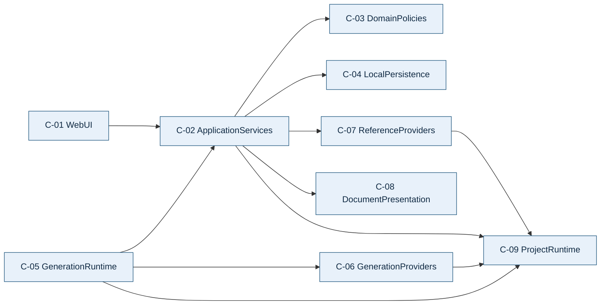
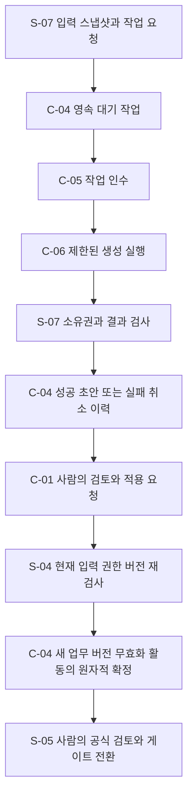

# PlanRepo 구성요소 의존 관계와 데이터 흐름

버전은 0.1이며 **사용자 승인 완료**입니다. 구성요소 정의는 `aidlc-docs/inception/application-design/components.md`, 계약은 `aidlc-docs/inception/application-design/component-methods.md`, 처리 순서는 `aidlc-docs/inception/application-design/services.md`에 있습니다. 모든 경로는 프로젝트 루트 기준입니다.

## 1. 의존 원칙과 행렬

행은 사용하는 구성요소이고 열은 의존 대상입니다. 응답이 돌아오는 것은 역방향 코드 의존을 뜻하지 않습니다. C-02 내부의 여러 서비스는 공통 정책과 같은 저장 경계를 사용하며 서로 독립적인 트랜잭션을 중첩해 부분 확정하지 않습니다.

| 사용 주체 | C-01 | C-02 | C-03 | C-04 | C-05 | C-06 | C-07 | C-08 | C-09 |
|---|---|---|---|---|---|---|---|---|---|
| C-01 | — | 사용 | — | — | — | — | — | — | — |
| C-02 | — | — | 사용 | 사용 | — | — | 사용 | 사용 | 사용 |
| C-03 | — | — | — | — | — | — | — | — | — |
| C-04 | — | — | — | — | — | — | — | — | — |
| C-05 | — | 사용 | — | — | — | 사용 | — | — | 사용 |
| C-06 | — | — | — | — | — | — | — | — | 사용 |
| C-07 | — | — | — | — | — | — | — | — | 사용 |
| C-08 | — | — | — | — | — | — | — | — | — |
| C-09 | — | — | — | — | — | — | — | — | — |

C-02는 C-05·C-06에 직접 의존하지 않습니다. 생성 요청은 C-04에 작업으로 저장되고 C-05가 내부 S-07 계약으로 작업을 인수합니다. 따라서 사용자 서비스에서 외부 호출을 기다리거나 dispatcher 호출 성공에 작업 보존을 의존하지 않습니다.

C-05는 C-02의 내부 실행 계약과 C-06의 provider 계약을 사용합니다. C-06에는 업무 저장소·승인 서비스 참조를 전달하지 않습니다. C-03·C-04·C-08·C-09는 다른 논리 구성요소를 호출하지 않는 기반 경계입니다. C-04의 실제 저장 드라이버 등 외부 라이브러리는 이후 스택 결정에서 정합니다.

## 2. 논리 의존 그림

글로 읽으면 UI는 ApplicationServices만 호출합니다. ApplicationServices는 정책·저장·Mock·표현·실행 설정을 사용합니다. GenerationRuntime은 내부 작업 서비스를 통해 상태를 관리하고 provider를 실행합니다. provider와 Mock은 프로젝트의 제한된 실행 기반을 사용합니다. 정책·저장·표현·기반 모듈에서 사용자 서비스로 돌아가는 의존은 없습니다.

## 3. 통신 방식과 저장 경계

| 연결 | 방식 | 데이터와 경계 |
|---|---|---|
| C-01과 C-02 | 로컬 백엔드의 명시적 요청·응답입니다. | Command/Query와 현재 버전·실패 사유를 교환합니다. HTTP 경로·전달 기술은 후속 설계에서 정합니다. |
| C-02와 C-03 | 프로세스 내부 호출입니다. | 현재 스냅샷으로 권한·업무·게이트·ReviewImpact를 판단합니다. |
| C-02와 C-04 | 트랜잭션·repository 포트입니다. | 업무·버전·현재 참조·요청 연결·이력·receipt를 같은 저장 경계에 둡니다. |
| C-02와 C-07 | Mock 조회 포트입니다. | 조회를 마친 뒤 저장 경계에서 중복·현재 상태를 검사합니다. |
| C-02와 C-08 | 순수 표현·비교·직렬화 호출입니다. | 전달된 고정 문서·인계 내용만 사용하고 임의 파일·URL을 읽지 않습니다. |
| C-05와 C-02 | 사용자에게 노출하지 않는 내부 작업 계약입니다. | runId·실행 소유권·상태·결과를 다룹니다. 외부 모델이 내부 주체를 사칭할 수 없습니다. |
| C-05와 C-06 | 공통 생성 계약의 비동기 호출입니다. | 명시 입력·제한 정책·정규화된 제안만 전달합니다. 업무 트랜잭션 밖에서 실행합니다. |
| C-06과 설치 Claude | 제한된 자식 프로세스 입출력입니다. | 실행 파일·인자·stdin을 분리하고 실행별 문맥·도구·MCP·설정을 검증합니다. |
| C-09와 로컬 환경 | 프로젝트 설정·PATH·시각·ID·제한 실행 기능입니다. | 개인 경로와 전역 개발 도구 상태를 제품 데이터의 필수 자산으로 만들지 않습니다. |

초기 앱은 로컬 실행을 대상으로 합니다. 원격 공개·운영 인증·외부 서비스 배포를 이 연결 표에 포함하지 않습니다. 실제 loopback 주소·포트·프로세스 수·동시 작업 수는 NFR·Infrastructure Design에서 정합니다.

## 4. 생성부터 사람의 적용까지

글로 읽으면 먼저 입력과 대기 작업을 저장합니다. dispatcher가 작업을 인수하고 provider를 호출합니다. 결과는 내부 실행 소유권과 출력 검사를 거쳐 초안이나 실패·취소 이력으로 저장합니다. 사람만 현재 초안을 적용할 수 있으며 적용 직전에 권한·입력·버전을 다시 검사합니다. 적용은 새 업무 버전·필요한 승인 무효화·활동 기록을 함께 확정합니다. 그 뒤의 공식 검토와 게이트 전환은 별도의 사람 행동입니다.

실패·취소 결과에서는 적용할 성공 초안을 만들지 않습니다. 오래된 성공 초안은 원 입력의 결과로 보존하고 바로 적용하지 못하게 합니다. 그림은 정상 흐름의 책임 배치를 보여주며 오류·취소·재시도 계약은 services 문서에 정의합니다.

## 5. 다른 주요 데이터 흐름

### 문서·결정 변경과 재검토

UI가 버전·행위자·명령을 보냅니다. S-03 또는 S-04는 현재 저장 상태와 정책을 확인합니다. 새 내용, 검토 영향, 현재 묶음·요청 연결과 활동을 같은 경계에서 갱신합니다. S-09의 다음 조회는 그 확정 상태를 읽습니다. 저장 성공과 무효화 실패가 따로 발생하는 설계를 허용하지 않습니다.

### 개별 승인과 단계 전환

S-05의 recordApproval은 지정 검토자·현재 묶음·체크리스트를 확인해 개별 기록을 만듭니다. assessGate는 화면용 조건을 읽습니다. transitionStage는 화면 결과를 신뢰하지 않고 저장 확정 경계에서 같은 정책으로 전 조건을 다시 계산합니다. G1·G2·담당자 외 동료·전원 승인을 함께 확인합니다.

### Handoff와 외부 구현 이력

S-08이 유효한 기준 버전을 고정하고 C-08이 같은 본문으로 미리보기·Markdown 표현을 제공합니다. 현재용 내보내기는 유효성을 다시 확인합니다. 외부 시작·완료는 그 인계와 연결된 수동 사실입니다. 재검토 후에도 이전 인계·진행 사실을 조회하되 새 유효 인계와 구분합니다.

## 6. 그림 검증과 다음 단계

작성한 Mermaid 부분 문법의 노드·연결·스타일과 의존 그래프의 순환 부재를 검사합니다. 실제 Mermaid renderer 화면은 아직 확인하지 않았습니다. 각 그림의 글 설명을 제공합니다.

이 그래프는 최종 unit 분해가 아닙니다. Units Generation에서 이 계약을 기준으로 선행 기능·검증 책임과 순환 없는 작업 단위를 정합니다. 상세 상태·구현 라이브러리·DB·실행 정책은 후속 단계에서 결정합니다.
