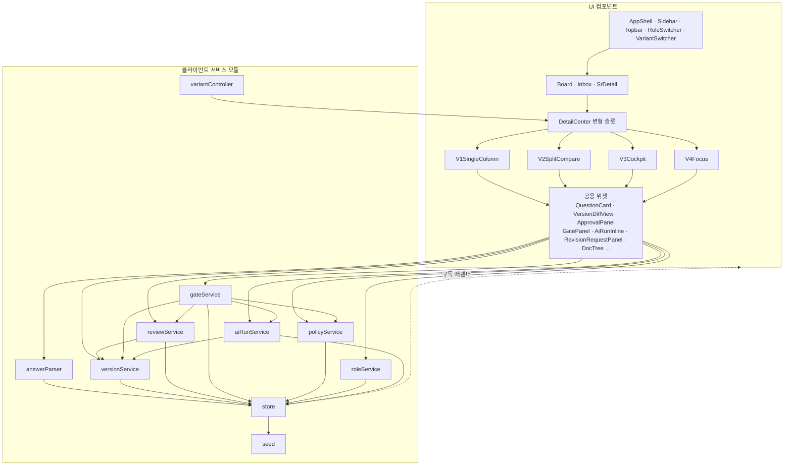

# Component Dependency — 의존성 그래프

> 단방향 데이터 흐름: UI 컴포넌트 → 서비스 모듈 → `store` → 구독 재렌더. 4종 변형은 동일 위젯·서비스를 공유(NFR-VIS-1).

## 의존성 규칙
- **UI → 서비스 → store** 단방향. UI는 서비스가 반환한 순수 결과를 `store.dispatch`로 커밋하고, `store.subscribe`로 재렌더한다.
- `gateService`는 다른 서비스(version/review/ai/policy)의 상태를 **읽어** 게이트 조건을 평가(계산만, 상태 변경 없음).
- `reviewService`·`aiRunService`는 새 버전 생성 시 `versionService`에 위임.
- `variantController`는 `DetailCenter` 슬롯만 교체 — 셸/위젯/서비스에 영향 없음(비교 변수 격리, NFR-VIS-1).
- 순환 의존 없음: `store`는 어떤 UI도 직접 참조하지 않고 구독 콜백으로만 통지.
