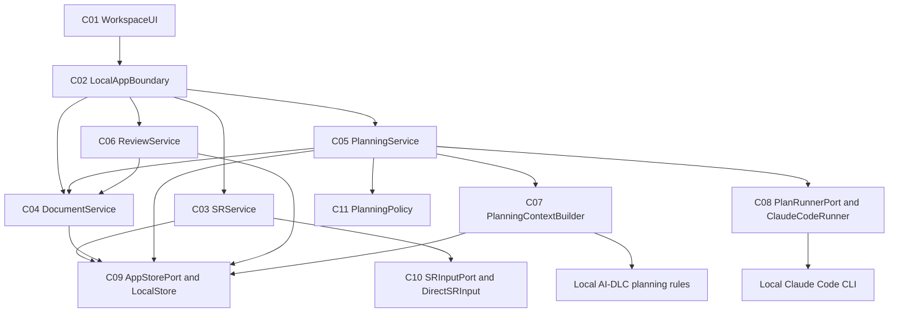
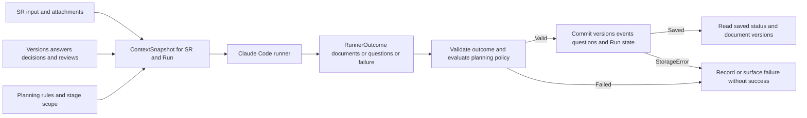

# 컴포넌트 의존성과 데이터 흐름

상태: 설계 산출물 Q1 A 승인 완료. [컴포넌트 정의](components.md), [서비스 흐름](services.md), [메서드 계약](component-methods.md)을 기준으로 한다.

## 의존성 행렬

행은 호출자, 열은 직접 사용하는 컴포넌트이다. X는 직접 의존, -는 없음이다. 반환값은 역방향 의존으로 세지 않는다. C09·C10·C08의 포트와 어댑터 연결은 런타임 구성에서 주입하며 프레임워크 선택을 전제하지 않는다.

| 호출자 | C01 | C02 | C03 | C04 | C05 | C06 | C07 | C08 | C09 | C10 | C11 |
|---|---|---|---|---|---|---|---|---|---|---|---|
| C01 | - | X | - | - | - | - | - | - | - | - | - |
| C02 | - | - | X | X | X | X | - | - | - | - | - |
| C03 | - | - | - | - | - | - | - | - | X | X | - |
| C04 | - | - | - | - | - | - | - | - | X | - | - |
| C05 | - | - | - | X | - | - | X | X | X | - | X |
| C06 | - | - | - | X | - | - | - | - | X | - | - |
| C07 | - | - | - | - | - | - | - | - | X | - | - |
| C08 | - | - | - | - | - | - | - | - | - | - | - |
| C09 | - | - | - | - | - | - | - | - | - | - | - |
| C10 | - | - | - | - | - | - | - | - | - | - | - |
| C11 | - | - | - | - | - | - | - | - | - | - | - |

C07은 주어진 RunSpecification으로 로컬 규칙 파일을 읽고 C09에서 문맥을 얻는다. C11을 호출하는 책임은 C05에 있다. C03 보드 조회는 C09의 저장된 요약을 조합하므로 PlanningService와 ReviewService를 다시 호출할 필요가 없다.

## 통신 패턴

| 경계 | 패턴 | 책임 |
|---|---|---|
| C01 → C02 | 로컬 HTTP 요청·응답을 기본 설계로 사용 | 단일 앱 조회·명령. 정확한 라우트·데이터 스키마는 후속 설계 |
| C02 → C03/C04/C05/C06 | 서버 내부 메서드 호출 | 전송 입력에서 서비스 계약으로 변환 |
| C05 → C08 | 비동기 프로세스 실행 추상 계약 | RunView는 먼저 반환하고 내부 작업이 실행 결과 수집 |
| C01 → C02 → C05.getRun | 상태 재조회 | 생성 중·정상 결과·실패 표시. 실시간 소켓 서비스는 요구하지 않음 |
| 서비스 → C09 | 조회 및 관련 변경의 일관된 저장 | 영속 데이터·사건·참조 관리 |
| C08 → Claude Code CLI | 로컬 자식 프로세스 | 기존 인증 사용, 계획 전용 입력·결과·실행 범위. 명령 옵션은 후속 설계 |
| C07 → 로컬 AI-DLC 규칙 | 읽기 | SR 실행에 필요한 계획 규칙과 구현 전 종료 경계 전달 |
| C10 → 외부 입력 확장 | 공통 SRDraft 포트 | 현재는 직접 입력만 구현. 실제 Jira 통신 경로 없음 |

## 컴포넌트 호출도

텍스트 대안: 브라우저는 로컬 서버 경계를 통해 네 서비스에 접근한다. SR 서비스는 입력 정규화와 저장소를 사용한다. 문서 서비스는 저장소를 사용한다. 계획 서비스는 정책 판단, 문맥 구성, CLI 실행, 문서 변경 준비 및 저장을 조율한다. 리뷰 서비스는 원래 문서 버전과 저장소를 사용하며 계획 서비스를 호출하지 않는다. 문맥 구성은 저장소·로컬 규칙을 읽는다. 실행 어댑터는 실제 CLI만 호출한다.

## 계획 실행 데이터 흐름

텍스트 대안: SR 입력·첨부와 저장된 문서 버전·응답·결정·리뷰, 단계 규칙을 문맥에 묶어 CLI로 전달한다. 반환 결과는 검증과 정책 판단을 거친다. 유효한 문서 또는 질문 결과는 실행 상태·사건과 함께 저장하고 UI가 읽는다. 실행·검증·저장 실패는 성공을 표시하지 않는 실패 경로로 처리한다.

## 의존성 검토 및 작업 단위 연결

직접 호출 그래프에는 순환이 없다. PlanningService가 DocumentService를 사용하지만 문서 서비스는 계획 서비스를 호출하지 않는다. ReviewService는 PlanningPolicy나 계획 서비스를 호출하지 않으며 진행 상태를 갱신하지 않는다. Runner는 저장소에 직접 연결하지 않는다.

U1은 C03·C04·C09·C10 및 기본 UI/전송 경계를 중심으로 하고, U2는 C05·C07·C08·C11과 계획 UI/전송 경계를 확장한다. U3는 C06과 리뷰 UI 및 수동 완료 UI를 완성한다. C03.markImplemented의 최종 구현 책임은 U3에 배정하는 안이다. 모든 공통 인터페이스·스토리 책임의 정확한 배정은 Units Generation에서 확정한다.
