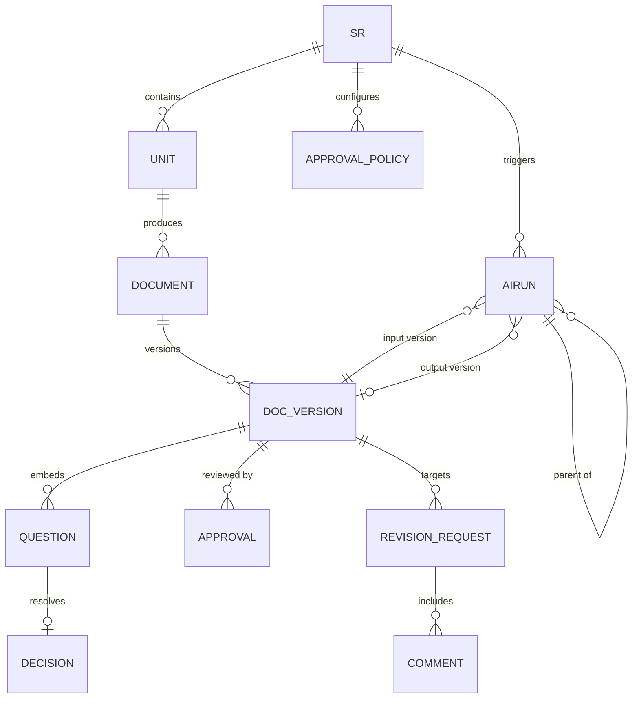

# Data Model — PlanRepo 시드 데이터 모델 (§11)

> 클라이언트 인메모리 시드 데이터만 모델링(서버·DB·영속성 없음, §3). 새로고침 시 초기화(MK-6).
> §3.9(§11) 7개 엔티티를 필수 링크와 함께 정의하고, `table-order-ddthon`(MK-4) 소재로 구체 시드를 채운다.

## 1. 엔티티 관계도 (ER)

## 2. 엔티티 정의 (7 코어 + 보조)

### E1. SR (Service Request)
| 필드 | 설명 |
|---|---|
| `id` | SR 식별자 (예: `SR-1024`) |
| `title` | 제목 |
| `stage` | `SR 접수` \| `Inception` \| `Construction 설계` \| `구현 대기` (FR-STG-1) |
| `assignee` | 담당자 |
| `scope` | 작업 범위 요약 |
| `workflowVersion` | 적용 워크플로우 버전 |
| `refs` | 관련 Jira/저장소(표시용, 연동 없음 §6) |
| `blockReason` | 대표 차단 원인(보드 카드용, FR-UI-BOARD) |
| `reviewStatusAgg` / `aiStatusAgg` | 유닛 집계 facet(FR-STG-7) |
| `exceptionAdvance` | 예외 진행 여부·사유·실행자(FR-GATE-4) |

### E2. Unit (설계 작업/유닛)
| 필드 | 설명 |
|---|---|
| `id` / `srId` | 유닛·소속 SR |
| `name` | 예: `U2 메뉴` |
| `facets` | 설계 작업 목록: `{key, applicable, reason, requiredArtifacts[], predecessors[], reviewCheckpoint}` — 생략은 `applicable:false, reason:'해당 없음'`(FR-STG-5) |
| `progress` | 진행 위치 + 미해결 의존성(FR-STG-6) |
| `reviewStatus` / `aiStatus` | 유닛별 facet(FR-STG-7) |

### E3. Document + E3v. DocVersion (문서 버전)
| 필드 | 설명 |
|---|---|
| `Document.id` | 문서 ID (예: `DOC-U2-FUNC`) |
| `Document.type` | 종류(functional-design, nfr-design, story-generation-plan, unit-of-work-plan …) |
| `Document.unitId` | 소속 유닛 |
| `Document.currentVersion` | 최신 버전 번호 |
| `DocVersion.version` | 정수 `v1 → v2 → v3`(§8 가정) |
| `DocVersion.body` | 원문(Markdown 문자열 — [Answer] 보존 대상) |
| `DocVersion.createdReason` | 생성 근거 |
| `DocVersion.inputVersions` | 입력 문서 버전(FR-VER 재검토 전파 근거) |
| `DocVersion.prevVersion` | 이전 버전 링크 |
| `DocVersion.status` | `초안` \| `승인` |
| `DocVersion.staleReview` | `재검토 필요` 여부(FR-VER-5) |

### E4. Question + E4d. Decision (결정)
| 필드 | 설명 |
|---|---|
| `Question.id` / `docVersionId` | 질문·포함 문서 버전 |
| `Question.originalTitle` | 원문 제목 그대로(`## Question 1`, `### Q1.` …, FR-QN-1) |
| `Question.choices[]` | 원본 문자·순서 보존(A/B/…/X, FR-QN-2) + 자유 설명 |
| `Question.otherChar` | Other 문자(원본에서 읽음, 추측 금지 FR-QN-5) |
| `Question.selectionMode` | 단일 / 복수(문서 명시) / Other(FR-QN-3) |
| `Question.answerFormat` | `[Answer]` 표기 형태(FR-QN-4 보존) |
| `Question.required` / `blocking` | 필수 여부 / 현재 단계 차단 여부(FR-QN-11) |
| `Question.decisionOwner` | 담당 결정권자(P3) |
| `Question.parentRunId` | 후속 질문의 부모 실행(FR-QN-10, FR-AI-6) |
| `Question.parseError` | 형식 오류·중복 번호·Answer 누락 + 위치(FR-QN-13) |
| `Decision.answerState` | `미답변 → 편집 중/미저장 → 답변 제안(저장됨) → 확정`(FR-QN-8) |
| `Decision.answerValue` | 현재 [Answer] 값 |
| `Decision.saveState` | `저장 중` \| `저장됨` \| `저장 실패` \| `미저장`(FR-SV-1) |
| `Decision.confirmedBy` / `confirmedAt` / `rationale` | 확정 기록(수정 시 이전 기록 보존 FR-QN-9) |
| `Decision.source` | `사람 확정` vs `AI 권고`(구분 표기 FR-QN-10) |

### E5. Approval (승인 요청/기록)
| 필드 | 설명 |
|---|---|
| `id` | 승인 식별자 |
| `docId` + `version` | **버전 고정**(FR-VER-1) |
| `reviewerSet[]` | 지정 리뷰어 |
| `policy` | `전원` \| `과반수` \| `리더`(요청 시점 정책 기록 FR-POL-2·3) |
| `result` | `대기` \| `승인` \| `수정 요청` |
| `checklist` | 리뷰 체크리스트 상태 |
| `approver` / `approvedAt` | 승인자·시각 |

### E6. RevisionRequest + Comment (수정 요청/댓글)
| 필드 | 설명 |
|---|---|
| `id` | 수정 요청 식별자(예: `RR-2`) |
| `docId` + `atVersion` + `area` | 요청 당시 버전·영역 |
| `state` | `열림 → 수정 완료·확인 대기 → 확인 완료`(FR-RR-1) / `재오픈` |
| `submitter` | 수정 완료 제출자(작성자 P2) |
| `fixVersion` | 지정한 수정 버전 |
| `confirmer` | 최종 확인 리뷰어(제출자 ≠ 확인자 FR-POL-4) |
| `blocking` | 차단 여부(제출만으로 미해제 FR-RR-2) |
| `Comment.quote` / `anchor` | 인용 문구·위치; 새 버전에서 미검출 시 `이전 버전의 댓글`(FR-VER-4) |

### E7. AIRun (AI 실행) — 표시만, 실제 실행 없음(§8)
| 필드 | 설명 |
|---|---|
| `id` / `parentRunId` | 실행·부모 실행(FR-AI-1·6) |
| `srId` / `taskType` | SR / `질문 분석` \| `생성 계획 승인` \| `산출물 생성` \| `수정 초안`(FR-AI-3) |
| `inputVersion` / `confirmedAnswers` / `revisionRequestId` | 입력 묶음 |
| `outputVersion` | 출력 문서 버전(새 초안 FR-AI-5) |
| `planApproved` | 생성 계획 승인 여부(FR-AI-3) |
| `status` | `실행 전`·`실행 중`·`추가 답변 대기`·`초안 준비`·`실패`·`취소`·`중단·재개 가능`(FR-STG-2/FR-AI-7) |
| `checkpoint` / `error` | 체크포인트·오류(FR-AI-10, 목업은 시드 상태) |

### E-보조. ApprovalPolicy
SR별 `{policy, reviewerSet, changedBy, reason}` — 정책 변경 이력 보존(FR-POL-3).

## 3. 시드 인스턴스 (table-order-ddthon 기반, MK-4)

- **SR-1024 「테이블 오더 — 메뉴/주문/결제」** · stage=`Construction 설계` · 담당자 김도현(P2)
  - **U1 주문**: func-design v2(승인), nfr-design v1(승인) — 완료
  - **U2 메뉴** *(주 시연 유닛)*:
    - `DOC-U2-FUNC` (functional-design): v1(승인)·v2(승인)·**v3(초안, 재검토 대상)** — Q2/Q3/Q5 포함
    - `DOC-U2-NFR` (nfr-design): v2(초안)
    - 질문: **Q2 「옵션 그룹 필수 선택 규칙」**(필수·차단·결정권자 이서준 P3·미확정), **Q3 「품절 옵션 처리」**(필수·차단), **Q5 「다국어 메뉴명 범위」**(필수), **Q7 후속 질문**(부모 실행 `RUN-U2-03`·차단 아님)
    - **파서 오류 예시**: Q6 Answer 누락(줄 42), Q4 중복 번호 — `미답변 0건`으로 숨기지 않음(AC-12)
    - 버전 비교: v2→v3 변경 3곳(＋품절 노출 규칙 §3.2 [신규·미검토], ＋옵션 그룹 maxSelect 필드 [신규·미검토], ～카테고리 정렬 문구 [수정])
    - **RR-2**: `DOC-U2-FUNC` v2 대상 수정 요청 — state=`수정 완료·확인 대기`, 제출자 김도현(P2), fixVersion=v3, 확인자 박민지(P4) 미확인 → **차단 유지**(AC-6)
    - **AIRUN RUN-U2-03**: taskType=`산출물 생성`, status=`추가 답변 대기`(Q2 미확정), inputVersion=v3, planApproved=true
  - **U3 결제**: 진행 대기(⏳), 선행=U2 승인
  - **승인 정책**: 전원 승인(리뷰어 박민지 P4 + 1); 리더 최유진(P5)
- **Inception 문서**: `story-generation-plan`(승인), `unit-of-work-plan`(승인) — SR 상세 문서 트리·탐색(US-F1) 소재
- **원본 Markdown 예시**(MK-3): `DOC-U2-FUNC` v3 본문 일부를 실제 `### Q2.` + A/B/C/X 선택지·`[Answer]:` 형태로 보존해 AC-1/AC-12 시연.

## 4. 검토함 시드(내 검토함, FR-UI-INBOX)
박민지(P4) 기준 우선순위 목록: ① `RR-2` 수정 결과 확인(차단) ② `DOC-U2-FUNC` v3 산출물 승인 ③ Q2 결정 확정(이서준 P3 관점 전환 시) ④ Q5 답변 작성 — 기한 초과→차단→직접 요청→생성 시각 순.

## 5. 파생/무결성 규칙(시드에 내재)
- 답변 **확정**이 문서 Answer를 갱신 → 새 DocVersion 생성(§8 가정). 미확정 제안(저장)은 버전 미생성.
- 과거 버전 화면에서 최신 버전 승인 불가(FR-VER-3, AC-5).
- 저장 실패·미저장·이전 입력 기준 초안은 성공/최신으로 표시 금지(NFR-INTEGRITY-1).
