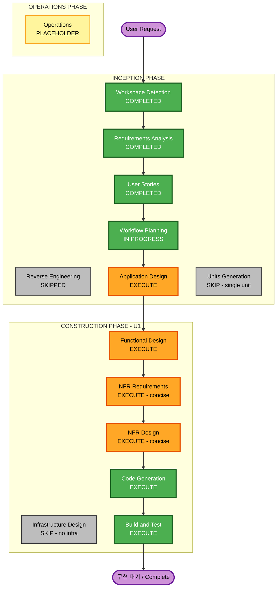

# Execution Plan — PlanRepo HTML 목업

## Detailed Analysis Summary

### Change Impact Assessment
- **User-facing changes**: Yes — 제품 전체가 사용자 대면(보드·내 검토함·SR 상세 4종). 목업 목적이 사용자 과업 속도 비교(§13).
- **Structural changes**: No (greenfield, 신규 단일 프런트엔드 산출물 — 기존 시스템 변경 없음).
- **Data model changes**: 클라이언트 시드 데이터 스키마만(§11 7개 엔티티). 서버·DB 없음.
- **API changes**: No — 실제 API/서버 없음(§3).
- **NFR impact**: Yes — 접근성(색 비의존·글자 크기·키보드), 반응형, 자기완결성, 상태 무결성(§10, NFR-*).

### Risk Assessment
- **Risk Level**: Low — 격리된 단일 정적 HTML, 롤백 용이(파일 교체), 서버·영속성·인증 없음.
- **Rollback Complexity**: Easy.
- **Testing Complexity**: Simple~Moderate — 자동화 서버 테스트 대신 브라우저 상호작용·접근성·요구사항/AC 대조 검증.

### Unit Decomposition
- 단일 유닛 **U1: planrepo-mockup** (단일 자기완결 HTML + 인앱 전환기). 다중 서비스·패키지 분해 불필요 → Units Generation SKIP.

## Workflow Visualization

## Phases to Execute

### 🔵 INCEPTION PHASE
- [x] Workspace Detection (COMPLETED)
- [x] Reverse Engineering (SKIPPED — greenfield; reference prototype targets superseded spec)
- [x] Requirements Analysis (COMPLETED)
- [x] User Stories (COMPLETED)
- [x] Workflow Planning (IN PROGRESS → COMPLETED)
- [ ] Application Design — **EXECUTE**
  - **Rationale**: 신규 화면·컴포넌트 정의 필요 — 4종 변형의 구체 정의, 공유 셸/컴포넌트 인벤토리, 시드 데이터 모델(§11), 화면 간 내비게이션. 목업 품질의 핵심 입력.
- [ ] Units Generation — **SKIP**
  - **Rationale**: 단일 자기완결 HTML(U1) — 다중 서비스/패키지 분해 불필요. 단일 유닛으로 Construction 진행.

### 🟢 CONSTRUCTION PHASE (Unit U1: planrepo-mockup)
- [ ] Functional Design — **EXECUTE**
  - **Rationale**: 클라이언트 상태 모델(답변 상태 머신·버전·수정 요청·게이트 평가), 시드 데이터 스키마, 상호작용 로직 정의 필요.
- [ ] NFR Requirements — **EXECUTE (concise)**
  - **Rationale**: 접근성·반응형·자기완결성·상태 무결성은 실질 요구(§10). 참조 시안이 이를 위반했으므로 명시 필요. requirements.md의 NFR을 U1 관점으로 구체화.
- [ ] NFR Design — **EXECUTE (concise)**
  - **Rationale**: a11y 패턴(색 비의존·포커스·글자 하한), 반응형 전략(서랍/순차), 외부 의존 제거(시스템 폰트) 설계.
- [ ] Infrastructure Design — **SKIP**
  - **Rationale**: 클라우드/배포 인프라 없음. 정적 파일 + 로컬 정적 서버 서빙만. 인프라 매핑 불필요.
- [ ] Code Generation — **EXECUTE (ALWAYS)**
  - **Rationale**: 단일 자기완결 `index.html`(HTML/CSS/JS) + 4종 변형 + 시드 데이터 생성.
- [ ] Build and Test — **EXECUTE (ALWAYS)**
  - **Rationale**: 빌드 없음(정적). 브라우저 상호작용·접근성·요구사항/AC 대조 검증 + 로컬 정적 서버 서빙.

### 🟡 OPERATIONS PHASE
- [ ] Operations — PLACEHOLDER

## Estimated Timeline
- **Total Stages to Execute**: 6 (Application Design, Functional Design, NFR Requirements, NFR Design, Code Generation, Build and Test)
- **Stages to Skip**: 3 (Reverse Engineering, Units Generation, Infrastructure Design)
- **Estimated Duration**: 단일 세션 내 완료(자동 진행, 표준 승인).

## Success Criteria
- **Primary Goal**: §13 목적 달성 — 어떤 정보 배치가 질문 응답·변경 검토를 가장 빠르게 만드는지 비교 가능한 목업.
- **Key Deliverables**:
  - `index.html` — 단일 자기완결, 인앱 전환기로 4종 SR 상세 변형 토글, 가을톤 고정, 한국어.
  - table-order-ddthon 참조 시드 데이터, §12 인수 시나리오 상호작용/정적 표현.
  - 로컬 정적 서버로 서빙되어 브라우저에서 열람 가능.
- **Quality Gates**:
  - 네 행동·세 게이트 분리, 문서 버전 승인, 수정 요청 라이프사이클이 시연됨.
  - 접근성(색 비의존·글자 하한·키보드), 반응형, 자기완결성 충족.
  - §12 AC-1..12가 목업 표현 수준으로 확인됨.
