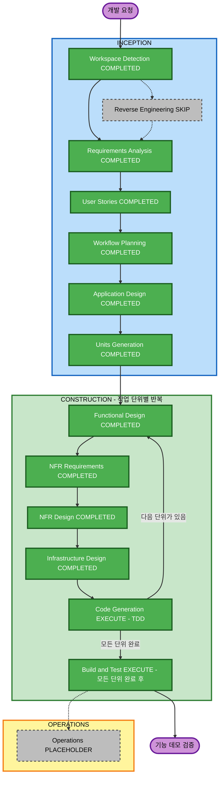

# PlanRepo 실행 계획

버전은 0.1이며 **사용자 승인 완료**입니다. 승인 응답 “응 진행해”를 2026-09-08T13:16:54Z에 기록했습니다. 요구사항 0.4와 스토리·페르소나 0.1을 승인받아 작성했습니다. 이 문서는 실행할 단계·깊이·의존 관계·검증 순서를 제안합니다. 실행 계획을 승인받은 뒤 Application Design 0.1도 승인받았습니다. Units Generation 분해 계획과 단위 산출물 세 개도 승인받았습니다. Functional Design 산출물도 승인받았습니다. NFR Requirements 산출물 0.1도 승인받았습니다. NFR Design 산출물 0.1도 승인받았습니다. Infrastructure Design 산출물 0.1을 승인받았습니다. 현재는 Code Generation Part 2 구현 중입니다. 사용자 응답 “응 진행하도록”으로 `aidlc-docs/construction/plans/planrepo-code-generation-plan.md`의 전체 계획 0.1과 28개 과제의 생성 순서를 승인받았습니다.

## 1. 입력과 현재 상태

모든 경로는 프로젝트 루트 기준입니다.

- 제품 기준은 `aidlc-docs/inception/requirements/requirements.md`입니다. FR 23개·NFR 8개·AC 19개와 결정 11개를 적용합니다.
- 사용자 행동은 `aidlc-docs/inception/user-stories/stories.md`입니다. 스토리 34개·개별 수용 기준 122개·공통 기준 7개를 적용합니다.
- 역할은 `aidlc-docs/inception/user-stories/personas.md`의 다섯 페르소나를 적용합니다.
- 기존 답변은 `aidlc-docs/inception/requirements/requirement-verification-questions.md`, 검토 사례는 `aidlc-docs/inception/requirements/reference-context.md`에 있습니다.
- 진행 상태와 감사 기록은 `aidlc-docs/aidlc-state.md`, `aidlc-docs/audit.md`에 있습니다.
- 이 단계는 `.aidlc-rule-details/inception/workflow-planning.md`와 `.aidlc-rule-details/common/depth-levels.md`를 따릅니다.

프로젝트는 Greenfield입니다. 계획 수립 당시에는 애플리케이션 코드·빌드 설정이 없었습니다. 현재는 CG-01 도구와 runtime 기반을 구현하고 검토 중입니다. Workspace Detection·Requirements Analysis·User Stories를 마쳤고 Reverse Engineering은 생략했습니다. 스토리 산출물의 승인 응답은 “승인할게 진행해”입니다.

## 2. 범위와 영향 분석

목표는 가상 사용자와 네 개 시드 SR로 동작하는 로컬 기능 데모입니다. SR의 접수부터 질문·결정·문서·G1·G2·Handoff·외부 구현 이력까지 연결합니다. 저장·권한·승인·차단·재검토와 Claude 생성은 실제로 동작해야 합니다.

| 영향 영역 | 판단과 설계 대상 |
|---|---|
| 사용자 경험 | 신규 기능입니다. 다섯 역할의 다음 행동, 검토 대상 버전, 오류·차단 이유와 키보드 흐름을 정합니다. |
| 구조 | 신규 구성요소가 필요합니다. UI·업무 처리·저장·AI 실행·외부 Mock의 책임과 의존 관계를 정합니다. |
| 데이터 | SR·질문·결정·문서 버전·ReviewBundle·승인·수정 요청·정책·생성 작업·Handoff·활동 이력을 설계합니다. |
| API·계약 | 신규 상태 변경·조회와 생성 계약을 정의합니다. 권한·현재 버전·원자적 전환·중복 방지를 서버의 처리 경계에서 보장합니다. |
| NFR | NFR-01부터 NFR-08까지 저장·복구·충돌·권한·표시 안전성·반응·자료·실행 경계를 설계하고 검증합니다. |
| 실행 환경 | 로컬 앱·영속저장·설치된 Claude CLI의 실제 연결을 정합니다. 프로젝트 루트에서 실행과 검증을 재현합니다. |
| 운영 | 운영 인증·운영 배포·실제 조직 자료 처리는 후속 범위입니다. 운영 자원을 생성하지 않습니다. |

Brownfield의 변환 범위 분석, 기존 구성요소 의존 그래프, 기존 패키지 업그레이드·마이그레이션 순서는 N/A입니다. 기존 코드가 없기 때문입니다. 신규 구성요소의 관계는 Application Design에서 작성합니다.

한 SR의 구현 단위를 하나로 제한하는 제품 정책을 유지합니다. 이 정책은 PlanRepo를 개발할 작업 단위의 개수와 별개입니다. 분해 계획에서 개발 단위는 UOW-01 하나로 승인받았습니다. 이후 승인된 NFR Requirements에서 TypeScript·React/Vite·Fastify·SQLite를 선택했습니다. 패키지 조합과 실제 실행은 구현 단계에서 검증합니다.

## 3. 위험과 먼저 확인할 사항

전체 구현 위험은 **High**입니다. 운영 시스템의 변경 위험이 아니라 여러 역할·버전·승인·동시 변경·실제 AI 실행이 서로 영향을 주는 복잡도 때문입니다. 검증 복잡도도 Complex입니다.

현재 문서 변경의 복구는 쉽습니다. 구현 후에는 영속 데이터와 승인 이력을 보존해야 하므로 복구 복잡도는 Moderate로 평가합니다. 저장 구조·초기화·호환성·복구 확인 방식은 설계에서 구체화합니다. 기존 사용자 자료를 삭제하는 초기화를 기본 절차로 삼지 않습니다.

| 위험 | 해소할 단계 | 필요한 검증 근거 |
|---|---|---|
| 설치된 Claude가 실제 생성에는 실패할 수 있습니다. | Application Design에서 계약·실행 경계를 정하고, NFR·로컬 실행 설계를 거쳐 초기 AI 구현에서 확인합니다. | 실제 가상 SR 질문·문서·답변 반영 후속 생성과 실행 정보입니다. 설치·도움말이나 Mock만으로 AC-17을 통과하지 않습니다. |
| 조건 검사 뒤 변경이 끼어들 수 있습니다. | Functional Design·NFR Design에서 저장 경계를 정하고 해당 단위 구현에서 TDD로 검증합니다. | 게이트·Handoff 처리 중 동시 변경, 이전 버전 저장·승인, 반복 전환·인계의 실패와 중복 방지입니다. |
| 개별 승인과 게이트 통과가 섞일 수 있습니다. | Application Design에서 행동을 나누고 Functional Design에서 상태·권한을 정합니다. | 지정 전원·담당자 외 동료·필수 질문·결정·수정 확인과 역할 겸임의 정상·거절 결과입니다. |
| 변경 후 과거 승인을 잘못 재사용할 수 있습니다. | Functional Design·NFR Design에서 변경 전파표와 묶음 참조를 정합니다. | G1·종속 G2, G2 전용 변경, 새 차단 문제, 정책 명시 적용, 섹션 삭제와 요청 승계입니다. |
| AI의 늦은 결과·실패가 현재 기준을 바꿀 수 있습니다. | AI 단위의 Functional·NFR·Infrastructure Design에서 작업 수명과 적용 경계를 정합니다. | 취소·형식 오류·재시도·오래된 결과·적용 직전 충돌·SR 문맥 분리·도구 제한입니다. |
| 다른 폴더나 개발 도구 설정에 의존할 수 있습니다. | Infrastructure Design과 Build and Test에서 실행 전제와 경로를 확인합니다. | 별도 프로젝트 사본의 실행·저장·재접속·내보내기입니다. Claude는 PATH로 찾고 개인 설치 경로는 고정하지 않습니다. |
| 인계와 외부 구현 사실을 혼동할 수 있습니다. | Handoff 설계·통합 검증에서 기준 버전과 수동 기록을 분리합니다. | 무효 게이트의 신규 인계 거절, 과거 기준과 외부 진행 사실 보존, 자동 검증으로 표시하지 않는 결과입니다. |

첫 AI 연결은 설치된 Claude CLI입니다. 개발 도구는 Codex이며 제품 AI 실행 주체와 구분합니다. 최신 사용자 지시에 따라 기존 환경에서 explicit 모델 global.anthropic.claude-opus-4-8을 사용하고 provider·model 교체 계약을 유지합니다. 이 모델의 짧은 실제 호출은 exit 0으로 확인했습니다. 업무 생성·취소·복구의 검증은 후속 구현에서 합니다. 현재 실행 결정은 aidlc-docs/construction/planrepo/code/claude-execution-decision.md입니다.

## 4. 단계별 실행 판단과 깊이

이후 실행할 단계의 종류는 **8개**입니다. Application Design·Units Generation 뒤에는 작업 단위별로 다섯 Construction 단계를 실행하고 모든 단위를 마친 뒤 Build and Test를 실행합니다.

| 단계 | 판단 | 깊이 | 이유와 산출물 내용 |
|---|---|---|---|
| Workspace Detection | COMPLETED | 필요한 범위입니다. | Greenfield·현재 자산·규칙·승인 상태를 확인했습니다. |
| Reverse Engineering | SKIP | N/A입니다. | 분석할 기존 코드가 없습니다. |
| Requirements Analysis | COMPLETED | Comprehensive입니다. | 요구사항 0.4를 승인받았습니다. |
| User Stories | COMPLETED | Comprehensive입니다. | 스토리·페르소나·수용 기준·추적표를 승인받았습니다. |
| Workflow Planning | COMPLETED | Comprehensive입니다. | 이 실행 계획을 사용자에게 승인받았습니다. |
| Application Design | COMPLETED | Comprehensive입니다. | 구성요소·책임·인터페이스·서비스·의존 관계와 전체 데이터 흐름을 정합니다. |
| Units Generation | COMPLETED | Standard입니다. | 검증 가능한 단위·의존 관계·34개 스토리 배정과 코드 배치를 정합니다. |
| Functional Design | COMPLETED, 단위별입니다. | 핵심 규칙은 Comprehensive, 나머지는 Standard입니다. | 상태·업무 규칙·데이터·해당 UI를 정합니다. 게이트·버전·AI 적용·Handoff는 상세히 다룹니다. |
| NFR Requirements | COMPLETED, 단위별입니다. | Standard입니다. | 적용 NFR·검증 규모·응답시간·자료·실행 조건과 기술 선택을 정합니다. |
| NFR Design | COMPLETED, 단위별입니다. | 원자성·AI 실행은 Comprehensive, 나머지는 Standard입니다. | 충돌·중복·권한·오류·복구·작업 수명과 논리 구성요소를 정합니다. |
| Infrastructure Design | COMPLETED, 단위별입니다. | Standard입니다. | 논리 구성요소를 로컬 프로세스·저장·CLI·설정·시작·종료·재접속 환경에 매핑합니다. |
| Code Generation | EXECUTE, 단위별입니다. | Comprehensive입니다. | 단위 구현 계획 승인 후 코드·테스트·실행 문서를 생성하고 TDD로 검증합니다. |
| Build and Test | EXECUTE, 전체 단위 완료 후입니다. | Comprehensive입니다. | 빌드·단위·통합·성능·계약·권한·UI·실제 Claude 검증 안내와 결과를 정리합니다. |
| Operations | PLACEHOLDER | N/A입니다. | 실제 배포·운영 모니터링은 이번 범위에 포함하지 않습니다. |

실행 단계는 그 단계 상세 규칙이 정의한 필수 산출물을 모두 만듭니다. 깊이는 문서 안의 상세 수준이며 필수 파일을 생략하는 근거가 아닙니다. 공통 규칙의 예시 목록보다 해당 단계의 상세 규칙을 기준으로 합니다.

Application Design에서는 구성요소·메서드·서비스·의존 관계 문서와 통합 설계를 만듭니다. Units Generation에서는 단위 정의·의존 관계·스토리 연결·Greenfield 코드 배치를 만듭니다. 단위별 Functional·NFR·Infrastructure Design은 단계 계획과 정의된 설계 문서를 만듭니다. UI가 있는 단위의 화면 구성과 공유 실행 환경이 있는 경우의 공통 매핑도 포함합니다.

Infrastructure Design은 로컬 환경을 대상으로 합니다. 각 단위에서 필요한 매핑을 기록하고 이미 확정한 공유 환경은 프로젝트 안의 설계를 참조합니다. 클라우드 공급자·로드밸런서·다중 조직·운영 알림은 이번 데모에 필요하지 않아 N/A로 기록합니다. 필요하지 않은 외부 서비스를 만들지 않습니다.

Build and Test는 빌드·단위·통합·성능 안내와 결과 요약을 포함합니다. 계약 테스트, 제품 기본 권한·실행 경계 검증, e2e 안내도 실제 범위에 맞게 추가합니다. 성능 목표는 NFR에서 정하고 사용성의 10초 목표는 기존 요구사항을 유지합니다.

## 5. 워크플로우 그림

녹색은 완료했거나 항상 실행할 단계이고, 주황색은 필요성을 판단해 실행할 단계입니다. 회색은 생략 또는 Placeholder입니다. INCEPTION·Functional Design·NFR Requirements·NFR Design 산출물 승인을 마쳤으며 Infrastructure Design도 승인받았습니다. Code Generation 전체 계획을 승인받고 Part 2를 진행합니다. 그림의 EXECUTE는 향후 실행 결정이며 이미 완료했다는 뜻이 아닙니다.

### 글로 읽는 진행 순서

1. Workspace Detection·Requirements Analysis·User Stories는 완료했습니다. Reverse Engineering은 생략했습니다.
2. Workflow Planning의 실행 계획을 승인받았습니다.
3. Application Design의 책임·인터페이스 설계를 승인받았습니다. Units Generation으로 단위·의존 관계·검증 배정을 정합니다.
4. 한 단위에서 Functional Design, NFR Requirements, NFR Design, Infrastructure Design, Code Generation의 순서로 필요한 설계·구현·검증·승인을 마칩니다.
5. 해당 단위를 마친 뒤 다음 단위에서 같은 순서를 반복합니다. 전체 설계만 먼저 쌓아 두고 모든 코드를 나중에 생성하는 방식으로 바꾸지 않습니다.
6. 모든 단위를 마치면 Build and Test에서 제품 전체를 검증합니다. Operations는 별도의 Placeholder이며 실제 배포 절차로 진행하지 않습니다.

이 그림에서 사용한 노드·그룹·연결·상태·스타일의 제한된 Mermaid 문법을 검사했습니다. Mermaid 렌더러로 화면을 출력한 결과는 아직 확인하지 않았습니다. 위 순서 설명으로 같은 내용을 읽을 수 있습니다.

## 6. 구성요소와 구현 순서의 결정 원칙

Application Design에서는 UI와 상태 변경 서비스, 버전·승인·저장, 생성 계약과 Claude adapter, Jira·GitHub Mock 사이의 책임을 정합니다. provider의 응답을 직접 승인·단계 전환으로 연결하지 않습니다. 개별 승인과 게이트 검사·전환은 별도 행동으로 설계합니다.

공통 ID·버전·권한·생성 입력·오류 계약을 먼저 정합니다. 이후 Units Generation에서 단위별 주 책임, 제공·사용 계약, 의존 관계와 스토리별 검증 책임을 배정합니다. 서로 의존해 어떤 단위도 완료할 수 없는 순환 분할을 피합니다. 여러 단위가 관여하는 스토리는 최종 검증 책임을 명시합니다.

구현 순서는 다음 근거로 결정합니다. 아래 항목은 확정된 unit 이름이나 개수가 아닙니다.

1. SR·입력·문서 버전·저장·행위자 기록 같은 선행 기능을 준비합니다. 관련 상태·권한·저장 실패 검증을 함께 갖춥니다.
2. AI 실행 계약과 로컬 제한이 준비되면 실제 Claude 최소 호출을 구현 초기에 확인합니다. 질문·문서·답변 반영 후속 생성을 최종 통합 시점까지 미루지 않습니다. 실패·취소·교체 계약은 테스트 연결로 재현하고 실제 실행 근거를 별도로 남깁니다.
3. 질문·결정·수정 확인·개별 승인·G1·G2·정책·변경 전파를 검증합니다. 먼저 확정한 저장·권한 경계를 사용하고 경쟁 조건을 재현합니다.
4. 검토함·보드·Handoff·외부 구현 이력을 연결합니다. 앞 단계에서 만든 화면과 상태를 실제 사용자 흐름으로 통합합니다.

이 순서의 세부 분할·완료 기준은 Units Generation에서 확정합니다. 한 단위의 설계·코드·검증·승인 전에 다음 단위 구현을 시작하지 않습니다. 독립적인 읽기 전용 검토는 병행할 수 있습니다. 공통 계약·데이터 구조·같은 파일의 변경은 순서를 정해 처리합니다.

## 7. 구현과 검증 계획

행동 변경은 실패 테스트를 먼저 작성하고 실행해 예상한 RED를 확인합니다. 최소 구현으로 GREEN을 만든 뒤 정리하고 관련 전체 검증을 실행합니다. 정확한 명령·exit code·결과를 기록합니다. 코드 없는 문서 변경에는 형식·참조·내용 일치 검증을 적용합니다.

| 검증 묶음 | 연결할 스토리·조건 | 검증 위치와 완료 근거 |
|---|---|---|
| SR·근거·질문·결정 | US-001, US-002, US-003, US-004, US-005, US-006, US-007, US-008입니다. | 담당 단위에서 등록·원문·중복·미확인 근거·답변/해결·지정 결정권자·후속 범위 우회를 검증합니다. AC-01, AC-02, AC-03, AC-15를 포함합니다. |
| 생성·편집·교체 | US-009, US-010, US-011, US-012, US-013입니다. | 담당 단위에서 실제 Claude와 테스트 계약을 구분합니다. 오래된 결과·실패·취소·재시도·적용 충돌·model 설정을 검증합니다. AC-08, AC-17, AC-18, AC-19를 포함합니다. |
| G1 검토·반영·통과 | US-014, US-015, US-016, US-017, US-018, US-019입니다. | 담당 단위에서 버전·개별 승인·지정 전원·담당자 외 동료·반영 확인·이전 화면 거절을 검증합니다. AC-04, AC-05, AC-09를 포함합니다. |
| 계획·G2 통과 | US-020, US-021, US-022, US-023입니다. | 담당 단위에서 승인 G1 참조·필수 문서·현재 범위·현재 전원 승인·원자적 전환을 검증합니다. AC-04, AC-05, AC-09, AC-13, AC-15를 포함합니다. |
| 재검토 | US-024, US-025, US-026입니다. | 담당 단위에서 G1/G2 변경 구분·새 차단 문제·새 묶음 재승인·섹션 삭제·미해결 요청 승계를 검증합니다. AC-06, AC-07, AC-10, AC-12, AC-16을 포함합니다. |
| 보드·검토함·정책 | US-027, US-028, US-029, US-030입니다. | 담당 단위와 실제 UI에서 처리 대상 이동·상태 일치·정책 명시 적용·이전 요청 중복 제거를 검증합니다. AC-10, AC-14를 포함합니다. |
| 인계·외부 구현·이력 | US-031, US-032, US-033, US-034입니다. | 담당 단위와 통합 검증에서 정확한 기준 버전·무효 게이트 거절·반복 요청·과거 인계/진행 보존을 확인합니다. AC-11, AC-12, AC-13, AC-17을 포함합니다. |
| 공통 NFR | SC-01, SC-02, SC-03, SC-04, SC-05, SC-06, SC-07과 NFR-01, NFR-02, NFR-03, NFR-04, NFR-05, NFR-06, NFR-07, NFR-08입니다. | 상태를 바꾸는 단위의 저장·재접속·경쟁·중복·권한과 관련 화면의 안전성·키보드·생성 중 열람·가상 자료·실행 제한을 검증합니다. |

단위 구현 중에는 관련 단위·계약·통합 테스트를 실행합니다. 모든 단위를 마치면 Build and Test에서 빌드와 필요한 전체 검증을 실행합니다. 이미 통과한 검증을 이유 없이 반복하지 않으며 변경·실패·새 우려가 생기면 관련 범위를 다시 확인합니다.

실제 Claude 검증은 가상 자료만 사용합니다. 질문·결정 제안·문서 초안 외 임의 명령·파일 수정·승인·단계 전환을 모델에 맡기지 않습니다. 비밀 값을 로그·화면·인계본에 노출하지 않습니다. 설치 또는 사용이 불가능하면 실패를 표시하고 실제 생성 기준을 미통과로 남깁니다.

최종 통합에서는 PAY-102의 실제 생성·답변·적용·G1·G2·인계·정책 변경·재검토를 연결합니다. AUTH-331은 반영 확인과 G2 재승인, NOTI-028은 정확한 인계, CAT-093은 재검토 중 외부 구현 이력을 확인합니다. UI에서는 Markdown 표시 안전성·키보드 사용과 차단 이유·담당자를 10초 안에 찾는 사용성을 관찰합니다.

## 8. 프로젝트 내부 실행과 산출물 배치

애플리케이션 코드·설정·테스트·가상 데이터는 프로젝트 루트 아래에 둡니다. 최종 폴더 구조와 실행 명령은 설계·단위 생성·코드 계획에서 정합니다. 문서는 `aidlc-docs/` 아래에 둡니다.

시작·빌드·테스트·저장 위치·재접속·데모 데이터 준비·Claude 탐색과 실행 조건을 프로젝트 안의 안내에 포함합니다. 다른 프로젝트나 개인 홈 경로를 참조하는 지시를 만들지 않습니다. 외부 규칙을 실행 시 다시 가져오는 구조로 만들지 않습니다.

별도 프로젝트 사본에서 필요한 런타임·의존성·시스템 Claude라는 명시적 환경 전제만으로 설치·시작·기본 흐름을 재현합니다. 시스템 Claude 설치 전제를 다른 프로젝트 자산 의존성과 구분합니다. 전역 개발 도구 설정을 제품 상태 저장소로 사용하지 않습니다.

현재 이 단계의 새 산출물은 `aidlc-docs/inception/plans/execution-plan.md`입니다. Application Design·Units Generation·Construction의 문서와 코드는 이후 각 단계에서 만듭니다. 지금 생성됐거나 실행 가능한 앱이 있다는 뜻이 아닙니다.

## 9. 기간·완료 기준·승인 경계

이후 단계는 종류 기준 8개입니다. 작업 단위 수를 U라고 하면 다섯 단위별 단계를 모두 실행하는 이 계획의 이후 단계 실행 횟수는 3 + 5 × U입니다. 이 수는 기간이나 승인 횟수가 아닙니다. 계획/생성의 별도 승인이 있는 단계도 있습니다.

예상 기간은 아직 수치로 산정하지 않습니다. 기술 선택·실제 Claude 사용 가능성의 검증이 남아 있습니다. Units Generation과 첫 실제 연결 검증 후 구현 범위와 측정 근거로 산정합니다.

완료 기준은 다음과 같습니다.

- 기능 데모에서 승인된 34개 스토리와 FR·NFR·AC를 구현하고 검증 근거를 남깁니다.
- 실제 Claude의 질문·문서·후속 생성과 교체 계약을 확인합니다. Mock만으로 실제 생성 완료를 주장하지 않습니다.
- 저장·재접속·권한·동시 변경·G1/G2·재검토·Handoff의 정상·거절·실패 흐름을 검증합니다.
- 네 개 가상 SR과 사용자 전환, 보드·검토함·문서 비교·인계·외부 구현 이력을 연결합니다.
- 프로젝트 내부 문서와 자산으로 실행·빌드·테스트를 재현합니다. 앱 테스트·실제 실행을 하지 않은 항목은 미검증으로 표시합니다.

이번 실행 계획 승인은 다음 **Application Design** 단계로 진행하는 승인입니다. 상세 설계·단위 분해·단위 구현 계획·코드 생성 결과의 승인을 대신하지 않습니다. 각 단계에서 검토 가능한 결과를 먼저 제시한 뒤 해당 규칙의 승인을 받습니다. 추가 질문은 기존 답변으로 판단할 수 없는 결정에 한해 현재 대화에서 받습니다.

사용자는 실행 단계·깊이의 수정을 요청할 수 있으며 생략한 Reverse Engineering의 포함도 요청할 수 있습니다. 기존 코드가 없으면 실제 분석 대상부터 확인합니다. 운영 배포·운영 인증·실제 조직 자료·외부 레코드 변경은 이 실행 계획의 승인 범위에 추가하지 않습니다.

## 10. 실행·검증 체크리스트

### 이번 Workflow Planning

- [x] 사용자 원문 “승인할게 진행해”를 기록하고 User Stories를 완료 처리했습니다.
- [x] 승인된 요구사항·답변·스토리·페르소나와 단계 규칙을 읽었습니다.
- [x] Greenfield·영향·위험·실행 환경·현재 미검증 조건을 분석했습니다.
- [x] 이후 8개 단계의 실행·깊이와 Reverse Engineering 생략·Operations Placeholder를 정리했습니다.
- [x] 단위별 순서·의존 관계 결정 원칙·TDD·실제 AI·통합 검증 순서를 작성했습니다.
- [x] 사용한 Mermaid 문법·노드·그룹·연결·상태·스타일을 검사하고 글 설명을 포함했습니다.
- [x] 독립 검토에서 중대한 누락·모순을 찾지 못했고, 문서 15개·프로젝트 내부 경로·34개 스토리·수용 기준 연결을 검증했습니다.
- [x] 상태와 시작 안내를 맞추고 이번 응답에서 실행 계획의 검토·승인을 요청합니다.
- [x] 사용자 응답 “응 진행해”를 원문으로 기록하고 Workflow Planning을 완료 처리했습니다.

### 이후 단계

- [x] Application Design을 실행하고 산출물 0.1을 승인받았습니다.
- [x] Units Generation의 분해 계획과 산출물 0.1을 승인받았습니다.
- [x] UOW-01의 Functional Design 산출물 0.1을 승인받았습니다.
- [x] UOW-01의 NFR Requirements 산출물 0.1을 승인받았습니다.
- [x] UOW-01의 NFR Design 산출물 0.1을 승인받았습니다.
- [x] UOW-01의 Infrastructure Design 산출물 0.1을 승인받았습니다.
- [ ] 해당 단위의 Code Generation 계획을 승인받고 TDD로 구현·검증한 결과를 승인받습니다.
- [ ] 모든 단위를 마친 뒤 Build and Test의 안내·실제 결과를 정리하고 검토받습니다.

## 11. 확장 준수

| 확장 | Enabled | 판단 |
|---|---|---|
| Security Baseline | No | N/A입니다. 전체 규칙 로딩과 적용을 생략합니다. |
| Resiliency Baseline | No | N/A입니다. 전체 규칙 로딩과 적용을 생략합니다. |
| PBT | No | N/A입니다. 전체 규칙 로딩과 적용을 생략합니다. |

비활성 확장으로부터 새로운 요구를 추가하지 않습니다. 제품의 기존 NFR과 사용자 지정 TDD는 계속 적용합니다. 구현 테스트를 지금 통과했다고 표시하지 않습니다.
