# PlanRepo 실행 계획

상태: 실행 계획 Q1 A 승인 확인 (2026-09-08T14:05:45Z). Workflow Planning 완료, Application Design으로 진행.

근거: [승인된 요구사항](../requirements/requirements.md), [요구사항 답변](../requirements/requirement-verification-questions.md), [CLI 환경 답변](../requirements/requirements-clarification-questions.md), [승인된 스토리](../user-stories/stories.md), [페르소나](../user-stories/personas.md), [스토리 산출물 승인](../user-stories/user-stories-approval-questions.md).

## 1. 목표와 범위

하루 내 개발을 목표로 로그인 없는 로컬 macOS 단일 사용자 웹 앱을 만든다. SR 생성에서 실제 Claude Code CLI의 계획 문서 생성, 사람의 질문 응답·결정, 문서 편집·이력·비교·복원, 비차단 리뷰, 구현 대기·수동 완료까지 한 흐름을 제공한다. Git 독립 저장과 실제 생성·저장을 유지한다.

이 실행 계획은 PlanRepo 자체를 개발하는 절차이다. 제품이 실행하는 AI-DLC는 코드 구현 직전 문서 계획에서 종료하며, 제품이 코드 생성·빌드·커밋·PR을 자동 수행하도록 확장하지 않는다. Jira는 외부 SR 입력 연결 경계만 마련한다.

## 2. Workflow Planning 실행 체크리스트

- [x] 스토리 산출물 승인 A를 기록하고 User Stories 완료 처리
- [x] 요구사항·답변·스토리·페르소나·의도 분석과 확장 상태 확인
- [x] 범위·컴포넌트 영향·위험·의존 관계 분석
- [x] 실행 및 생략할 단계와 적응형 상세 수준 결정
- [x] 잠정 작업 단위·순서·검증 지점 제안
- [x] Mermaid와 텍스트 대안 작성 및 문법·참조 검증
- [x] 실행 계획·검토 질문 작성 및 상태·감사 로그 갱신
- [x] 실행 계획 승인 또는 변경 요청 수신·검증·기록
- [x] 승인된 계획에 따라 Workflow Planning 완료 및 Application Design으로 전환

이미 승인된 제품 범위와 스토리를 다시 질문하지 않는다. 아래 작업 단위는 계획상의 제안이며 정확한 경계와 스토리 배정은 Application Design 및 Units Generation에서 확정한다.

## 3. 상세 영향 분석

Greenfield이며 기존 코드·API·배포 시스템의 변경이나 마이그레이션은 없다. Brownfield 변환 분석, 기존 패키지 변경 순서 및 기존 컴포넌트 의존 그래프는 N/A이다.

| 영향 영역 | 필요한 신규 작업 | 근거 |
|---|---|---|
| 사용자 경험 | 고정 6열 칸반, SR 상세, 문서·질문·결정·리뷰 조작, 역할 전환 | FR-01, FR-02, FR-04, FR-06, FR-07, FR-08 |
| 구조 | UI, SR·문서 관리, 계획 진행, CLI 실행, 외부 SR 입력의 책임 경계 | FR-03, FR-09, NFR-06 |
| 데이터 | SR, 문서·버전, 질문·결정 사건, 진행·회차, 실행 결과, 리뷰 대상 버전 | FR-02–FR-07, NFR-04 |
| 인터페이스 | UI와 로컬 서버 계약, CLI 입력·결과 수집, 향후 Jira 입력 인터페이스 | FR-03, FR-04, FR-09 |
| 비기능 | 로컬 실행, 실제 영속 저장, 기본 키보드 조작, 생성·실패 표시 | NFR-02, NFR-03, NFR-04 |
| 의존성과 설정 | 언어·프레임워크·저장 기술 선택, 실행·데이터 위치, 기존 CLI 인증 이용 | 미정 기술은 NFR Requirements에서 선택 |
| 인프라 | 로컬 서버와 저장 위치를 실행 설정으로 정의; 신규 클라우드 자원·공용 배포 없음 | NFR-02 및 승인된 제품 경계 |
| 운영 | 로컬 시작·종료·검증 지침 제공; 운영 모니터링·알림·고가용성 구축 제외 | 로컬 MVP 및 Operations placeholder |

예상 책임 관계는 UI → SR·문서·계획·리뷰 서비스, 계획 서비스 → CLI 실행 경계 및 문서 저장, 리뷰 서비스 → 특정 문서 버전 참조이다. 직접 SR 입력과 향후 외부 입력은 같은 SR 생성 경계로 연결할 수 있게 설계한다. 이는 기존 구조에 대한 발견이 아닌 후속 설계의 출발점이다.

## 4. 위험 평가

전체 위험은 Medium이다. 여러 상태와 외부 프로세스 실행을 새로 연결하지만 운영 시스템이나 기존 사용자 데이터 마이그레이션은 없다. 구현 되돌리기는 비교적 쉽고 생성된 사용자 데이터의 보존은 별도로 검증해야 한다. 검증 복잡도는 Moderate이다.

| 위험 | 영향 | 해소 단계와 확인 기준 |
|---|---|---|
| CLI 설치·인증·호출 성공 미검증 | 실제 생성 시연 불가 | NFR Requirements에서 실행 계약을 구체화하고 CLI 단위 Code Generation 초기에 실제 문서 생성·저장·열람 검증. 실패하면 상태를 사실대로 기록하고 성공으로 대체하지 않음 |
| CLI가 제품의 계획 범위를 넘어 실행 | 코드 구현이 제품에서 시작될 수 있음 | Application Design·Functional Design에서 실행 범위와 결과 계약 정의, CLI 단위 검증에서 코드 구현 직전 종료 확인 |
| SR별 문맥과 결과 혼동 | 다른 SR 문서 또는 결정이 섞임 | SR·실행·문서 연결을 설계하고 CLI 통합 검증에서 입력 및 결과 대상 확인 |
| 버전·사건·리뷰 연결 불일치 | 결정 누락, 과거 이력 손실, 새 버전에 과거 승인 오적용 | 저장 모델과 복원·결정·리뷰 규칙 정의, 관련 기능의 집중 검증 |
| 회차·하위 stage·리뷰 상태 혼동 | 보드 표시 오류나 불필요한 진행 차단 | Functional Design에서 상태 전이 및 회차 계산 정의, 리뷰 진행 중 후속 단계 검증 |
| 하루 목표 대비 구현량 | 실제 CLI·비교·복원 품질 부족 | 공통 설정 재사용 및 순차 완성, 핵심 흐름 1개와 CLI 실패 경로 중심 검증. 승인 범위를 임의로 모의 기능이나 후속 작업으로 축소하지 않음 |

CLI 설치·인증은 사용자 환경 선택만 확인된 상태이며 실행 검증 완료를 의미하지 않는다. 미확정 수치나 성능 보장을 추가하지 않는다.

## 5. 단계 선택과 상세 수준

| 단계 | 결정 | 상세 수준 | 판단 근거 |
|---|---|---|---|
| Workspace Detection | COMPLETED | Minimal | 신규 프로젝트와 기존 변경 상태 확인 |
| Reverse Engineering | SKIP 완료 | N/A | 분석할 기존 코드 없음 |
| Requirements Analysis | COMPLETED | Standard | FR 9개·NFR 6개와 사용자 범위 승인 |
| User Stories | COMPLETED | Standard | 스토리 14개·역할 2개·시나리오 35개 승인 |
| Workflow Planning | COMPLETED | Standard | 의존성·위험·검증과 후속 단계 결정 |
| Application Design | EXECUTE | Standard | 새 컴포넌트·서비스·실행 및 입력 경계 정의 |
| Units Generation | EXECUTE | 간결한 Standard | 저장·CLI·리뷰 모듈의 선후 관계와 스토리 배정 필요 |
| Functional Design | EXECUTE, 단위별 | Standard | 데이터 모델, 단계·회차·결정·복원·리뷰 규칙 정의 |
| NFR Requirements | EXECUTE, 단위별 | 첫 단위 Standard, 이후 변경점 중심 | 기술 스택 미정, 실제 저장·CLI·기본 사용성 요구. 이후 단위는 승인된 공통 선택 재사용 |
| NFR Design | EXECUTE, 단위별 | 간결한 Standard | 영속성, 실행 상태, 결과 처리 및 키보드 조작을 구체적 설계에 반영 |
| Infrastructure Design | SKIP 승인, 모든 단위 | N/A | 클라우드 자원·공용 배포·신규 인프라 서비스 매핑 없음. 로컬 실행과 데이터 위치는 NFR 및 빌드 지침에서 정의 |
| Code Generation | EXECUTE, 단위별 | Standard | 계획 승인 후 실제 코드·필요한 검증·산출물 생성 |
| Build and Test | EXECUTE, 전체 단위 후 | MVP 범위의 Standard | 전체 빌드 및 핵심 통합 흐름 1개, 실제 CLI 성공·실패 검증 |
| Operations | PLACEHOLDER | N/A | 현재 AI-DLC 버전에 실행 절차 없음 |

실행하는 단계는 해당 상세 규칙의 필수 산출물을 모두 만든다. 간결한 상세 수준을 이유로 필수 파일을 누락하지 않는다. 단계별 규칙은 해당 단계 시작 시 로드한다.

현재 단계 이후 실행할 단계 종류는 7개(Application Design, Units Generation, Functional Design, NFR Requirements, NFR Design, Code Generation, Build and Test)이다. 잠정 3개 단위를 확정하면 후속 실행은 15회(설계·분해 2회 + 단위별 4단계 × 3 + 최종 검증 1회)이다. Reverse Engineering은 이미 생략했고 Infrastructure Design은 생략을 제안한다. Operations는 실행 단계 수에서 제외한다.

## 6. 작업 단위와 구현 순서 제안

별도 서비스나 배포 패키지 분리를 전제하지 않고 로컬 앱 내부의 세 작업 단위로 진행한다.

| 순서·잠정 단위 | 완성할 범위 | 주요 스토리·요구사항 | 다음 단위 전 확인 |
|---|---|---|---|
| U1 SR·문서·이력 기반 | 직접 SR 입력, 기본 보드·상세, 자체 저장, 문서 열람·편집·사건·비교·복원, Jira 입력 경계 | US-01, US-06–US-10; US-02의 기본 표시; FR-05, FR-06, FR-09 | SR 저장·재열람, 편집·복원의 과거 이력 보존, 본문 변화 없는 사건 기록을 확인 |
| U2 AI-DLC 계획 실행 | 실제 CLI 연결, SR 문맥·결과 저장, 질문·응답·결정, 단계 전환·회차·상태 표시 | US-03–US-05; US-02의 단계·회차; FR-03, FR-04 | 실제 생성 문서를 UI에서 열고 실패가 성공으로 표시되지 않는지 확인 |
| U3 리뷰·구현 상태와 UI 연결 | 버전 대상 리뷰, 역할 전환, 비차단 진행, 구현 대기·수동 완료 및 흐름 연결 | US-11–US-14; US-02의 리뷰 표시; FR-07, FR-08 | 리뷰 중 진행 및 새 버전과 과거 리뷰 구분, 전체 핵심 흐름 확인 |

U2는 U1의 SR·문서·사건 저장 계약에 의존한다. U3는 U1의 버전 참조와 U2의 진행 조건을 사용한다. US-02는 세 단위가 함께 완성하므로 Units Generation에서 담당 범위를 명시한다. NFR-01–NFR-06은 전체 단위 공통이며 단위별 검증에 추적한다.

각 단위는 Functional Design → NFR Requirements → NFR Design → Code Generation의 계획·생성 순서로 완성한 후 다음 단위로 진행한다. 모든 단위의 설계를 먼저 일괄 수행하지 않는다. Code Generation 중 해당 기능의 필요한 검증을 수행하고 전체 단위 후 Build and Test에서 통합한다. U1의 저장 검증용 문서 데이터는 허용하되 U2의 실제 CLI 검증을 대신하지 않는다.

공통 스택·저장 방식은 U1 NFR Requirements에서 선택하고 U2·U3는 적용 여부와 추가 요구만 정리한다. U2 실행 결과와 U3 리뷰가 U1의 기존 버전·사건 모델을 확장할 수 있도록 Application Design에서 먼저 연결 계약을 잡는다. 순차 실행을 기본으로 하며 별도 병렬 에이전트 작업은 계획하지 않는다.

## 7. 워크플로우 시각화

```mermaid
flowchart TD
    Start["PlanRepo development"]
    subgraph INCEPTION["INCEPTION"]
        WD["Workspace Detection - COMPLETED"]
        RE["Reverse Engineering - SKIP"]
        RA["Requirements Analysis - COMPLETED"]
        US["User Stories - COMPLETED"]
        WP["Workflow Planning - COMPLETED"]
        AD["Application Design - EXECUTE"]
        UG["Units Generation - EXECUTE"]
    end
    subgraph CONSTRUCTION["CONSTRUCTION - repeat per unit"]
        FD["Functional Design - EXECUTE"]
        NFRA["NFR Requirements - EXECUTE"]
        NFRD["NFR Design - EXECUTE"]
        ID["Infrastructure Design - SKIP"]
        CG["Code Generation - plan and generation - EXECUTE"]
        MORE["Remaining units"]
        BT["Build and Test - after all units - EXECUTE"]
    end
    subgraph OPERATIONS["OPERATIONS"]
        OPS["Operations - PLACEHOLDER"]
    end
    End["Validated MVP"]
    Start --> WD
    WD --> RE
    RE --> RA
    RA --> US
    US --> WP
    WP --> AD
    AD --> UG
    UG --> FD
    FD --> NFRA
    NFRA --> NFRD
    NFRD --> ID
    ID --> CG
    CG --> MORE
    MORE -->|Yes| FD
    MORE -->|No| BT
    BT --> End
    BT -.-> OPS
    style WD fill:#4CAF50,stroke:#1B5E20,stroke-width:3px,color:#fff
    style RA fill:#4CAF50,stroke:#1B5E20,stroke-width:3px,color:#fff
    style US fill:#4CAF50,stroke:#1B5E20,stroke-width:3px,color:#fff
    style WP fill:#4CAF50,stroke:#1B5E20,stroke-width:3px,color:#fff
    style CG fill:#4CAF50,stroke:#1B5E20,stroke-width:3px,color:#fff
    style BT fill:#4CAF50,stroke:#1B5E20,stroke-width:3px,color:#fff
    style AD fill:#FFA726,stroke:#E65100,stroke-width:3px,stroke-dasharray: 5 5,color:#000
    style UG fill:#FFA726,stroke:#E65100,stroke-width:3px,stroke-dasharray: 5 5,color:#000
    style FD fill:#FFA726,stroke:#E65100,stroke-width:3px,stroke-dasharray: 5 5,color:#000
    style NFRA fill:#FFA726,stroke:#E65100,stroke-width:3px,stroke-dasharray: 5 5,color:#000
    style NFRD fill:#FFA726,stroke:#E65100,stroke-width:3px,stroke-dasharray: 5 5,color:#000
    style RE fill:#BDBDBD,stroke:#424242,stroke-width:2px,stroke-dasharray: 5 5,color:#000
    style ID fill:#BDBDBD,stroke:#424242,stroke-width:2px,stroke-dasharray: 5 5,color:#000
    style OPS fill:#BDBDBD,stroke:#424242,stroke-width:2px,stroke-dasharray: 5 5,color:#000
    style Start fill:#CE93D8,stroke:#6A1B9A,stroke-width:3px,color:#000
    style End fill:#CE93D8,stroke:#6A1B9A,stroke-width:3px,color:#000
    style INCEPTION fill:#BBDEFB,stroke:#1565C0,stroke-width:2px,color:#000
    style CONSTRUCTION fill:#C8E6C9,stroke:#2E7D32,stroke-width:2px,color:#000
    style OPERATIONS fill:#FFF59D,stroke:#F57F17,stroke-width:2px,color:#000
    linkStyle default stroke:#333,stroke-width:2px
```

텍스트 대안: 작업공간·요구사항·스토리는 완료했고 역공학은 생략했다. 실행 계획은 승인되었으며 Application Design, Units Generation 순서로 진행한다. 각 단위에서 기능 설계, NFR 요구사항, NFR 설계, 코드 계획·생성을 수행한다. 인프라 설계는 생략한다. 남은 단위가 있으면 다음 단위의 기능 설계로 돌아가며 모두 완료한 뒤 통합 빌드·검증을 수행한다. Operations는 placeholder로 남긴다. 그림의 SKIP 노드는 생략 결정을 표시하며 실제 수행 작업이 아니다. 각 단계의 승인 조건은 해당 규칙대로 적용한다.

## 8. 예상 일정과 완료 기준

개발 목표는 하루이며, 계획상의 초기 추정은 설계·분해 1–2시간, 세 단위 구현과 집중 검증 5–7시간, 최종 통합 확인·수정 2–3시간으로 총 8–12시간의 실제 작업이다. 승인 대기와 CLI 환경 문제 해결 시간은 제외한 잠정 추정이다. 기술 스택·단위 경계·CLI 실행 결과 확인 후 갱신하며 하루 완료를 보장하는 수치로 사용하지 않는다.

성공 기준은 요구사항의 MVP 인수 시나리오 1개를 SR 생성 → 실제 계획 생성·질문·결정 → 문서 편집·이력·비교·복원 → 리뷰 중 후속 진행·대상 버전 검토 → 구현 대기·수동 완료까지 실행하는 것이다. 주요 조작을 키보드로 확인하고 저장된 SR·문서·이력을 재열람한다. 별도로 CLI 실패가 생성 성공이나 단계 완료로 표시되지 않는지 확인한다.

| 검증 지점 | 필요한 증거 |
|---|---|
| 설계 완료 | 전체 FR/NFR 및 14개 스토리의 단위 배정, 데이터·진행·실행 경계와 유보 항목의 결정 |
| 단위 코드 완료 | 승인된 코드 계획과 체크박스, 해당 기능의 집중 검증 결과, U2의 실제 CLI 실행·저장·열람 결과 |
| 전체 Build and Test | 실제 빌드 결과, 핵심 흐름 1개 및 CLI 실패 경로 결과, 미해결 항목의 사실 기록 |
| 문서·산출물 | 단계별 필수 산출물, 앱 소스와 실행 지침, 검증 요약, 갱신된 상태·감사 로그 |

단위 검증은 복원 이력 보존, 본문 변경 없는 결정 기록, 대상 버전 연결, 진행 조건 등 오류 영향이 큰 동작 중심으로 구성한다. 최종 통합 시나리오는 수동 검증을 허용하며 전체 E2E 자동화·성능 부하 테스트·PBT를 필수로 추가하지 않는다. Build and Test 단계의 필수 지침 파일은 생성하되 비적용 테스트는 N/A와 이유를 기록한다. 이번 단계에서 런타임 테스트를 실행한 것은 아니다.

애플리케이션 코드는 작업공간 루트에 두고 생성된 워크플로우 문서는 aidlc-docs/ 아래에 둔다. 원문 requirements/와 기존 사용자 변경은 보존한다.

## 9. 확장 준수 평가

| 확장 | Enabled | 평가 | 사유 |
|---|---|---|---|
| Security Baseline | No | N/A | Q11 B로 비활성화; 전체 규칙 로드·적용 생략 |
| Resiliency Baseline | No | N/A | Q12 B로 비활성화; 전체 규칙 로드·적용 생략 |
| Property-Based Testing | No | N/A | Q13 C로 비활성화; 전체 규칙 로드·적용 생략 |

활성화된 확장 규칙이 없으며 확장 차단 항목은 없다. 승인된 NFR-01–NFR-06은 그대로 적용한다.

## 10. 계획 검토

[실행 계획 검토 질문](workflow-planning-approval-questions.md)의 Q1에서 승인 또는 변경 요청을 기록한다. 실행 단계의 추가·제외, 생략 단계 포함, 작업 단위 및 순서 변경을 요청할 수 있다. A로 이 계획을 승인하면 다음 단계는 Application Design이다. 새 실행 계획의 승인 전에는 후속 단계 작업을 시작하지 않는다.

승인 기록: 검토 파일의 Q1 A를 확인하여 본 계획과 Infrastructure Design 생략을 승인 처리했다. Application Design을 시작한다. 잠정 작업 단위는 후속 설계·분해에서 확정한다.
