# Initial SR Prompt Selection Hotfix — Execution Plan

## Detailed Analysis Summary

### Transformation Scope

- **Transformation Type**: Focused change inside existing Worktree execution boundaries.
- **Primary Changes**: Build the initial prompt from SR source data and select it only when no persisted Claude session ID exists.
- **Related Components**: Worktree contracts/prompt builder, Worktree service, application composition root, runner validation and focused tests.
- **Unchanged Components**: HTTP routes, browser UI, SQLite schema, Worktree provision, document history, review and board movement.

### Change Impact Assessment

- **User-facing changes**: Yes. The first `AI-DLC 이어서 실행` action starts from the SR requirements instead of a state-resume-only sentence.
- **Structural changes**: Minor. The existing service receives a read-only SR requirements provider.
- **Data model changes**: No migration or stored-shape change.
- **API changes**: No HTTP endpoint or response change; one internal dependency contract is added.
- **NFR impact**: Prompt determinism, SR isolation and regression testing.

### Component Relationships

- **Primary Component**: `src/worktree-spike/worktree-spike-service.ts` — prompt selection and run orchestration; Patch change; Critical.
- **Shared Contract**: `src/worktree-spike/contracts.ts` or a focused prompt module — canonical templates and requirement-source contract; Patch change; Critical.
- **Composition Root**: `src/app/create-app.ts` — adapt the existing SQLite store to the read-only SR source; Minor compatible change; Important.
- **Runner**: `src/worktree-spike/runner/worktree-aidlc-runner.ts` — accept only generated initial or exact resume prompts on the legacy path; Patch change; Important.
- **Tests**: `tests/worktree-spike` — pin first run, attachment, later resume, persistence and SR isolation behavior; Test-only; Critical.
- **Infrastructure Components**: None.

### Risk Assessment

- **Risk Level**: Medium.
- **Rollback Complexity**: Easy; prompt selection changes are localized and require no migration.
- **Testing Complexity**: Moderate; first run, same-process lifecycle and persisted restart must be distinguished.
- **Primary risk**: Accidentally sending the resume-only prompt on a new SR or resending full SR requirements on an existing session.

## Workflow Visualization

```mermaid
flowchart TD
    Start(["User Request"])
    WD["Workspace Detection<br/><b>COMPLETED</b>"]
    RE["Reverse Engineering<br/><b>SKIPPED</b>"]
    RA["Requirements Analysis<br/><b>COMPLETED</b>"]
    US["User Stories<br/><b>SKIPPED</b>"]
    WP["Workflow Planning<br/><b>COMPLETED</b>"]
    AD["Application Design<br/><b>SKIP</b>"]
    UG["Units Generation<br/><b>SKIP</b>"]
    FD["Functional Design<br/><b>SKIP</b>"]
    NFRA["NFR Requirements<br/><b>SKIP</b>"]
    NFRD["NFR Design<br/><b>SKIP</b>"]
    ID["Infrastructure Design<br/><b>SKIP</b>"]
    CG["Code Generation<br/><b>EXECUTE</b>"]
    BT["Build and Test<br/><b>EXECUTE</b>"]
    OPS["Operations<br/><b>PLACEHOLDER</b>"]
    End(["Complete"])
    Start --> WD
    WD --> RE
    RE --> RA
    RA --> US
    US --> WP
    WP --> AD
    AD --> UG
    UG --> FD
    FD --> NFRA
    NFRA --> NFRD
    NFRD --> ID
    ID --> CG
    CG --> BT
    BT --> OPS
    OPS --> End
    style WD fill:#4CAF50,stroke:#1B5E20,stroke-width:3px,color:#fff
    style RA fill:#4CAF50,stroke:#1B5E20,stroke-width:3px,color:#fff
    style WP fill:#4CAF50,stroke:#1B5E20,stroke-width:3px,color:#fff
    style CG fill:#4CAF50,stroke:#1B5E20,stroke-width:3px,color:#fff
    style BT fill:#4CAF50,stroke:#1B5E20,stroke-width:3px,color:#fff
    style RE fill:#BDBDBD,stroke:#424242,stroke-width:2px,stroke-dasharray:5 5,color:#000
    style US fill:#BDBDBD,stroke:#424242,stroke-width:2px,stroke-dasharray:5 5,color:#000
    style AD fill:#BDBDBD,stroke:#424242,stroke-width:2px,stroke-dasharray:5 5,color:#000
    style UG fill:#BDBDBD,stroke:#424242,stroke-width:2px,stroke-dasharray:5 5,color:#000
    style FD fill:#BDBDBD,stroke:#424242,stroke-width:2px,stroke-dasharray:5 5,color:#000
    style NFRA fill:#BDBDBD,stroke:#424242,stroke-width:2px,stroke-dasharray:5 5,color:#000
    style NFRD fill:#BDBDBD,stroke:#424242,stroke-width:2px,stroke-dasharray:5 5,color:#000
    style ID fill:#BDBDBD,stroke:#424242,stroke-width:2px,stroke-dasharray:5 5,color:#000
    style OPS fill:#BDBDBD,stroke:#424242,stroke-width:2px,stroke-dasharray:5 5,color:#000
    style Start fill:#CE93D8,stroke:#6A1B9A,stroke-width:3px,color:#000
    style End fill:#CE93D8,stroke:#6A1B9A,stroke-width:3px,color:#000
    linkStyle default stroke:#333,stroke-width:2px
```

### Text Alternative

1. Workspace Detection is complete.
2. Reverse Engineering is skipped because current artifacts cover the change.
3. Requirements Analysis is complete and approved.
4. User Stories is skipped for the isolated bug fix.
5. Workflow Planning is complete and approved.
6. Application Design and Units Generation are skipped.
7. Functional Design, NFR Requirements, NFR Design and Infrastructure Design are skipped.
8. Code Generation planning and generation execute next.
9. Build and Test executes after generated artifacts are approved.
10. Operations remains a placeholder.

## Phases to Execute

### INCEPTION

- [x] Workspace Detection — completed.
- [x] Reverse Engineering — skipped; current artifacts reused.
- [x] Requirements Analysis — focused requirements approved.
- [x] User Stories — skipped; acceptance scenarios are sufficient.
- [x] Workflow Planning — plan approved.
- [x] Application Design — SKIP; no new component or service boundary.
- [x] Units Generation — SKIP; one focused Hotfix unit.

### CONSTRUCTION

- [x] Functional Design — SKIP; prompt invariants move into the Code Generation plan.
- [x] NFR Requirements — SKIP; existing local stack and bounds remain sufficient.
- [x] NFR Design — SKIP; no new architectural pattern.
- [x] Infrastructure Design — SKIP; no infrastructure change.
- [ ] Code Generation — EXECUTE; mandatory two-part stage with a short implementation plan and approval.
- [ ] Build and Test — EXECUTE; focused and full regression verification plus instructions.

### OPERATIONS

- [ ] Operations — PLACEHOLDER; no deployment or external mutation.

## Package Change Sequence

1. **Prompt contract/builder** — define the deterministic initial template, keep the exact resume constant and expose a narrow SR requirements input type.
2. **Worktree service** — load SR requirements only when `sessionId` is absent; reuse the exact resume prompt when it exists.
3. **Composition root and runner** — wire the existing store read and keep shell-free execution validation compatible.
4. **Focused tests** — verify prompt construction, service selection, persisted restart, SR isolation and unchanged interactive behavior.
5. **Integrated verification** — run focused tests, full typecheck, full tests, production build and diff checks.

The update is sequential because the service depends on the contract and the composition root depends on the service constructor. No useful parallel implementation lane exists within the 30-minute scope.

## Code Generation Outline

1. Freeze initial and resume prompt contracts and examples.
2. Implement a pure initial-prompt builder with optional attachment handling.
3. Add a read-only SR requirements dependency to the Worktree service.
4. Select initial versus resume prompt from the pre-run persisted session state.
5. Wire the existing SQLite `StorePort` query in the application composition root.
6. Add focused example tests.
7. Evaluate PBT-03 for deterministic inclusion and SR isolation; if applicable, use existing fast-check with domain generators, fixed seed and shrinking.
8. Run verification and generate Code Generation artifacts.

## Estimated Timeline

- **Code Generation planning and contract freeze**: 3 minutes after approval.
- **Implementation**: 15 minutes.
- **Focused and full verification**: 9 minutes.
- **Generated summaries and handoff**: 3 minutes.
- **Total implementation timebox**: 30 minutes, excluding time waiting at mandatory approval gates or environment approval.

## Success Criteria

- A new SR session receives its own complete SR requirements prompt.
- A persisted session receives only the exact existing resume prompt and resumes the same Claude session ID.
- No migration, HTTP response or UI contract changes are introduced.
- Focused examples and applicable Partial-PBT checks pass.
- Full typecheck, test suite, production build and diff checks pass.

## Extension Compliance

- Security Baseline: Disabled; N/A for Workflow Planning.
- Resiliency Baseline: Disabled; N/A for Workflow Planning.
- Property-Based Testing Partial: PBT-03 evaluation and PBT-07/08/09 constraints are included in Code Generation; PBT-02 is N/A because prompt construction has no inverse or round trip. No blocking finding.
