# 수동 계획 보드 상태 이동 — Hotfix Execution Plan

## Detailed Analysis Summary

### Transformation Scope

- **Transformation type**: 기존 component 경계 안의 작은 brownfield Hotfix.
- **Primary change**: 계획 보드 카드에 이전/다음 버튼을 추가하고, AI-DLC workflow와 분리된 수동 board-column override를 저장한다.
- **User-facing impact**: 카드가 인접 열로 이동하며 새로고침과 재시작 후에도 유지된다.
- **Structural impact**: 기존 SR service, SQLite store, HTTP route와 board UI를 확장한다. 새 독립 서비스나 외부 시스템은 만들지 않는다.
- **Data-model impact**: schema v4 위에 nullable `manual_board_column`을 추가하는 additive migration v5.
- **API impact**: 수동 이동 전용 POST endpoint 한 개와 command kind를 추가한다.
- **Infrastructure/configuration/dependency impact**: 없음.

### Current State Correction

현재 보드와 SR 조회는 `srs.workflow_column`을 사용하고, `planning_workflows` 변경을 commit할 때 같은 열이 갱신된다. 수동 Hotfix는 이 필드를 직접 바꾸지 않는다. 대신 nullable override를 추가하고 보드 조회에서만 `manual_board_column`을 우선한다. 따라서 AI-DLC workflow/revision/cycle/review 규칙은 기존 의미를 유지한다.

### Component Relationships

- **Primary component**: `src/sr-document-foundation` — storage, SR service, HTTP, board UI.
- **Shared component**: `src/shared` — `Column`, movement direction/result, command kind와 client guard.
- **Composition**: 기존 `routes`와 `LocalAppBoundary`를 그대로 사용하므로 `src/app/create-app.ts` 변경은 필요 없다.
- **Infrastructure**: N/A. 로컬 SQLite/Express/React 구조를 유지한다.
- **Worktree spike**: 제품 변경 대상이 아니다. 현재 uncommitted worktree 문서/저장 변경을 보존한다.

### Risk Assessment

- **Risk level**: Medium. UI는 단순하지만 schema migration과 workflow-derived column 의미를 보호해야 한다.
- **Rollback complexity**: Easy to moderate. UI/API 호출과 override projection은 되돌릴 수 있으며 additive nullable column은 남겨도 기존 동작에 영향이 없다.
- **Testing complexity**: Moderate. 인접 이동, boundary rejection, idempotency, migration preservation, workflow 비변경과 UI interaction을 확인한다.

## Workflow Visualization

```mermaid
flowchart TD
    Start(["Hotfix Request"])
    subgraph Inception["INCEPTION"]
        WD["Workspace Detection<br/><b>COMPLETED</b>"]
        RE["Reverse Engineering<br/><b>COMPLETED</b>"]
        RA["Requirements Analysis<br/><b>COMPLETED</b>"]
        US["User Stories<br/><b>SKIP</b>"]
        WP["Workflow Planning<br/><b>APPROVAL</b>"]
        AD["Application Design<br/><b>SKIP</b>"]
        UG["Units Generation<br/><b>SKIP</b>"]
    end
    subgraph Construction["CONSTRUCTION"]
        FD["Functional Design<br/><b>SKIP</b>"]
        NFRA["NFR Requirements<br/><b>SKIP</b>"]
        NFRD["NFR Design<br/><b>SKIP</b>"]
        ID["Infrastructure Design<br/><b>SKIP</b>"]
        CG["Code Generation<br/><b>EXECUTE</b>"]
        BT["Build and Test<br/><b>EXECUTE</b>"]
    end
    End(["Complete"])
    Start --> WD
    WD --> RE
    RE --> RA
    RA --> US
    US --> WP
    WP --> AD
    AD --> UG
    UG --> FD
    FD --> NFRA
    NFRA --> NFRD
    NFRD --> ID
    ID --> CG
    CG --> BT
    BT --> End
    style WD fill:#4CAF50,stroke:#1B5E20,stroke-width:3px,color:#fff
    style RE fill:#4CAF50,stroke:#1B5E20,stroke-width:3px,color:#fff
    style RA fill:#4CAF50,stroke:#1B5E20,stroke-width:3px,color:#fff
    style WP fill:#FFA726,stroke:#E65100,stroke-width:3px,stroke-dasharray:5 5,color:#000
    style CG fill:#4CAF50,stroke:#1B5E20,stroke-width:3px,color:#fff
    style BT fill:#4CAF50,stroke:#1B5E20,stroke-width:3px,color:#fff
    style US fill:#BDBDBD,stroke:#424242,stroke-width:2px,stroke-dasharray:5 5,color:#000
    style AD fill:#BDBDBD,stroke:#424242,stroke-width:2px,stroke-dasharray:5 5,color:#000
    style UG fill:#BDBDBD,stroke:#424242,stroke-width:2px,stroke-dasharray:5 5,color:#000
    style FD fill:#BDBDBD,stroke:#424242,stroke-width:2px,stroke-dasharray:5 5,color:#000
    style NFRA fill:#BDBDBD,stroke:#424242,stroke-width:2px,stroke-dasharray:5 5,color:#000
    style NFRD fill:#BDBDBD,stroke:#424242,stroke-width:2px,stroke-dasharray:5 5,color:#000
    style ID fill:#BDBDBD,stroke:#424242,stroke-width:2px,stroke-dasharray:5 5,color:#000
    style Start fill:#CE93D8,stroke:#6A1B9A,stroke-width:3px,color:#000
    style End fill:#CE93D8,stroke:#6A1B9A,stroke-width:3px,color:#000
    linkStyle default stroke:#333,stroke-width:2px
```

Text alternative: Workspace Detection, Reverse Engineering and Requirements Analysis are complete. User Stories, Application Design, Units Generation, Functional Design, NFR Requirements, NFR Design and Infrastructure Design are skipped. Workflow Planning awaits approval. Minimal Code Generation and Build and Test execute next.

## Phase Decisions

### Execute

1. **Workflow Planning** — 이 문서로 완료하며 승인 후 종료한다.
2. **Code Generation** — mandatory, minimal. 단일 Hotfix code plan 승인 후 구현한다.
3. **Build and Test** — mandatory, focused. 타입 검사, focused tests, migration/HTTP/UI 회귀와 가능한 전체 suite를 실행한다.

### Skip

1. **User Stories** — 단일 사용자 Hotfix이며 승인된 acceptance scenarios가 충분하다.
2. **Application Design** — 기존 component와 route/store/service 경계를 재사용한다.
3. **Units Generation** — 단일 Hotfix unit으로 분해 이점이 없다.
4. **Functional Design** — 인접 열 규칙과 독립 override가 requirements에 충분히 정의됐다.
5. **NFR Requirements / NFR Design** — 기존 local-app NFR과 dependency를 유지한다.
6. **Infrastructure Design** — cloud, deployment, network, configuration 변화가 없다.

생략 영향은 별도 장기 설계 문서와 persona/story traceability가 생성되지 않는 것이다. 이 Hotfix의 범위, acceptance scenarios, exact code plan과 test evidence가 대신 추적 기준이 된다.

## Package Change Sequence

1. **Shared contracts and column helper**
   - `Column` 순서에서 이전/다음 목표를 계산하는 pure helper를 추가한다.
   - `move_board` command와 request/response 타입을 추가한다.
2. **Additive SQLite persistence**
   - 새 `006-manual-board-column.ts` migration으로 nullable override를 추가한다.
   - migration registry를 현재 uncommitted schema v5 위에 안전하게 확장한다.
   - board query만 override를 우선하고 일반 `SR.column`/workflow 의미는 유지한다.
3. **Atomic domain and HTTP mutation**
   - `ChangeSet`에 expected projected column과 target override를 추가한다.
   - `SRService`가 인접 이동과 idempotent receipt를 구성한다.
   - 전용 POST route가 direction/current column을 검증하고 AI-DLC service를 호출하지 않는다.
4. **Board UI**
   - 카드 링크와 버튼을 중첩하지 않도록 구조를 분리한다.
   - 카드별 이전/다음 disabled/busy/error 처리 후 board를 reload한다.
   - 현재 dirty `styles.css`의 worktree 문서 스타일을 보존하며 필요한 rule만 추가한다.
5. **Verification**
   - helper property test, storage/migration/service/HTTP/client/component tests를 추가한다.
   - typecheck와 focused tests를 먼저 통과시킨 뒤 전체 test/build를 실행한다.

## PBT Forward Plan

- PBT-03: 모든 생성된 `Column`과 유효 direction에 대해 결과가 동일 목록의 정확히 한 인접 인덱스이거나 경계에서 없음임을 검증한다.
- PBT-07: raw string이 아닌 재사용 가능한 `Column` generator와 direction generator를 사용한다.
- PBT-08: fast-check shrinking을 유지하고 고정 seed를 기록한다.
- PBT-09: 기존 fast-check 4.9.0과 Vitest를 재사용한다.
- PBT-02: 경계가 아닌 열에서 `next` 후 `previous`, 또는 `previous` 후 `next`가 원래 열을 반환하는 round-trip property를 검증한다.

## Dirty Worktree and Rollback Strategy

- 기존 worktree-spike source/tests와 관련 migration v4/v5 변경은 사용자 소유 변경으로 보존한다.
- 동일 파일인 `migrations.ts`, migration tests, `api-client.ts`, `styles.css`를 수정할 때 현재 내용을 기준으로 최소 patch를 적용한다.
- unrelated worktree client test failure는 Hotfix 수정 대상으로 확대하지 않는다. 최종 결과에서 focused Hotfix pass와 full-suite baseline을 구분한다.
- rollback은 manual override projection/API/UI를 제거하는 방식이며 기존 workflow state와 data는 수정하지 않는다. migration v6는 additive이므로 column을 남겨도 null인 기존 행은 이전 동작을 유지한다.

## Estimated Timeline

- Code Generation plan/approval: 5–10 minutes excluding user response.
- Implementation and focused verification: 20–35 minutes.
- Full regression/build and documentation: 5–10 minutes.

## Success Criteria

- 이전/다음 버튼으로 인접 열 이동이 가능하다.
- boundary와 stale/current mismatch는 서버에서 거부된다.
- 재시작 후 수동 상태가 유지된다.
- AI-DLC workflow payload/revision/cycles는 이동 전후 동일하다.
- 기존 수동 override 없는 SR의 동작은 유지된다.
- 신규 dependency 없이 focused tests와 typecheck가 통과한다.
- full-suite의 기존 unrelated failure는 별도로 명시한다.

## Extension Compliance

- Security Baseline: Disabled, N/A.
- Resiliency Baseline: Disabled, N/A.
- Property-Based Testing Partial: Workflow Planning 단계에 직접 적용되는 blocking rule은 없다. PBT-03/07/08/09의 구체적인 Code Generation evidence를 계획했으며 blocking finding은 없다.
