# Stateful Interactive AI-DLC Continuation — 30-Minute Execution Plan

## Detailed Analysis Summary

### Transformation Scope

- **Transformation type**: Focused brownfield vertical slice inside the existing Worktree subsystem.
- **Primary change**: Replace one-shot `claude -p` handling with a persistent stream-JSON child session, retained session identity, incremental transcript and follow-up user messages.
- **Related packages**: `src/worktree-spike`, `src/app/create-app.ts`, current Worktree persistence JSON, HTTP routes/client/UI and focused tests.
- **Infrastructure impact**: None. The local Node, SQLite and browser deployment remains unchanged.

### Change Impact

- **User-facing**: Yes. Users can see Claude output during execution and send a follow-up message without losing context.
- **Structural**: Moderate extension of existing runner/service boundaries; no new top-level package.
- **Data model**: Compatible JSON-view extension for session ID, transcript and interaction status; no new SQLite migration planned.
- **API**: Existing resume becomes asynchronous and two focused message/cancel mutations are added.
- **NFR**: Process lifecycle, transcript bounds, ordering, idempotency and shutdown behavior are critical.
- **Dependencies**: No new package. Node child processes, existing REST/polling, React, Vitest and fast-check are reused.

### Component Relationships

- **Primary component**: `WorktreeAidlcRunner`, which owns the stream-JSON child and open stdin.
- **Coordinator**: `WorktreeSpikeService`, which owns one active interaction per SR and persists its projection.
- **Shared contract**: Worktree session, transcript, message and lifecycle types in `contracts.ts`.
- **Dependent boundaries**: Worktree HTTP routes, guarded browser client, `WorktreeSpikePanel` and application shutdown.
- **Verification**: fake duplex Claude launcher plus service, API, UI and property tests.

### Risk Assessment

- **Risk level**: Medium.
- **Rollback complexity**: Easy to moderate; source changes are reversible and stored JSON fields are additive, but an existing Claude session ID must remain readable.
- **Testing complexity**: Moderate because child input/output ordering and long-lived completion are asynchronous.
- **Primary risks**: duplicate user input, incomplete JSON chunks, transcript growth, orphaned process handles and resuming the wrong SR session.
- **Mitigation**: one active process per SR, UUID session isolation, newline framing, sequence numbers, bounded transcript, operation deduplication and process-group cancellation.

## Minimal Stage Decisions

### Execute

1. **Workflow Planning** — approve the timeboxed scope and skipped-stage tradeoff.
2. **Code Generation** — Part 1 freezes exact protocol/contracts/tests; Part 2 implements only after approval.
3. **Build and Test** — focused runner/service/API/UI/PBT, impacted Worktree regressions, typecheck and build.

### Reuse

1. **User Stories** — approved US-WT-08, US-WT-10 and US-WT-11 already define real Worktree execution, progress visibility and user responses.

### Skip

1. **Application Design** — existing runner, service, persistence, routes and UI boundaries are extended.
2. **Units Generation** — one stateful interactive continuation unit is sufficient.
3. **Functional Design** — stream/session invariants move directly into the Code Generation plan.
4. **NFR Requirements** — existing local process, output bound, timeout and accessibility constraints are retained.
5. **NFR Design** — lifecycle and recovery rules move directly into the Code Generation plan and focused tests.
6. **Infrastructure Design** — no cloud, deployment, networking or IaC changes.

Skipping separate design stages trades independent design review for speed. The Code Generation plan must therefore treat the CLI argument matrix, stream framing, session isolation, transcript ordering/bounds, message idempotency and shutdown behavior as blocking contracts.

## Sequential Package Change Strategy

1. **Contracts and runner**
   - Add session/transcript types and a duplex runner handle.
   - Start Claude with `--session-id` for a new conversation or `--resume` for the stored conversation.
   - Use stream-JSON input/output, keep stdin open, parse newline-delimited events and retain process-group cancellation.
2. **Service and persistence projection**
   - Keep one active handle per SR.
   - Persist session ID, bounded normalized transcript and status in the existing Worktree JSON view.
   - Make resume return promptly while background output continues.
3. **HTTP and guarded client**
   - Preserve existing status polling.
   - Add idempotent message and cancel commands with strict body validation.
4. **Interactive UI**
   - Poll while active, render ordered Claude/user/status lines, provide message form and cancel control.
5. **Verification**
   - Run fake duplex child tests, focused integration/UI/PBT, Worktree regressions, typecheck and production build.

The sequence is intentionally serial because contracts block service work and the service projection blocks client/UI integration. No parallel agent work is used in the shared dirty worktree.

## Workflow Visualization

```mermaid
flowchart TD
    Start(["Approved Request"])
    WD["Workspace Detection<br/><b>COMPLETED</b>"]
    RE["Reverse Engineering<br/><b>COMPLETED</b>"]
    RA["Requirements Analysis<br/><b>COMPLETED</b>"]
    US["User Stories<br/><b>REUSED</b>"]
    WP["Workflow Planning<br/><b>IN REVIEW</b>"]
    AD["Application Design<br/><b>SKIP</b>"]
    UG["Units Generation<br/><b>SKIP</b>"]
    FD["Functional Design<br/><b>SKIP</b>"]
    NFRA["NFR Requirements<br/><b>SKIP</b>"]
    NFRD["NFR Design<br/><b>SKIP</b>"]
    ID["Infrastructure Design<br/><b>SKIP</b>"]
    CG["Code Generation<br/><b>EXECUTE</b>"]
    BT["Build and Test<br/><b>EXECUTE</b>"]
    End(["Complete"])
    Start --> WD --> RE --> RA --> US --> WP --> AD --> UG --> FD --> NFRA --> NFRD --> ID --> CG --> BT --> End
    style WD fill:#4CAF50,stroke:#1B5E20,stroke-width:3px,color:#fff
    style RE fill:#4CAF50,stroke:#1B5E20,stroke-width:3px,color:#fff
    style RA fill:#4CAF50,stroke:#1B5E20,stroke-width:3px,color:#fff
    style US fill:#4CAF50,stroke:#1B5E20,stroke-width:3px,color:#fff
    style WP fill:#FFA726,stroke:#E65100,stroke-width:3px,stroke-dasharray:5 5,color:#000
    style CG fill:#4CAF50,stroke:#1B5E20,stroke-width:3px,color:#fff
    style BT fill:#4CAF50,stroke:#1B5E20,stroke-width:3px,color:#fff
    style AD fill:#BDBDBD,stroke:#424242,stroke-width:2px,stroke-dasharray:5 5,color:#000
    style UG fill:#BDBDBD,stroke:#424242,stroke-width:2px,stroke-dasharray:5 5,color:#000
    style FD fill:#BDBDBD,stroke:#424242,stroke-width:2px,stroke-dasharray:5 5,color:#000
    style NFRA fill:#BDBDBD,stroke:#424242,stroke-width:2px,stroke-dasharray:5 5,color:#000
    style NFRD fill:#BDBDBD,stroke:#424242,stroke-width:2px,stroke-dasharray:5 5,color:#000
    style ID fill:#BDBDBD,stroke:#424242,stroke-width:2px,stroke-dasharray:5 5,color:#000
    style Start fill:#CE93D8,stroke:#6A1B9A,stroke-width:3px,color:#000
    style End fill:#CE93D8,stroke:#6A1B9A,stroke-width:3px,color:#000
    linkStyle default stroke:#333,stroke-width:2px
```

Text alternative: completed Workspace Detection, Reverse Engineering and Requirements Analysis lead through reused User Stories to Workflow Planning review. All six conditional design/decomposition stages are skipped for the 30-minute slice. Code Generation and Build and Test remain mandatory.

## Code Generation Blocking Contracts

- Exact new-session and resume argument arrays for installed Claude Code 2.1.266.
- Stream-JSON user-message encoder and newline parser with fragmented/multiple chunk handling.
- One active process per SR and strict session ID isolation.
- Monotonic transcript sequence, partial/final deduplication and bounded retention.
- Immediate start response, status polling, idempotent send and explicit cancel semantics.
- Server shutdown cancellation and persisted-session resume behavior.
- Backward-compatible load of older Worktree JSON without interactive fields.
- PBT generator, invariant, seed and replay requirements.

## Verification Gates

- Example tests for first session, same-process follow-up, stored-session resume, incremental output, malformed event, duplicate message, cancel and shutdown.
- HTTP tests for prompt start, message validation/idempotency, status transcript and cancel.
- UI/client tests for polling, ordered output, keyboard message submit, busy/error and cancel states.
- PBT-02 event encode/decode round trip and PBT-03 sequence/dedup/bound invariants with PBT-07 domain generators.
- Fixed seed 424242, at least 150 runs and shrinking for PBT-08; existing fast-check 4.9.0 satisfies PBT-09.
- Existing Worktree provision, manifest, state, document history/edit, review and board regressions.
- `npm run typecheck`, focused/full `npm test`, `npm run build` and `git diff --check`.

## Estimated Timeline

- **Code Generation planning and approval**: 3–5 minutes.
- **Implementation**: 15–18 minutes.
- **Verification and Build/Test artifacts**: 5–7 minutes.
- **Total target**: within 30 minutes excluding time spent waiting for mandatory user approvals or external CLI authentication.

## Success Criteria

- Claude output becomes visible before process exit.
- A user response reaches the same active Claude process and receives a subsequent response.
- Later explicit continuation uses the stored Claude session ID.
- Transcript ordering, bounds, SR isolation and duplicate-message protection hold.
- Existing Worktree and board features remain compatible.
- All blocking verification gates pass or exact failures are reported.

## Extension Compliance

- **Security Baseline**: Disabled; skipped and N/A.
- **Resiliency Baseline**: Disabled; skipped and N/A.
- **Property-Based Testing Partial**: Workflow Planning has no blocking PBT rule. Code Generation must enforce PBT-02, PBT-03, PBT-07, PBT-08 and PBT-09.
