# Worktree Document Edit and History — Minimal Execution Plan

## Detailed Analysis Summary

### Transformation Scope

- **Transformation type**: Focused brownfield feature across one existing Worktree subsystem and its SR-detail integration seams.
- **Primary change**: Extend read-only Worktree AI-DLC documents with safe human editing and immutable version history.
- **Related packages**: `src/worktree-spike`, `src/sr-document-foundation/storage`, `src/sr-document-foundation/ui`, `src/shared` and matching tests.
- **Infrastructure impact**: None. The application remains a local Node, SQLite and browser process.

### Change Impact

- **User-facing**: Yes. Latest editable Worktree Markdown gains edit/save/cancel; current and historical versions gain clear metadata and navigation.
- **Structural**: Minor. Existing service, route, filesystem adapter, persistence adapter and UI boundaries are extended without a new top-level package.
- **Data model**: Yes. Add immutable Worktree document/version storage using the next available additive migration version.
- **API**: Yes. Add version listing, historical read and idempotent edit endpoints under the existing Worktree route.
- **NFR**: Filesystem containment, optimistic hash conflict handling, atomic replacement, restart persistence and immutable records are on the critical path.
- **Dependencies**: No new package. Existing Node filesystem/crypto, `better-sqlite3`, React, Vitest and fast-check are reused.

### Component Relationships

- **Primary component**: Worktree document service and filesystem adapter.
- **Shared components**: Worktree contracts, response guards, operation tracker, validation and limits.
- **Data component**: Additive SQLite migration and Worktree document history repository.
- **Dependent components**: Worktree routes/client, `WorktreeDocumentTree`, `WorktreeDocumentWorkspace` and `SRDetailPage` revision refresh.
- **Supporting components**: Manifest collection and Worktree runner, which record AI-generated versions after a successful run.

### Risk Assessment

- **Risk level**: Medium.
- **Rollback complexity**: Moderate; product code can be reverted, while an applied additive migration and captured immutable versions must remain readable.
- **Testing complexity**: Moderate; filesystem and SQLite outcomes must be checked together and restart/conflict cases need integration fixtures.
- **Primary risk**: A process or storage failure between file replacement and database recording can leave the current file and projection inconsistent.
- **Mitigation at minimal depth**: Explicit expected-hash gate, same-directory atomic rename, compensating file restoration on failed metadata commit, immutable history rows and failure-path tests.

## Minimal Stage Decisions

### Execute

1. **Workflow Planning** — this plan and user-controlled scope gate.
2. **Code Generation** — Part 1 will freeze schema/contracts, save ordering and tests; Part 2 will implement only after approval.
3. **Build and Test** — targeted Worktree tests, PBT, impacted regressions, typecheck and production build.

### Reuse

1. **User Stories** — approved US-WT-13 and US-WT-14 already define history exploration and safe editing.

### Skip

1. **Reverse Engineering** — the refreshed current-code artifacts already describe the exact read-only Worktree seam.
2. **Application Design** — existing components are extended; no new service boundary or external system is introduced.
3. **Units Generation** — one focused Worktree document unit is sufficient.
4. **Functional Design** — save-order, conflict and lineage rules will be frozen directly in the Code Generation plan.
5. **NFR Requirements** — the approved stack, limits and local runtime remain unchanged.
6. **NFR Design** — filesystem/SQLite failure ordering will be specified directly in the Code Generation plan and tests.
7. **Infrastructure Design** — no cloud, deployment, networking or IaC change.

Skipping Functional and NFR Design trades separate design review for speed. The Code Generation plan must therefore treat path policy, file/DB ordering, immutable lineage, idempotency and failure recovery as blocking implementation contracts.

## Package Change Sequence

1. **Shared Worktree contracts and pure policies**
   - Define summaries, version views, edit request/result, editable-path policy and response guards.
   - Preserve the existing read-only route and current UI contract until the new storage layer compiles.
2. **Additive schema and history repository**
   - Allocate the next available migration version at implementation time.
   - Worktree review storage owns schema v5 and the now-approved manual-board Hotfix owns schema v6; this feature uses v7 rather than rewriting or reusing either migration.
   - Add immutable version rows, latest pointers, unique SR/path/version rules and idempotent edit receipts.
3. **Filesystem save and Worktree service**
   - Revalidate containment, file type, UTF-8, size, edit policy and expected hash.
   - Use same-directory temporary write plus rename, compensate on metadata failure, and capture AI-run changes without duplicate hashes.
4. **HTTP routes and browser client**
   - Add paged version history, current/historical reads and edit mutation using the existing operation-ID policy.
5. **SR-detail UI**
   - Keep the document tree across runs, add editor/dirty-state/conflict handling and distinguish latest file from stored past versions.
6. **Verification and documentation**
   - Run focused unit/integration/PBT suites, impacted existing document/review/migration tests, full typecheck and production build.

The sequence is intentionally sequential because contracts and the migration block service work, and the service/API contract blocks UI integration. Pure UI state tests may be prepared alongside filesystem tests only after the contracts are frozen.

## Workflow Visualization

```mermaid
flowchart TD
    Start(["Approved Feature Request"])
    WD["Workspace Detection<br/><b>COMPLETED</b>"]
    RE["Reverse Engineering<br/><b>SKIP</b>"]
    RA["Requirements Analysis<br/><b>COMPLETED</b>"]
    US["User Stories<br/><b>REUSED</b>"]
    WP["Workflow Planning<br/><b>IN REVIEW</b>"]
    AD["Application Design<br/><b>SKIP</b>"]
    UG["Units Generation<br/><b>SKIP</b>"]
    FD["Functional Design<br/><b>SKIP</b>"]
    NFRA["NFR Requirements<br/><b>SKIP</b>"]
    NFRD["NFR Design<br/><b>SKIP</b>"]
    ID["Infrastructure Design<br/><b>SKIP</b>"]
    CG["Code Generation<br/><b>EXECUTE</b>"]
    BT["Build and Test<br/><b>EXECUTE</b>"]
    End(["Complete"])
    Start --> WD --> RE --> RA --> US --> WP --> AD --> UG --> FD --> NFRA --> NFRD --> ID --> CG --> BT --> End
    style WD fill:#4CAF50,stroke:#1B5E20,stroke-width:3px,color:#fff
    style RA fill:#4CAF50,stroke:#1B5E20,stroke-width:3px,color:#fff
    style US fill:#4CAF50,stroke:#1B5E20,stroke-width:3px,color:#fff
    style WP fill:#FFA726,stroke:#E65100,stroke-width:3px,stroke-dasharray:5 5,color:#000
    style CG fill:#4CAF50,stroke:#1B5E20,stroke-width:3px,color:#fff
    style BT fill:#4CAF50,stroke:#1B5E20,stroke-width:3px,color:#fff
    style RE fill:#BDBDBD,stroke:#424242,stroke-width:2px,stroke-dasharray:5 5,color:#000
    style AD fill:#BDBDBD,stroke:#424242,stroke-width:2px,stroke-dasharray:5 5,color:#000
    style UG fill:#BDBDBD,stroke:#424242,stroke-width:2px,stroke-dasharray:5 5,color:#000
    style FD fill:#BDBDBD,stroke:#424242,stroke-width:2px,stroke-dasharray:5 5,color:#000
    style NFRA fill:#BDBDBD,stroke:#424242,stroke-width:2px,stroke-dasharray:5 5,color:#000
    style NFRD fill:#BDBDBD,stroke:#424242,stroke-width:2px,stroke-dasharray:5 5,color:#000
    style ID fill:#BDBDBD,stroke:#424242,stroke-width:2px,stroke-dasharray:5 5,color:#000
    style Start fill:#CE93D8,stroke:#6A1B9A,stroke-width:3px,color:#000
    style End fill:#CE93D8,stroke:#6A1B9A,stroke-width:3px,color:#000
    linkStyle default stroke:#333,stroke-width:2px
```

Text alternative: the approved request moves through completed Workspace Detection, skipped Reverse Engineering, completed Requirements Analysis, reused User Stories and Workflow Planning review. All conditional design stages are skipped under the user's minimal-workflow direction. Code Generation and Build and Test remain mandatory before completion.

## Code Generation Plan Requirements

The next plan must freeze these contracts before implementation:

- next available migration number and compatibility with concurrent schema work;
- immutable version identity, ordering, origin and latest-pointer rules;
- exact editable/read-only path policy;
- expected-hash and no-op semantics;
- filesystem write, metadata commit and compensation ordering;
- idempotent operation receipt behavior;
- AI-run collection and duplicate-hash behavior;
- current versus historical API and route semantics;
- editor dirty-state and conflict-draft behavior;
- PBT generators, invariants, fixed seed and replay command.

## Verification Gates

- Example tests for safe edit, no-op, conflict, protected path, traversal, symlink, oversize input and metadata failure compensation.
- Migration tests from every supported schema version, including whichever concurrent migration lands first.
- Restart persistence and immutable update/delete tests.
- AI-run capture followed by human edit and a subsequent run without losing prior versions.
- PBT-02 round-trip and PBT-03 ordering/deduplication invariants using reusable PBT-07 generators, shrinking and a fixed PBT-08 seed with existing fast-check PBT-09.
- Existing legacy planning-document, review, Worktree runner and manifest tests.
- TypeScript typecheck and production build.

## Estimated Effort

- **Future stages**: Code Generation and Build and Test.
- **Implementation estimate**: 3–5 focused hours excluding approval and environment delays.
- **No parallel agent work**: implementation remains sequential to protect shared migration, contract and composition files.

## Success Criteria

- Eligible Worktree AI-DLC Markdown is editable from SR detail and persists to the actual worktree.
- Hash conflicts and protected paths never overwrite the current file; failed requests preserve the draft.
- AI and human versions remain immutable, ordered, restart-persistent and selectable.
- Unchanged documents remain visible across later runs.
- No Git history operation occurs.
- Legacy SQLite documents, reviews, Worktree execution and any separately approved manual-board Hotfix remain compatible.
- All blocking verification gates pass or the stage reports the exact unresolved failure.

## Extension Compliance

- **Security Baseline**: Disabled; skipped and N/A.
- **Resiliency Baseline**: Disabled; skipped and N/A.
- **Property-Based Testing Partial**: Workflow Planning has no blocking PBT rule. Code Generation must enforce PBT-02, PBT-03, PBT-07, PBT-08 and PBT-09 as listed in the verification gates.
