# Worktree 통합 Execution Plan

> **Superseded**: 사용자의 1시간 timebox 요청에 따라 이 40–60시간 전체 계획은 [1시간 Vertical Spike 계획](worktree-integration-one-hour-execution-plan.md)으로 대체되었다. 본 문서는 승인되지 않은 원래 권장안의 감사 기록으로 보존한다.

## 1. 입력과 목표

- [Reverse Engineering architecture](../reverse-engineering/architecture.md)
- [Component inventory](../reverse-engineering/component-inventory.md)
- [Technology stack](../reverse-engineering/technology-stack.md)
- [Dependencies](../reverse-engineering/dependencies.md)
- [승인된 요구사항](../requirements/worktree-integration-requirements.md)
- [승인된 stories](../user-stories/worktree-integration-stories.md)
- [승인된 personas](../user-stories/worktree-integration-personas.md)

목표는 실제 SR worktree를 기준으로 AI-DLC를 실행하고, 상태·파일·질문·승인·checkpoint를 Git commit 없이 관리하는 P0+P1 기능을 기존 PlanRepo에 additive하게 통합하는 것이다.

## 2. Detailed Analysis Summary

### Transformation Scope

- **Transformation Type**: Architectural transformation
- **현재 구조**: React/Express/SQLite 단일 로컬 앱, 고정 9단계 policy, 임시 directory Claude 실행, DB-authoritative 문서
- **목표 구조**: Repository registry, SR worktree, AI-DLC profile/state parser, worktree runner, manifest/blob/checkpoint, drift와 file-authoritative 문서
- **Deployment 변화**: 없음. Loopback 단일 Node process와 SQLite를 유지한다.
- **Infrastructure 변화**: Cloud/IaC 없음. Local managed workspace/blob root와 process limit 설정만 추가한다.

### Change Impact Assessment

| 영역 | 영향 | 설명 |
| --- | --- | --- |
| User-facing | Major | 저장소 등록, worktree 상태, profile, run, drift, file browser·editor·restore UI 추가 |
| Structural | Major | Git/filesystem/profile/blob ports와 services를 새로 도입하고 fixed planning policy를 교체 |
| Data model | Major | Repository, SRWorkspace, Profile, Run 확장, Checkpoint, FileSnapshot, ArtifactVersion, Interaction, Approval 추가 |
| API | Major | Repository/workspace/sync/run/file/checkpoint/interaction/approval resource와 기존 endpoint compatibility 필요 |
| NFR | Major | 경로 격리, subprocess policy, 원자성, partial recovery, 20k-file 성능, PBT Partial |
| Infrastructure | None/Configuration | Cloud resource·network·deployment 변화 없음; local root와 limits만 설정 |
| Operations | Minor | Startup recovery, diagnostic/audit와 local storage capacity 안내 강화 |

### Component Relationships

| Component | Change | Priority | Reason |
| --- | --- | --- | --- |
| `src/shared` | Major | Critical | Dynamic profile/workspace/checkpoint/run contracts와 validation이 모든 module의 선행 계약 |
| `src/app` | Major | Critical | Managed roots, adapters, service assembly, startup recovery와 shutdown coordination |
| `src/sr-document-foundation` | Major | Critical | Additive schema, file-backed artifact versions, blob/checkpoint, edit·restore·history |
| `src/aidlc-planning` | Major | Critical | Fixed policy/temp runner를 profile parser/worktree runner로 대체 |
| `src/review-implementation` | Minor | Important | Worktree artifact version과 기존 review target/draft semantics 호환 |
| `tests/*` | Major | Critical | Git/worktree/filesystem/process fault, migration, UI와 PBT coverage 추가 |
| Root config/package | Minor | Important | Managed roots·limits, optional PBT framework와 scripts 결정 |

### Risk Assessment

- **Risk Level**: High
- **Rollback Complexity**: Difficult if file authority is switched in-place; reduced by additive migrations and legacy compatibility path
- **Testing Complexity**: Complex — actual Git worktrees, filesystem races, process interruption, SQLite transactions and UI polling must be integrated
- **Primary risks**: Path/symlink escape, partial collection, state parser ambiguity, stale approval, duplicate run, existing data migration, binary/non-restorable snapshots
- **Mitigation**: Port boundaries, additive schema, immutable checkpoints, feature-level cutover, fake adapters plus isolated real Git fixtures, per-unit integration gates

## 3. Workflow Visualization

```mermaid
flowchart TD
    Start(["Worktree Integration Request"])
    subgraph INC["INCEPTION PHASE"]
        WD["Workspace Detection<br/>COMPLETED"]
        RE["Reverse Engineering<br/>COMPLETED"]
        RA["Requirements Analysis<br/>COMPLETED"]
        US["User Stories<br/>COMPLETED"]
        WP["Workflow Planning<br/>AWAITING APPROVAL"]
        AD["Application Design<br/>EXECUTE"]
        UG["Units Generation<br/>EXECUTE"]
    end
    subgraph CON["CONSTRUCTION PHASE"]
        FD["Functional Design<br/>EXECUTE PER UNIT"]
        NFRA["NFR Requirements<br/>EXECUTE PER UNIT"]
        NFRD["NFR Design<br/>EXECUTE PER UNIT"]
        ID["Infrastructure Design<br/>SKIP"]
        CG["Code Generation<br/>EXECUTE PER UNIT"]
        BT["Build and Test<br/>EXECUTE"]
    end
    subgraph OPS["OPERATIONS PHASE"]
        OP["Operations<br/>PLACEHOLDER"]
    end
    End(["Complete"])
    Start --> WD
    WD --> RE
    RE --> RA
    RA --> US
    US --> WP
    WP --> AD
    AD --> UG
    UG --> FD
    FD --> NFRA
    NFRA --> NFRD
    NFRD --> ID
    ID --> CG
    CG --> BT
    BT --> End
    BT -.-> OP
    style WD fill:#4CAF50,stroke:#1B5E20,stroke-width:3px,color:#fff
    style RE fill:#4CAF50,stroke:#1B5E20,stroke-width:3px,color:#fff
    style RA fill:#4CAF50,stroke:#1B5E20,stroke-width:3px,color:#fff
    style US fill:#4CAF50,stroke:#1B5E20,stroke-width:3px,color:#fff
    style WP fill:#FFA726,stroke:#E65100,stroke-width:3px,stroke-dasharray:5 5,color:#000
    style AD fill:#FFA726,stroke:#E65100,stroke-width:3px,stroke-dasharray:5 5,color:#000
    style UG fill:#FFA726,stroke:#E65100,stroke-width:3px,stroke-dasharray:5 5,color:#000
    style FD fill:#FFA726,stroke:#E65100,stroke-width:3px,stroke-dasharray:5 5,color:#000
    style NFRA fill:#FFA726,stroke:#E65100,stroke-width:3px,stroke-dasharray:5 5,color:#000
    style NFRD fill:#FFA726,stroke:#E65100,stroke-width:3px,stroke-dasharray:5 5,color:#000
    style ID fill:#BDBDBD,stroke:#424242,stroke-width:2px,stroke-dasharray:5 5,color:#000
    style CG fill:#4CAF50,stroke:#1B5E20,stroke-width:3px,color:#fff
    style BT fill:#4CAF50,stroke:#1B5E20,stroke-width:3px,color:#fff
    style OP fill:#BDBDBD,stroke:#424242,stroke-width:2px,stroke-dasharray:5 5,color:#000
    style Start fill:#CE93D8,stroke:#6A1B9A,stroke-width:3px,color:#000
    style End fill:#CE93D8,stroke:#6A1B9A,stroke-width:3px,color:#000
    style INC fill:#BBDEFB,stroke:#1565C0,stroke-width:3px,color:#000
    style CON fill:#C8E6C9,stroke:#2E7D32,stroke-width:3px,color:#000
    style OPS fill:#FFF59D,stroke:#F57F17,stroke-width:3px,color:#000
    linkStyle default stroke:#333,stroke-width:2px
```

### Text Alternative

1. Workspace Detection, Reverse Engineering, Requirements Analysis와 User Stories는 완료했다.
2. Workflow Planning은 산출물 검토 승인을 기다린다.
3. 승인 후 Application Design과 Units Generation을 실행한다.
4. 각 unit에서 Functional Design, NFR Requirements, NFR Design과 Code Generation을 실행한다.
5. Infrastructure Design은 cloud/deployment 변화가 없어 건너뛴다.
6. 모든 unit 이후 Build and Test를 실행한다.
7. Operations는 현재 workflow version의 placeholder다.

## 4. Phases to Execute

### INCEPTION

| Stage | Decision | Depth | Rationale |
| --- | --- | --- | --- |
| Workspace Detection | Completed | Standard | Brownfield application과 stale RE 여부 확인 |
| Reverse Engineering | Completed | Comprehensive | 현재 구조·API·module·gap 문서화 |
| Requirements Analysis | Completed | Comprehensive | Git/filesystem/process/DB 신뢰·복구 경계 확정 |
| User Stories | Completed | Comprehensive | 18 stories와 69 criteria로 사용자 흐름·failure behavior 확정 |
| Workflow Planning | Awaiting approval | Comprehensive | 실행 단계·unit·risk·sequence 결정 |
| Application Design | Execute | Comprehensive | Repository/workspace/profile/checkpoint/runner services와 method contracts 신규 필요 |
| Units Generation | Execute | Comprehensive | Multiple domains, additive schemas, APIs와 state transitions를 의존 단위로 분해 필요 |

### CONSTRUCTION

| Stage | Decision | Depth | Rationale |
| --- | --- | --- | --- |
| Functional Design | Execute per unit | Comprehensive | Worktree lifecycle, checkpoint invariants, parser/approval/drift business rules 필요 |
| NFR Requirements | Execute per unit | Comprehensive | Path security, capacity, performance, recovery와 PBT-09 framework 결정 필요 |
| NFR Design | Execute per unit | Comprehensive | Atomic DB/filesystem boundary, process policy, worker/scheduler와 test properties 필요 |
| Infrastructure Design | Skip | N/A | Cloud/IaC/deployment resource 변화 없음; local paths/process는 NFR/Application Design 소관 |
| Code Generation | Execute per unit | Comprehensive | Plan approval 후 additive implementation과 tests 필요 |
| Build and Test | Execute once | Comprehensive | Unit, integration, migration, actual Git/CLI, PBT, performance와 browser regression 필요 |

### OPERATIONS

- Operations는 placeholder다. 배포·remote monitoring·CI/CD 변경은 이번 범위에 없다.

## 5. Proposed Units

Units Generation에서 최종 확정하며 현재 권장 분해는 다음과 같다.

| Unit | Scope | Primary Stories | Depends On |
| --- | --- | --- | --- |
| W1 `repository-workspace` | Repository trust, SR binding, worktree lifecycle, Git command policy | US-WT-01, 02, 03, 07 | Existing shared/app foundation |
| W2 `checkpoint-artifacts` | Manifest, content-addressed blob, checkpoint, file versions, drift, edit·compare·restore | US-WT-06, 13, 14, 15, 16 | W1 worktree identity |
| W3 `aidlc-execution` | Profiles, state parsers, init, worktree runner, concurrency, recovery, dynamic projection | US-WT-04, 05, 08, 09, 10 | W1, W2 pre/post checkpoint contract |
| W4 `interaction-experience` | Questions, approval baseline, UI integration, legacy migration/review compatibility, handoff | US-WT-11, 12, 17, 18 | W1, W2, W3 |

## 6. Module Update Strategy

- **Update Approach**: Hybrid — dependency-critical contracts sequential, independent adapters/UI/tests parallel within each unit
- **Critical Path**: Shared contracts/config → additive schema/store ports → W1 workspace identity → W2 checkpoint contract → W3 runner/profile → W4 interaction/UI → full verification
- **Coordination Points**: SR/workspace ownership, relative-path identity, checkpoint transaction boundary, run operation receipt, state revision, approval baseline, legacy document/review references
- **Testing Checkpoints**: Contract/typecheck after shared changes; migration/storage tests after each schema version; unit suite before downstream unit; cross-unit integration after W3 and W4; actual Git/CLI/browser at final gate

### Recommended Package Change Sequence

1. **Shared contracts and app configuration** — dynamic identifiers, limits, errors and ports must compile before adapters.
2. **Additive SQLite migrations and store algebra** — preserve schema v3 data and expose ownership/transaction contracts.
3. **Repository/worktree/Git policy services** — establish safe file/process boundary used by all later units.
4. **Manifest/blob/checkpoint/artifact services** — provide pre/post execution and edit/restore integrity.
5. **AI-DLC profile parsers and worktree runner** — use established workspace/checkpoint boundaries.
6. **Interaction/approval and compatibility services** — bind to actual state revisions and file hashes.
7. **HTTP routes and React UI** — integrate stable service contracts; independent panels can be parallelized.
8. **Cross-feature tests and documentation** — validate end-to-end migration, recovery and existing features.

### Rollback Strategy

- Keep existing DB document/planning read path available until a specific SR baseline conversion commits.
- Use additive migrations only; never drop or rewrite existing version/review/history tables in-place.
- Treat each unit as an integration checkpoint; do not enable downstream UI actions until backing service invariants pass.
- On run or file collection failure, preserve worktree files and last good checkpoint rather than rolling back automatically.
- If a later unit fails verification, disable its composition wiring while preserving earlier additive tables and immutable records.

## 7. Testing Strategy

- **Unit**: Path canonicalization, Git policy, state parsers, manifest/hash, approval validity, drift and redaction.
- **Property-based**: Parser/formatter and serialization round-trip, manifest/hash invariants, domain generators, shrinking and seed replay.
- **Storage/migration**: Fresh schema plus v3 upgrade, rollback on transaction failure, immutable triggers and ownership isolation.
- **Integration**: Two-SR worktree isolation, pre/post checkpoints, duplicate operation receipt, interrupted process recovery, stale approval, external drift, document restore.
- **Actual runtime**: Isolated real Git repository/worktrees and one authenticated Claude Code run without exposing credentials.
- **Browser**: Repository registration, status/actions, questions, approval, file editing, conflict/draft protection, review compatibility and 390 px layout.
- **Performance**: 20,000 managed-file manifest within 5 seconds on the documented target environment; general API within 1 second excluding Claude.

## 8. Estimated Timeline

- **Remaining stage types**: Application Design, Units Generation, four per-unit construction loops, Build and Test
- **Provisional stage executions**: 19 — 2 inception, 16 per-unit design/code, 1 final Build and Test
- **Estimated effort**: 40–60 working hours excluding user approvals, dependency installation and external CLI/authentication delays
- **Reassessment points**: Application Design approval, Units Generation approval, W2 filesystem prototype and first actual W3 CLI run

## 9. Success Criteria

- All 18 approved stories and 69 acceptance criteria map to an owning unit and verification layer.
- Existing schema v3 SR/document/review data survives migration and explicit baseline conversion.
- Two SRs sharing one repository remain isolated by branch, worktree, checkpoint and run ownership.
- Real Claude executes from the SR worktree and dynamic profile state—not fixed stages—controls UI actions.
- Run/edit/restore changes create immutable file versions and checkpoints without PlanRepo Git commits.
- Interrupted, drifted, stale and over-capacity states fail closed without hiding or deleting files.
- PBT Partial rules are evidenced in their applicable NFR, code and build/test stages.
- Full typecheck, build, unit/integration/PBT/performance/browser verification passes before completion.

## 10. Extension Compliance

| Extension | Status | Workflow Planning Result |
| --- | --- | --- |
| Security Baseline | Disabled | N/A; explicit product security NFR remains planned in every affected unit. |
| Resiliency Baseline | Disabled | N/A; explicit interruption/checkpoint recovery remains planned. |
| Property-Based Testing | Partial | No rule is directly enforceable in Workflow Planning; future applicable stages and unit ownership are explicit. |

### PBT Rule-by-Rule Status

| Rule | Status | Rationale |
| --- | --- | --- |
| PBT-01 | Advisory/N/A | Partial mode; Functional Design will still identify useful properties. |
| PBT-02 | N/A | W2/W3 Code Generation will verify parser and serialization round-trips. |
| PBT-03 | N/A | W2/W3 Code Generation will verify manifest/hash and parser invariants. |
| PBT-04 | Advisory/N/A | Not blocking in Partial mode. |
| PBT-05 | Advisory/N/A | Not blocking in Partial mode. |
| PBT-06 | Advisory/N/A | Not blocking in Partial mode. |
| PBT-07 | N/A | W2/W3 Code Generation will require reusable domain generators. |
| PBT-08 | N/A | Code Generation and Build and Test will require shrinking and seed replay. |
| PBT-09 | N/A | Per-unit NFR Requirements will select and document the Vitest-compatible framework. |
| PBT-10 | Advisory/N/A | Example-based tests remain required by approved story criteria. |

No blocking extension finding exists in Workflow Planning.
