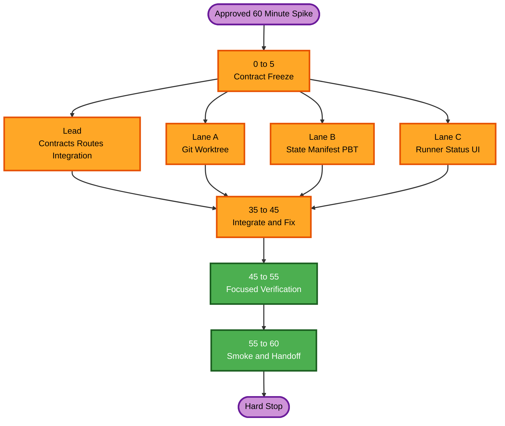

# Worktree 통합 1시간 Vertical Spike Execution Plan

## 1. 목표와 시간 제한

- **Timebox**: Plan 승인 후 최대 60분
- **목표**: 기존 PlanRepo 안에서 하나의 SR에 대해 격리 worktree를 준비하고, legacy `aidlc-docs/aidlc-state.md`를 읽어 정확한 resume prompt로 runner를 실행한 뒤 변경된 Markdown 경로와 동적 상태를 최소 UI/API에서 확인한다.
- **산출물 성격**: 기술 검증 가능한 vertical spike. 승인된 P0+P1 전체 기능이나 production-ready 구현이 아니다.
- **중단 규칙**: 60분에 도달하면 passing 상태의 범위만 인계하고, 미완료 항목은 backlog로 기록한다. 시간 연장은 별도 승인 없이는 하지 않는다.

## 2. 축소된 완료 기준

다음 다섯 가지를 모두 만족하면 spike를 성공으로 본다.

1. 격리된 임시 Git fixture에서 `planrepo/sr/<sr-id>` branch와 worktree가 생성된다.
2. Legacy state parser가 `aidlc-docs/aidlc-state.md`의 현재 stage와 첫 미완료 항목을 반환한다.
3. Fake Claude 실행 검증에서 process `cwd`가 SR worktree이고 정확한 resume prompt가 전달된다.
4. 실행 전후 `aidlc-docs/**/*.md`, `AGENTS.md`, `CLAUDE.md`의 hash manifest 차이가 생성된다.
5. 최소 API/UI가 worktree readiness, parsed stage, run status와 changed paths를 표시하며 focused tests와 typecheck가 통과한다.

실제 인증된 Claude CLI smoke는 환경과 남은 시간이 허용할 때만 수행하는 stretch goal이다. Fake CLI 검증만 통과한 경우 실제 provider 성공을 주장하지 않는다.

## 3. 명시적 범위

### 포함

- 서버 설정의 단일 local repository path와 managed workspace root
- 한 SR에 대한 deterministic worktree 생성·재발견
- 최소 Git deny policy: commit, push, reset-hard, clean 금지
- Legacy `aidlc-docs/aidlc-state.md` parser 한 개
- 정확한 resume prompt와 worktree `cwd`를 사용하는 runner proof
- Markdown·instruction 파일의 pre/post hash manifest와 changed path 목록
- 기존 앱에 isolated API route와 최소 status panel
- Focused unit/integration test, manifest PBT와 typecheck

### 제외·후속 Backlog

- Repository/SRWorkspace 영구 SQLite schema와 다중 repository UI
- Official space/intent profile, ambiguity recovery와 AI-DLC initializer
- Content-addressed blob, immutable checkpoint와 artifact version 저장
- Drift resolution, 문서 edit/compare/restore와 approval baseline
- Interrupted process 재연결, transcript persistence와 redaction pipeline
- 기존 SR baseline migration, peer review compatibility와 handoff bundle
- 20,000-file performance acceptance, browser 전체 회귀와 production build 최적화
- Remote clone, authentication, streaming, P2 전체 checkpoint rollback

## 4. Stage 축소 결정

| Stage | Decision | Impact |
| --- | --- | --- |
| Application Design | Skip for spike | Method·service 전체 설계 대신 5분 contract freeze만 수행; 장기 구조 재작업 가능 |
| Units Generation | Skip for spike | 하나의 `WT-Spike` integration unit만 사용; 정식 ownership/trace artifact 없음 |
| Functional Design | Skip for spike | 전체 business rules 대신 아래 invariants만 구현 계약으로 고정 |
| NFR Requirements | Skip for spike | Production security/capacity/recovery 분석 제외; PBT framework는 이 계획에서 `fast-check`로 선결정 |
| NFR Design | Skip for spike | DB/filesystem atomicity와 durable recovery 설계를 구현하지 않음 |
| Infrastructure Design | Skip | Cloud/IaC/deployment 변화 없음 |
| Code Generation | Execute | 단일 spike plan 승인 후 병렬 구현 |
| Build and Test | Execute, focused | Typecheck와 targeted tests; 전체 요구사항 인수·성능 검증 아님 |

## 5. 최소 계약과 Invariants

Lead가 첫 5분에 다음 interface만 고정하고 공통 파일은 다른 lane이 수정하지 않는다.

- `WorktreeHandle`: SR ID, base repository, branch, worktree root, readiness
- `ParsedAidlcState`: state path, current stage, first incomplete label, status
- `RunRequest`: SR ID, worktree root, exact prompt, operation ID
- `ManifestDelta`: before/after hashes와 created/modified/deleted relative paths
- 모든 path는 canonical worktree root 아래여야 하고 `.git`과 외부 symlink를 읽지 않는다.
- 동일 SR provision은 같은 worktree를 재발견하며 다른 SR path를 반환하지 않는다.
- Runner는 shell을 사용하지 않고 worktree root만 `cwd`로 사용한다.
- Manifest 정렬과 serialization은 같은 입력에 결정적이어야 한다.

## 6. 4-Lane 병렬 분할

동시 작업 슬롯은 lead 포함 4개다. 공통 계약을 먼저 고정한 뒤 세 lane이 겹치지 않는 새 파일을 소유한다.

| Lane | 시간 | 소유 범위 | 결과 |
| --- | ---: | --- | --- |
| Lead — contracts/integration | 0–60분 | Shared spike contracts, app composition, route wiring, integration tests, final merge | 충돌 없는 공통 계약과 end-to-end 연결 |
| A — Git/worktree | 5–35분 | `src/worktree-spike/git/`, `tests/worktree-spike/git/` | Safe provision/re-discovery, branch naming, deny policy tests |
| B — state/manifest/PBT | 5–35분 | `src/worktree-spike/state/`, `src/worktree-spike/manifest/`, matching tests | Legacy parser, scoped hash delta, fast-check properties |
| C — runner/status UI | 5–35분 | `src/worktree-spike/runner/`, `src/worktree-spike/ui/`, matching tests | Worktree cwd runner proof와 minimal status panel |

### 파일 충돌 방지

- `src/shared/*`, `src/app/create-app.ts`, root config와 HTTP route mount는 Lead만 수정한다.
- Lane은 새 `src/worktree-spike/<lane>/`와 대응 test directory만 수정한다.
- Lane 간 import는 첫 5분에 고정한 contracts에서만 한다.
- 공통 계약 변경 요청은 Lead에게 전달하고 lane이 직접 편집하지 않는다.

## 7. 60분 실행 순서

| 분 | 활동 | 병렬성/게이트 |
| ---: | --- | --- |
| 0–5 | Lead가 contracts, file ownership, acceptance commands를 고정 | 모든 lane의 시작 gate |
| 5–35 | A/B/C 병렬 구현; Lead는 route/composition과 integration fixture 작성 | 네 작업 동시 진행 |
| 35–45 | Lead 통합; A/B/C는 type/error 수정과 독립 review | Contract/typecheck gate |
| 45–55 | Focused tests, manifest PBT, isolated Git/fake CLI end-to-end | 실패 시 신규 기능 추가 중단 |
| 55–60 | 가능하면 local UI smoke; 결과·미완료·실제 CLI 여부 문서화 | Hard stop과 handoff |

## 8. Focused 검증 명령과 증거

- Targeted Vitest: `tests/worktree-spike/**`
- TypeScript typecheck: 기존 project typecheck 중 영향 범위
- PBT: `fast-check`로 manifest serialization round-trip, deterministic ordering과 worktree-relative path invariant 검증
- Git fixture: 임시 bare가 아닌 local repository와 두 SR ID를 사용해 path 격리 확인
- Fake CLI: 전달된 argument, exact prompt와 `cwd` capture
- HTTP/UI: 한 SR의 readiness/state/delta response guard와 render test
- Stretch: 기존 인증을 사용하는 실제 Claude CLI 한 번; credential 값과 home content는 로그에 남기지 않음

## 9. Risk와 Trade-off

- 이 spike는 DB 재시작 후 durable workspace/run/checkpoint 복구를 제공하지 않는다.
- Manifest는 diff evidence이며 복원 가능한 checkpoint가 아니다.
- Legacy parser만 구현하므로 official intent profile 요구사항은 미충족이다.
- 최소 UI는 제품 UX 완성이 아니며 기존 review/edit flows와 완전 통합되지 않는다.
- Focused test 통과는 18 stories 또는 69 acceptance criteria 완료를 의미하지 않는다.
- Dependency 설치, 기존 compile failure 또는 CLI 인증 문제가 timebox를 소비하면 실제 UI/CLI smoke가 제외될 수 있다.

## 10. 후속 전환

Spike 성공 후 정식 P0/P1 개발을 재개할 때 원래 [전체 execution plan](worktree-integration-execution-plan.md)의 W1–W4 분해를 다시 사용한다. Spike code는 proof로 평가하며, 장기 ports/schema/invariants에 맞지 않으면 그대로 production화하지 않는다.

## 11. Workflow Visualization

### Text Alternative

1. 승인 후 0–5분에 Lead가 공통 계약과 파일 소유권을 고정한다.
2. 5–35분에 Lead, Git/worktree, state/manifest/PBT, runner/status UI의 네 lane이 병렬 작업한다.
3. 35–45분에 Lead가 통합하고 각 lane은 오류 수정과 review를 지원한다.
4. 45–55분에 focused tests, PBT와 isolated Git/fake CLI 검증을 수행한다.
5. 55–60분에 가능한 smoke test와 handoff를 마치고 hard stop한다.

## 12. Extension Compliance

| Extension/Rule | Status | One-Hour Plan Result |
| --- | --- | --- |
| Security Baseline | Disabled | N/A; canonical path, symlink exclusion와 shell-free process는 spike invariant로 유지 |
| Resiliency Baseline | Disabled | N/A; durable recovery는 명시적으로 제외 |
| PBT-01 | Advisory/N/A | Partial mode; manifest와 path properties만 식별 |
| PBT-02 | Planned | Manifest serialization round-trip test를 Lane B가 구현 |
| PBT-03 | Planned | Deterministic ordering와 root-bound path invariant를 Lane B가 구현 |
| PBT-04 | Advisory/N/A | Partial mode에서 non-blocking |
| PBT-05 | Advisory/N/A | Partial mode에서 non-blocking |
| PBT-06 | Advisory/N/A | Partial mode에서 non-blocking |
| PBT-07 | Planned | Relative path·manifest domain generator를 Lane B가 소유 |
| PBT-08 | Planned | Shrinking을 유지하고 failure seed를 출력 |
| PBT-09 | Planned | `fast-check`를 Vitest-compatible framework로 선택하고 exact dependency를 lockfile에 기록 |
| PBT-10 | Advisory/N/A | Example-based Git/parser/runner tests를 PBT와 병행 |

Workflow Planning 단계에서 blocking extension finding은 없다. PBT의 Planned 항목은 Code Generation과 focused Build and Test에서 실제 증거가 없으면 완료 처리할 수 없다.
