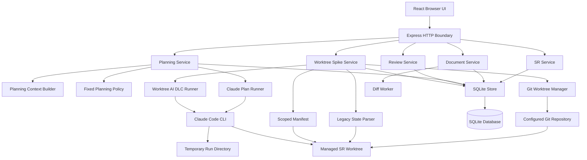
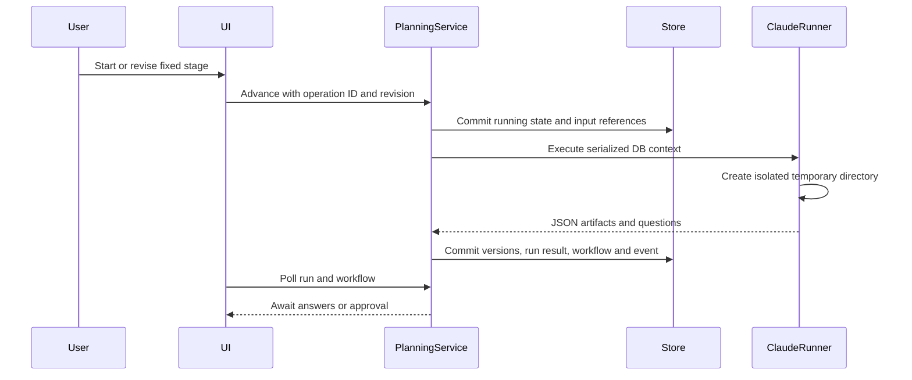

# System Architecture

## System Overview

PlanRepo is a single Node.js process serving an Express REST API and a React browser application on `127.0.0.1`. It uses an embedded SQLite database and a worker process for document diffs. Legacy planning code remains in the repository, while the active composition mounts the worktree subsystem and worktree review routes. The worktree subsystem provisions deterministic per-SR Git worktrees and runs the exact AI-DLC resume prompt inside them. Service classes express business rules; the shared store handles core SR mutations, while schema-v7 adapters persist worktree views, document versions, reviews and manual board overrides.

The spike now has a configured repository path, worktree manager, managed-file manifest, legacy `aidlc-state.md` parser, worktree runner, changed-Markdown reader/writer, immutable AI/human version history and worktree-specific review. It still has no repository registry, content-addressed blob/checkpoint store, profile registry, drift/restore lifecycle, approval baseline, or durable execution/session/transcript model.

## Architecture Diagram

Text alternative: the diagram inventories source-level packages and relationships. The current composition mounts SR/document, worktree review, and worktree-spike services; legacy planning packages remain available in source but are not mounted. The worktree path uses Git, a legacy state parser, a scoped manifest and a separate Claude runner, then persists status and immutable document versions in SQLite.

## Component Descriptions

### Application shell

- **Purpose**: configure and run the local web application.
- **Responsibilities**: resolve app/database/rules/worker paths, construct services, recover interrupted runs, serve Vite or built assets, and coordinate shutdown.
- **Dependencies**: Express, Vite, SQLite store, services, diff worker, Claude runner.
- **Type**: Application.

### HTTP boundary and routes

- **Purpose**: expose the local API and enforce transport validation.
- **Responsibilities**: loopback host/origin checks, JSON and operation-ID requirements, payload validation, result/error mapping, and route composition.
- **Dependencies**: service layer and shared validators/contracts.
- **Type**: Application/client boundary.

### SR and document foundation

- **Purpose**: provide immutable SR/document/version/history behavior.
- **Responsibilities**: create SRs, list board/detail data, prepare AI-generated versions, edit, compare, restore, and manually complete implementation.
- **Dependencies**: `StorePort`, diff worker, shared contracts.
- **Type**: Application/domain.

### Planning subsystem

- **Purpose**: execute nine predefined planning stages.
- **Responsibilities**: stage transitions, revision checks, question/decision lifecycle, DB-context creation, Claude execution, output collection, and startup recovery.
- **Dependencies**: document service, store, fixed `PLANNING_STAGES`, local rule files, Claude Code CLI.
- **Type**: Application/integration.

### Review subsystem

- **Purpose**: track non-blocking peer review for exact document versions.
- **Responsibilities**: author/reviewer role checks, review lifecycle, idempotent writes, and manual implementation-complete UI.
- **Dependencies**: SR/document services, store, shared review contracts.
- **Type**: Application/domain.

### Worktree vertical-spike subsystem

- **Purpose**: prove a repository-backed AI-DLC resume flow alongside the legacy planner.
- **Responsibilities**: provision/reuse a deterministic SR branch and worktree, parse current stage/first incomplete item, capture before/after managed-file manifests, run Claude with the exact resume prompt and worktree current directory, expose and safely edit changed Markdown, persist immutable versions, and deduplicate in-process operations.
- **Dependencies**: system Git, filesystem/crypto/process APIs, Claude Code CLI, schema-v7 worktree adapters.
- **Type**: Application/integration spike.

### SQLite persistence

- **Purpose**: persist all current business state locally.
- **Responsibilities**: schema migration through version 7, paged reads, transactional `ChangeSet` commits, optimistic checks, idempotency receipts, immutable-record triggers, worktree view/history/review persistence, and manual board overrides.
- **Dependencies**: `better-sqlite3`.
- **Type**: Data store adapter.

### Diff worker

- **Purpose**: isolate potentially expensive line comparisons.
- **Responsibilities**: detailed diff under bounds, coarse fallback for large documents, timeout/cancellation/failure handling.
- **Dependencies**: Node worker threads and `diff`.
- **Type**: Worker.

### Claude plan runner

- **Purpose**: generate a validated planning JSON result.
- **Responsibilities**: create/remove a temporary run directory, spawn without a shell, bound time/output, disable tools/hooks/project settings/session persistence, and parse a strict JSON schema.
- **Dependencies**: Claude Code CLI.
- **Type**: External-process adapter.

## Current Planning Data Flow

Text alternative: a user action commits a running workflow before Claude is invoked. Claude receives serialized database context in a temporary directory. The returned JSON becomes immutable document versions, then the UI polls until answers or approval are required.

## Integration Points

- **External executable**: Claude Code CLI, supplied as `PLANREPO_CLAUDE_PATH` or `claude` on `PATH`.
- **Database**: one SQLite file, default `.planrepo/planrepo.sqlite` under the application root.
- **Git executable and repository**: system Git operates on `PLANREPO_REPOSITORY_PATH`; managed SR worktrees default under `.planrepo/worktrees` or `PLANREPO_WORKSPACE_ROOT`.
- **Browser integration**: HTTP only on `127.0.0.1`, with exact Host and Origin enforcement.
- **File inputs**: legacy planning reads AI-DLC rule detail files from `.aidlc-rule-details` or a configured path. The spike reads managed instructions plus `aidlc-docs/**/*.md` and selected state metadata inside the configured worktree, then hash-validates changed Markdown before display.
- **Third-party APIs**: none called directly by PlanRepo; provider access occurs within Claude Code CLI.

## Infrastructure Components

- **Cloud infrastructure**: none found. No CDK, Terraform, CloudFormation, container, or CI/CD package is present.
- **Deployment model**: local Node process with embedded SQLite and browser assets.
- **Networking**: loopback-only HTTP; no TLS, authentication service, remote database, or message broker.

## Change-Seam Assessment

| Required capability | Current seam | Gap |
| --- | --- | --- |
| Repository registration | `PLANREPO_REPOSITORY_PATH` config | Single configured root only; no repository entity, base-SHA policy, trust confirmation, or multi-repository lifecycle. |
| Per-SR worktree | `GitWorktreeManager` | Deterministic provision/reuse exists; no durable lifecycle state, cleanup, drift status, or base selection contract. |
| Dynamic AI-DLC profiles | `LegacyAidlcStateParser` plus fixed `PLANNING_STAGES` | One legacy Markdown parser exists, but no profile registry, version detection, or dynamic capability contract. |
| Worktree Claude execution | `WorktreeAidlcRunner` | Exact prompt and current directory are proven, but the runner invokes `claude -p`, closes stdin after one prompt, buffers stdout until exit, discards stderr content, and stores no session ID. Interactive turns, transcript streaming, restart recovery and partial outcomes are absent. |
| Claude CLI continuation | Installed Claude Code 2.1.266 | The local CLI supports `--session-id`, `--resume`, `--input-format stream-json`, `--output-format stream-json`, partial messages and user-message replay, but PlanRepo does not use these capabilities. |
| File source of truth | Legacy DB versions plus worktree reads/writes | The two authorities coexist. Atomic expected-hash file edits and immutable per-document bodies exist, but there is no complete checkpoint or unified cross-model lineage. |
| Worktree document history | `WorktreeDocumentWriter` and `SQLiteWorktreeDocumentHistory` | Atomic expected-hash edits and immutable AI/human versions exist; compare, restore, external drift and full checkpoint lineage remain incomplete. |
| Checkpoints and drift | `ScopedManifestService` and SHA-256 summaries | Before/after delta exists only within a run; no durable start/end manifests, content blobs, tombstones, or drift state machine. |
| Recovery and rollback | document restoration | Single DB document restore exists; no worktree file/checkpoint restore or append-only audit policy. |
| Manual board movement | board service/API/UI and nullable override | Adjacent manual movement is implemented independently from AI-DLC progress; drag/drop and arbitrary jumps remain out of scope. |
