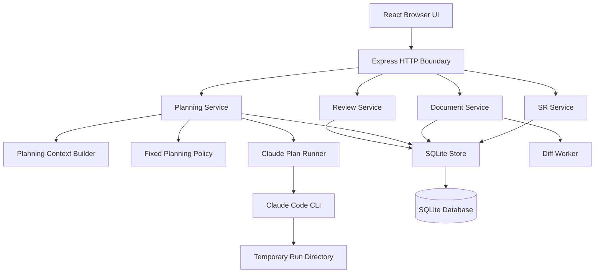
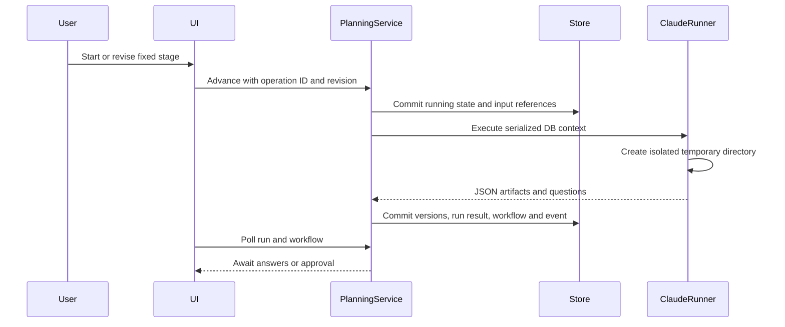

# System Architecture

## System Overview

PlanRepo is a single Node.js process serving an Express REST API and a React browser application on `127.0.0.1`. It uses an embedded SQLite database and a worker process for document diffs. Planning runs spawn Claude Code CLI asynchronously. Service classes express business rules; a shared `StorePort` and `ChangeSet` make multi-record mutations atomic.

The current architecture has no repository registry, worktree manager, file collector, blob store, AI-DLC profile adapter, or dynamic state parser. These are the primary seams required by the worktree integration enhancement.

## Architecture Diagram

Text alternative: the React UI calls the Express boundary. The boundary delegates to SR, document, planning, and review services. All services use the SQLite store; document comparison uses a worker. Planning also uses a context builder, a fixed-stage policy, and a Claude runner that executes inside a temporary directory.

## Component Descriptions

### Application shell

- **Purpose**: configure and run the local web application.
- **Responsibilities**: resolve app/database/rules/worker paths, construct services, recover interrupted runs, serve Vite or built assets, and coordinate shutdown.
- **Dependencies**: Express, Vite, SQLite store, services, diff worker, Claude runner.
- **Type**: Application.

### HTTP boundary and routes

- **Purpose**: expose the local API and enforce transport validation.
- **Responsibilities**: loopback host/origin checks, JSON and operation-ID requirements, payload validation, result/error mapping, and route composition.
- **Dependencies**: service layer and shared validators/contracts.
- **Type**: Application/client boundary.

### SR and document foundation

- **Purpose**: provide immutable SR/document/version/history behavior.
- **Responsibilities**: create SRs, list board/detail data, prepare AI-generated versions, edit, compare, restore, and manually complete implementation.
- **Dependencies**: `StorePort`, diff worker, shared contracts.
- **Type**: Application/domain.

### Planning subsystem

- **Purpose**: execute nine predefined planning stages.
- **Responsibilities**: stage transitions, revision checks, question/decision lifecycle, DB-context creation, Claude execution, output collection, and startup recovery.
- **Dependencies**: document service, store, fixed `PLANNING_STAGES`, local rule files, Claude Code CLI.
- **Type**: Application/integration.

### Review subsystem

- **Purpose**: track non-blocking peer review for exact document versions.
- **Responsibilities**: author/reviewer role checks, review lifecycle, idempotent writes, and manual implementation-complete UI.
- **Dependencies**: SR/document services, store, shared review contracts.
- **Type**: Application/domain.

### SQLite persistence

- **Purpose**: persist all current business state locally.
- **Responsibilities**: schema migration through version 3, paged reads, transactional `ChangeSet` commits, optimistic checks, idempotency receipts, and immutable-record triggers.
- **Dependencies**: `better-sqlite3`.
- **Type**: Data store adapter.

### Diff worker

- **Purpose**: isolate potentially expensive line comparisons.
- **Responsibilities**: detailed diff under bounds, coarse fallback for large documents, timeout/cancellation/failure handling.
- **Dependencies**: Node worker threads and `diff`.
- **Type**: Worker.

### Claude plan runner

- **Purpose**: generate a validated planning JSON result.
- **Responsibilities**: create/remove a temporary run directory, spawn without a shell, bound time/output, disable tools/hooks/project settings/session persistence, and parse a strict JSON schema.
- **Dependencies**: Claude Code CLI.
- **Type**: External-process adapter.

## Current Planning Data Flow

Text alternative: a user action commits a running workflow before Claude is invoked. Claude receives serialized database context in a temporary directory. The returned JSON becomes immutable document versions, then the UI polls until answers or approval are required.

## Integration Points

- **External executable**: Claude Code CLI, supplied as `PLANREPO_CLAUDE_PATH` or `claude` on `PATH`.
- **Database**: one SQLite file, default `.planrepo/planrepo.sqlite` under the application root.
- **Browser integration**: HTTP only on `127.0.0.1`, with exact Host and Origin enforcement.
- **File inputs**: AI-DLC rule detail files are read from `.aidlc-rule-details` or configured path. Repository project files are not currently read.
- **Third-party APIs**: none called directly by PlanRepo; provider access occurs within Claude Code CLI.

## Infrastructure Components

- **Cloud infrastructure**: none found. No CDK, Terraform, CloudFormation, container, or CI/CD package is present.
- **Deployment model**: local Node process with embedded SQLite and browser assets.
- **Networking**: loopback-only HTTP; no TLS, authentication service, remote database, or message broker.

## Change-Seam Assessment

| Required capability | Current seam | Gap |
| --- | --- | --- |
| Repository registration | SR creation and config | No repository entity, allowed-root validation, or trust confirmation. |
| Per-SR worktree | None | No Git adapter, lifecycle, base SHA, branch, or recovery state. |
| Dynamic AI-DLC profiles | `PLANNING_STAGES`, `PlanningContextBuilder` | Stage list and rules are compile-time fixed; no state locator/parser. |
| Worktree Claude execution | `PlanRunnerPort`, `ClaudePlanRunner` | Port is reusable, but implementation forces a temporary directory and disables project capabilities. |
| File source of truth | `DocumentService` and DB versions | Documents exist only as database records; no relative-path identity or atomic file write. |
| Checkpoints and drift | `ChangeSet` and receipts | Transaction pattern helps, but no manifests, blobs, file hashes, tombstones, or drift states. |
| Recovery and rollback | document restoration | Single DB document restore exists; no worktree file/checkpoint restore or append-only audit policy. |
