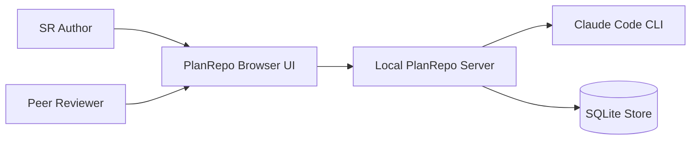

# Business Overview

## Business Context Diagram

Text alternative: authors and reviewers use the PlanRepo browser UI. The UI calls a loopback-only server, which persists SR, document, planning, and review records in SQLite and invokes Claude Code CLI for planning generation.

## Business Description

- **Business description**: PlanRepo is a local, single-user planning workspace that turns a software request (SR) into reviewed AI-DLC planning artifacts. It preserves immutable document versions and decisions, supports peer-review simulation through role switching, and records manual implementation completion.
- **Current operating model**: planning documents are JSON results produced by Claude in an isolated temporary directory and then stored in SQLite. The repository under planning is not registered or modified.
- **Targeted improvement context**: the new worktree requirements replace that isolated planning model with one Git worktree per SR, file-based AI-DLC state as the source of truth, and independent checkpoints for comparison and restoration.

## Business Transactions

1. **Create SR**: validate title, description, and optional Markdown attachment; create an immutable SR input and history event.
2. **Generate planning stage**: evaluate the current fixed stage, snapshot DB context, run Claude, validate structured output, and atomically persist generated document versions and run state.
3. **Answer AI questions**: store one complete answer set against the active question set and workflow revision.
4. **Approve or request changes**: bind a decision to the latest document version references and reject stale targets.
5. **Edit a document**: create a new immutable human-edit version when the caller's base version is current.
6. **Compare or restore a document**: compute a bounded diff or create a new restoration version from historical content.
7. **Request and decide peer review**: bind a review to the original document version; allow a reviewer to record one terminal result without blocking AI-DLC progression.
8. **Mark implementation complete**: allow the author to make a manual declaration after planning reaches implementation-ready.
9. **Recover interrupted planning**: mark database runs left in `running` state as failed during application startup.

## Business Dictionary

| Term | Current meaning |
| --- | --- |
| SR | Software request containing immutable initial title, description, and optional Markdown attachment. |
| Workflow | SQLite record with a revision, fixed stage index, status, cycles, current questions, and decision. |
| Run | One asynchronous Claude planning invocation for a fixed stage. |
| Document | Logical planning artifact identified by an SR-scoped logical key. |
| Document version | Immutable body/title record; the document row points to its latest version. |
| Decision | AI-DLC-stage approve or request-changes record tied to exact version references. |
| Review | Non-blocking peer review tied permanently to the requested document version. |
| Operation receipt | Idempotency record linking a client operation ID and fingerprint to its committed outcome. |
| Worktree | Not currently represented; the improvement introduces a dedicated Git worktree for each SR. |
| Checkpoint | Not currently represented; the improvement introduces a file manifest and recoverable blob set. |

## Component-Level Business Descriptions

### SR and document foundation

- **Purpose**: maintain SR inputs, immutable planning document history, comparison, restoration, and audit events.
- **Responsibilities**: input validation, optimistic version checks, pagination, idempotent mutations, diff worker execution, and board/detail presentation.

### AI-DLC planning

- **Purpose**: guide an SR through planning stages and collect AI artifacts, questions, and approval decisions.
- **Responsibilities**: fixed-stage policy, context assembly from SQLite, isolated Claude invocation, output validation, run recovery, and UI polling.

### Review and implementation

- **Purpose**: provide author/reviewer collaboration around exact document versions and a manual implementation-complete marker.
- **Responsibilities**: role checks, immutable review target/result history, non-blocking review status, and manual completion declaration.

### Local application shell

- **Purpose**: compose the browser, HTTP, service, CLI, worker, and persistence layers into one loopback-only application.
- **Responsibilities**: dependency construction, development/production asset serving, shutdown, role switching, and unsaved-draft protection.
