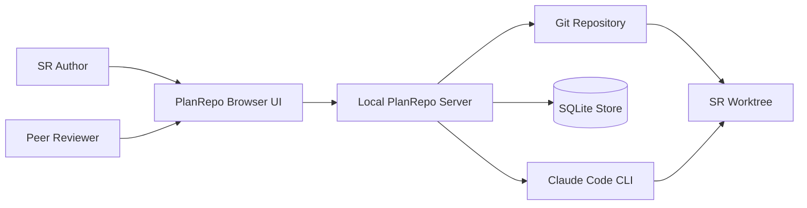

# Business Overview

## Business Context Diagram

Text alternative: authors and reviewers use the PlanRepo browser UI. The UI calls a loopback-only server, which persists SR, document, planning, review, and worktree-spike state in SQLite. The server can invoke Claude either for legacy planning generation or inside a configured per-SR Git worktree.

## Business Description

- **Business description**: PlanRepo is a local, single-user planning workspace that turns a software request (SR) into reviewed AI-DLC planning artifacts. It preserves immutable document versions and decisions, supports peer-review simulation through role switching, and records manual implementation completion.
- **Current operating model**: the legacy planning packages remain in source, but the active composition routes users through the worktree subsystem. It provisions one deterministic Git worktree per SR, runs the exact AI-DLC resume prompt there, parses legacy `aidlc-state.md`, persists worktree status, and records AI/human Markdown versions.
- **Current board model**: six fixed columns are rendered from `SRSummary.column`. A nullable manual-board override can move a card to an adjacent column without changing AI-DLC workflow state.
- **Improvement boundary**: worktree integration now includes Git provisioning, scoped manifests, document reads and atomic edits, immutable document history, state parsing, execution and schema-v7 persistence. It still has no repository registry, durable checkpoints/blobs, drift workflow, restore lifecycle, profile registry, approval baseline, cleanup orchestration, durable Claude session identity, or interactive transcript channel.

## Business Transactions

1. **Create SR**: validate title, description, and optional Markdown attachment; create an immutable SR input and history event.
2. **Generate planning stage**: evaluate the current fixed stage, snapshot DB context, run Claude, validate structured output, and atomically persist generated document versions and run state.
3. **Answer AI questions**: store one complete answer set against the active question set and workflow revision.
4. **Approve or request changes**: bind a decision to the latest document version references and reject stale targets.
5. **Edit a document**: create a new immutable human-edit version when the caller's base version is current.
6. **Compare or restore a document**: compute a bounded diff or create a new restoration version from historical content.
7. **Request and decide peer review**: bind a review to the original document version; allow a reviewer to record one terminal result without blocking AI-DLC progression.
8. **Mark implementation complete**: allow the author to make a manual declaration after planning reaches implementation-ready.
9. **Recover interrupted planning**: mark database runs left in `running` state as failed during application startup.
10. **Provision an SR worktree**: validate the configured repository, create or reuse the deterministic SR branch/worktree, parse current AI-DLC state, and persist the view.
11. **Resume AI-DLC in a worktree**: capture a managed-file manifest, run the exact resume prompt with the worktree as the current directory, compute the manifest delta, parse updated state, and persist generated Markdown summaries.
12. **Read a changed worktree document**: validate a managed relative path, reject symlinks and escapes, enforce a 1 MiB UTF-8 limit, and require the current SHA-256 hash to match the recorded summary.
13. **Edit and version a worktree document**: use an expected SHA-256, atomic file replacement, immutable SQLite version lineage, and operation receipts while preserving drafts on conflict.
14. **Move a board card manually**: validate one adjacent-column move and persist a board-only override without mutating AI-DLC progress.

## Business Dictionary

| Term | Current meaning |
| --- | --- |
| SR | Software request containing immutable initial title, description, and optional Markdown attachment. |
| Workflow | SQLite record with a revision, fixed stage index, status, cycles, current questions, and decision. |
| Run | One asynchronous Claude planning invocation for a fixed stage. |
| Document | Logical planning artifact identified by an SR-scoped logical key. |
| Document version | Immutable body/title record; the document row points to its latest version. |
| Decision | AI-DLC-stage approve or request-changes record tied to exact version references. |
| Review | Non-blocking peer review tied permanently to the requested document version. |
| Operation receipt | Idempotency record linking a client operation ID and fingerprint to its committed outcome. |
| Worktree | Deterministic SR-specific Git branch and directory managed by the vertical-spike subsystem. |
| Scoped manifest | Sorted SHA-256 inventory of managed AI-DLC files used to compute created, modified, and deleted paths around one run. |
| Worktree spike state | Schema-v7 JSON payload containing readiness, branch/root, parsed stage, run status, changed paths, and generated/modified Markdown summaries. |
| Claude session | Not implemented as PlanRepo state; every current resume starts a new one-shot `claude -p` process. |
| Transcript | Not implemented; stdout is retained only until process exit and is not exposed to the browser. |
| Checkpoint | Not implemented; the broader improvement calls for durable manifests plus recoverable content blobs. |

## Component-Level Business Descriptions

### SR and document foundation

- **Purpose**: maintain SR inputs, immutable planning document history, comparison, restoration, and audit events.
- **Responsibilities**: input validation, optimistic version checks, pagination, idempotent mutations, diff worker execution, and board/detail presentation.

### AI-DLC planning

- **Purpose**: guide an SR through planning stages and collect AI artifacts, questions, and approval decisions.
- **Responsibilities**: fixed-stage policy, context assembly from SQLite, isolated Claude invocation, output validation, run recovery, and UI polling.

### Review and implementation

- **Purpose**: provide author/reviewer collaboration around exact document versions and a manual implementation-complete marker.
- **Responsibilities**: role checks, immutable review target/result history, non-blocking review status, and manual completion declaration.

### Worktree vertical spike

- **Purpose**: prove one repository-backed AI-DLC resume path without replacing the legacy planner.
- **Responsibilities**: Git command policy, deterministic worktree provisioning, legacy state parsing, scoped manifest capture/diff, bounded one-shot Claude execution, hash-checked document reads, atomic edits, immutable version history, SQLite persistence, and status/document UI.

### Local application shell

- **Purpose**: compose the browser, HTTP, service, CLI, worker, and persistence layers into one loopback-only application.
- **Responsibilities**: dependency construction, development/production asset serving, shutdown, role switching, and unsaved-draft protection.
