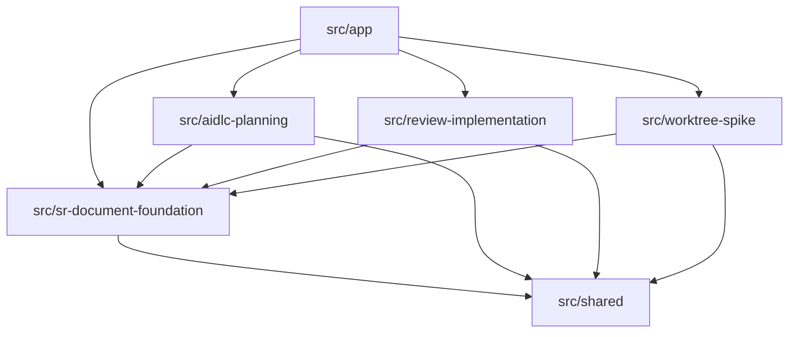

# Code Structure

## Build System

- **Type**: npm with a committed lockfile.
- **Runtime**: Node.js 24.
- **Development**: compile the comparison worker, then run the TypeScript server through `tsx`; Vite is mounted as middleware.
- **Production build**: Vite builds browser assets and TypeScript builds server/worker output.
- **Verification**: separate client, server, and test TypeScript projects plus Vitest.
- **Configuration**: `package.json`, `package-lock.json`, `tsconfig.json`, `tsconfig.client.json`, `tsconfig.server.json`, `tsconfig.worker.json`, `tsconfig.test.json`, and `vite.config.ts`.

## Key Module Hierarchy

Text alternative: the app composition root depends on four feature areas. Every feature uses shared contracts; planning, review, and the worktree spike also depend on foundation behavior or its SQLite database boundary.

## Existing Source Files Inventory

### Application composition

- `src/app/client.tsx` - mounts the React router and application shell.
- `src/app/config.ts` - resolves loopback server, database, Claude, rules, worker, optional repository, and managed-workspace configuration.
- `src/app/create-app.ts` - composition root for database, services, legacy planning, worktree-spike adapters/API, Vite/static assets, and shutdown.
- `src/app/server.ts` - starts the HTTP server and installs signal handling.
- `src/app/WorkspaceShell.tsx` - global layout, demo role switch, and multi-owner dirty-navigation guard.
- `src/app/roles.css` - role switch styling.
- `src/app/styles.css` - global application styling.

### Shared contracts and client support

- `src/shared/contracts.ts` - SR, document, version, history, command, receipt, query, and result contracts.
- `src/shared/planning-contracts.ts` - fixed stages, workflow/run/question/decision/context contracts, and planning limits.
- `src/shared/review-contracts.ts` - review and demo-role contracts.
- `src/shared/planning.ts` - planning-related shared helpers and guards.
- `src/shared/errors.ts` - typed error/result helpers.
- `src/shared/limits.ts` - content, pagination, and Kanban-column limits.
- `src/shared/validation.ts` - primitive object, ID, and UTF-8 text validation.
- `src/shared/client/api-client.ts` - browser fetch wrapper, response guards, and version routes.
- `src/shared/client/operation-tracker.ts` - browser idempotency/unknown-outcome tracking.

### SR and document foundation

- `src/sr-document-foundation/services/sr-input.ts` - normalizes initial SR input.
- `src/sr-document-foundation/services/sr-service.ts` - creates/lists SRs and records manual implementation completion.
- `src/sr-document-foundation/services/document-service.ts` - document queries, immutable edits, generation, diff, and restoration.
- `src/sr-document-foundation/http/boundary.ts` - translates local commands/queries into service calls.
- `src/sr-document-foundation/http/routes.ts` - root REST routes and loopback/JSON guards.
- `src/sr-document-foundation/http/validation.ts` - SR and pagination request validators.
- `src/sr-document-foundation/http/operations.ts` - command fingerprint and receipt behavior.
- `src/sr-document-foundation/http/error-handler.ts` - result-to-HTTP and exception mapping.
- `src/sr-document-foundation/storage/database.ts` - opens and configures SQLite.
- `src/sr-document-foundation/storage/migrations.ts` - validates schema identity and migrates versions 1 through 4.
- `src/sr-document-foundation/storage/migrations/001-foundation.ts` - SR/document/version/history/receipt schema.
- `src/sr-document-foundation/storage/migrations/002-planning.ts` - workflow/run/link schema.
- `src/sr-document-foundation/storage/migrations/003-reviews.ts` - review schema.
- `src/sr-document-foundation/storage/migrations/004-worktree-spike.ts` - one persisted worktree-spike JSON view per SR.
- `src/sr-document-foundation/storage/store-port.ts` - read algebra and transactional `ChangeSet` port.
- `src/sr-document-foundation/storage/sqlite-store.ts` - `StorePort` implementation and atomic optimistic commit.
- `src/sr-document-foundation/storage/queries.ts` - prepared/query mapping helpers.
- `src/sr-document-foundation/storage/cursors.ts` - stable pagination cursor encoding and validation.
- `src/sr-document-foundation/compare/diff-contracts.ts` - worker request/result contracts.
- `src/sr-document-foundation/compare/diff-worker-adapter.ts` - worker lifecycle, request correlation, and failure handling.
- `src/sr-document-foundation/compare/diff-worker.ts` - worker entry point.
- `src/sr-document-foundation/compare/line-diff.ts` - bounded detailed/coarse line diff algorithm.
- `src/sr-document-foundation/ui/AsyncStatus.tsx` - compact async-state rendering.
- `src/sr-document-foundation/ui/BoardPage.tsx` - paged Kanban board.
- `src/sr-document-foundation/ui/KanbanColumn.tsx` - one board column.
- `src/sr-document-foundation/ui/SRCard.tsx` - SR summary card.
- `src/sr-document-foundation/ui/SRCreateForm.tsx` - SR input form.
- `src/sr-document-foundation/ui/SRDetailPage.tsx` - orchestrates input, planning, documents, history, and review panels.
- `src/sr-document-foundation/ui/InitialInputPanel.tsx` - immutable input display.
- `src/sr-document-foundation/ui/DocumentWorkspace.tsx` - document route/view/edit/compare composition.
- `src/sr-document-foundation/ui/DocumentList.tsx` - document index.
- `src/sr-document-foundation/ui/DocumentReader.tsx` - Markdown/raw paged reader.
- `src/sr-document-foundation/ui/DocumentEditor.tsx` - optimistic Markdown editing.
- `src/sr-document-foundation/ui/VersionPicker.tsx` - historical-version selector.
- `src/sr-document-foundation/ui/VersionCompare.tsx` - comparison UI.
- `src/sr-document-foundation/ui/RestoreConfirm.tsx` - restoration confirmation.
- `src/sr-document-foundation/ui/HistoryPanel.tsx` - paged audit history.
- `src/sr-document-foundation/ui/PagedText.tsx` - bounded raw-text pages.
- `src/sr-document-foundation/ui/Pagination.tsx` - pagination controls.
- `src/sr-document-foundation/ui/ConfirmDialog.tsx` - reusable confirmation dialog.
- `src/sr-document-foundation/ui/ErrorNotice.tsx` - error presentation.
- `src/sr-document-foundation/ui/attachment.ts` - attachment client rules.
- `src/sr-document-foundation/ui/compare-state.ts` - comparison state helper.
- `src/sr-document-foundation/ui/editor-state.ts` - editor state helper.
- `src/sr-document-foundation/ui/use-query.ts` - abortable query hook.

### AI-DLC planning

- `src/aidlc-planning/policy/planning-policy.ts` - transition rules over the fixed nine-stage workflow.
- `src/aidlc-planning/context/planning-context-builder.ts` - reads stage rules and serializes SR/doc/history DB context.
- `src/aidlc-planning/cli/claude-plan-runner.ts` - isolated CLI process and strict JSON output parser.
- `src/aidlc-planning/services/planning-service.ts` - workflow commands, concurrency, approvals, run completion, and recovery.
- `src/aidlc-planning/http/planning-routes.ts` - workflow/run/action/answer/decision endpoints.
- `src/aidlc-planning/ui/PlanningPanel.tsx` - fixed-stage actions, polling, questions, and decisions UI.
- `src/aidlc-planning/ui/planning-client.ts` - planning response guards and mutation tracker.
- `src/aidlc-planning/ui/planning.css` - planning panel styling.

### Review and implementation

- `src/review-implementation/services/review-service.ts` - immutable version-specific review lifecycle and role checks.
- `src/review-implementation/http/review-routes.ts` - review and manual completion endpoints.
- `src/review-implementation/ui/ReviewPanel.tsx` - request/result/history/manual-completion UI.
- `src/review-implementation/ui/review-client.ts` - review response guards and mutation tracker.
- `src/review-implementation/ui/review.css` - review panel styling.

### Worktree vertical spike

- `src/worktree-spike/contracts.ts` - exact resume prompt, run bounds, view/document/manifest contracts, and integration ports.
- `src/worktree-spike/worktree-spike-service.ts` - worktree provision/resume orchestration, summarized state persistence, document reads, and in-process operation deduplication.
- `src/worktree-spike/git/git-command-policy.ts` - explicit Git argument allowlist.
- `src/worktree-spike/git/git-worktree.ts` - repository validation plus deterministic branch/worktree provisioning and reuse.
- `src/worktree-spike/state/legacy-aidlc-state-parser.ts` - current-stage and first-unchecked-item extraction from legacy state Markdown.
- `src/worktree-spike/manifest/scoped-manifest.ts` - managed-path traversal, SHA-256 capture, canonical serialization, deserialization, and delta calculation.
- `src/worktree-spike/runner/worktree-aidlc-runner.ts` - bounded shell-free Claude execution in the worktree with exact prompt/cwd.
- `src/worktree-spike/storage/sqlite-worktree-spike-persistence.ts` - schema-v7-compatible worktree JSON view validation/load/upsert.
- `src/worktree-spike/files/worktree-document-reader.ts` - hash-checked, size-bounded, symlink-safe changed Markdown reading.
- `src/worktree-spike/http/worktree-spike-routes.ts` - status, document, provision, and resume endpoints.
- `src/worktree-spike/ui/worktree-spike-client.ts` - strict response guard and mutation client.
- `src/worktree-spike/ui/WorktreeDocumentTree.tsx` - hierarchy for changed worktree Markdown summaries.
- `src/worktree-spike/ui/WorktreeDocumentWorkspace.tsx` - selected changed-document fetch and display workspace.
- `src/worktree-spike/ui/WorktreeSpikePanel.tsx` - readiness/stage/run/delta display and manual provision/resume controls.

## Test Structure

- `tests/sr-document-foundation/` - configuration, migrations, storage, services, HTTP, idempotency, pagination, worker/diff, and UI-state tests with four helpers.
- `tests/aidlc-planning/` - policy, context, CLI, migration, service, HTTP, and client-state tests plus a fake Claude executable.
- `tests/review-implementation/` - migration, service, HTTP, cross-feature integration, and client-state tests.
- `tests/worktree-spike/` - Git policy/provisioning, legacy parser, manifest unit/property, runner/client, persistence, and isolated vertical integration tests.
- The current reverse-engineering refresh records 101 source files, 44 test/support files, successful typecheck, and 139 passing tests across 38 Vitest files.

## Design Patterns

### Ports and adapters

- **Location**: `StorePort`, `PlanRunnerPort`, `DiffPort`, `SRInputPort`.
- **Purpose**: isolate persistence, external process, worker, and input behavior.
- **Implementation**: services depend on TypeScript interfaces; SQLite, Claude, and direct input provide concrete adapters.

### Atomic change set

- **Location**: `storage/store-port.ts` and `sqlite-store.ts`.
- **Purpose**: combine expected-version checks, domain records, events, workflow state, and receipts in one transaction.
- **Implementation**: services prepare a `ChangeSet`; SQLite commits it with optimistic checks.

### Immutable history with mutable pointers

- **Location**: document versions, history events, planning runs/links, reviews, and triggers.
- **Purpose**: retain an audit trail while presenting the latest state efficiently.
- **Implementation**: immutable version/event rows plus mutable document/workflow/review terminal pointers under guarded transitions.

### Idempotent commands

- **Location**: `X-Operation-Id`, command fingerprints, receipts, and client mutation trackers.
- **Purpose**: prevent duplicate mutation after a lost HTTP response.
- **Implementation**: replay the committed receipt when operation ID, kind, SR, and fingerprint agree.

### Optimistic concurrency

- **Location**: document version references and workflow revisions.
- **Purpose**: reject edits, approvals, and transitions based on stale state.
- **Implementation**: exact expected refs/revisions are checked in the storage transaction.

### Managed filesystem boundary

- **Location**: `GitWorktreeManager`, `ScopedManifestService`, and `readWorktreeDocument`.
- **Purpose**: constrain Git and filesystem operations to the configured repository/workspace and managed AI-DLC paths.
- **Implementation**: Git command allowlisting, canonical containment checks, symlink rejection, deterministic paths, SHA-256 manifests, and hash verification on read.

### Focused spike persistence

- **Location**: `SQLiteWorktreeSpikePersistence`, `SQLiteWorktreeDocumentHistory`, worktree review persistence, and schema migrations 4 through 7.
- **Purpose**: retain minimal worktree readiness/run/change display state across application restarts.
- **Implementation**: validated per-SR JSON payload upsert with immutable SR identity and no-delete triggers; active handles and operation promises remain in memory.

## Structural Risks for the Enhancement

- Fixed `PLANNING_STAGES` and `stageIndex` are embedded in contracts, policy, service, storage payloads, board projection, UI, and tests.
- The legacy runner deliberately creates and deletes an OS temporary directory, while the worktree runner edits repository files; the two execution models and artifact authorities coexist.
- The worktree runner enables repository work but still uses one-shot `claude -p`; it does not expose installed CLI session/stream capabilities or model a durable session/transcript.
- Legacy `DocumentRecord.logicalKey` is not a worktree-relative path contract and legacy document bodies remain authoritative in SQLite; the spike introduces a separate path/hash view without unifying these models.
- Startup recovery only changes legacy database run status; it does not reconcile a persisted worktree spike left `running` or retain partial manifests.
- Schema v7 stores worktree views, document history, reviews and manual board overrides; it still has no repository registry, durable workspace lifecycle, profile, checkpoint/blob, Claude session/transcript, approval-baseline, or restore entity.
- Board state is projected from workflow state when present and has no independent movement command; adding manual movement requires an explicit precedence/persistence rule.
- Source modules are mostly compact, but several files are highly condensed into long statements, which raises review and modification risk for a broad cross-cutting change.
