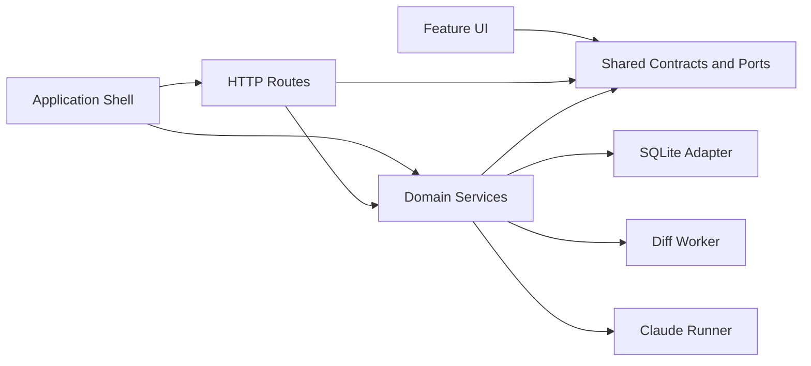

# Dependencies

## Internal Dependencies

Text alternative: the composition root constructs routes and services. UI and HTTP use shared contracts. Services depend on ports, with SQLite, the diff worker, and Claude runner as adapters.

### Application shell depends on all feature packages

- **Type**: compile and runtime.
- **Reason**: `create-app.ts` is the dependency composition root and mounts every route/service/UI entry.

### Planning depends on the foundation

- **Type**: compile and runtime.
- **Reason**: planning reads/writes via `StorePort`, uses `DocumentService` to prepare generated artifacts, and stores version references in runs/decisions.

### Review depends on the foundation

- **Type**: compile and runtime.
- **Reason**: review validates exact document versions and uses SR workflow/column state.

### UI packages depend on shared browser clients

- **Type**: compile and browser runtime.
- **Reason**: common response guards, route builders, operation IDs, and lost-response recovery are reused.

### Tests depend on feature modules

- **Type**: test.
- **Reason**: Vitest imports services/adapters directly and uses temporary databases, HTTP servers, and a fake CLI.

## External Dependencies

| Dependency | Version | Purpose | License |
| --- | ---: | --- | --- |
| `better-sqlite3` | 13.0.3 | Embedded synchronous SQLite access. | MIT |
| `diff` | 9.0.0 | Line diff generation. | BSD-3-Clause |
| `express` | 5.2.1 | Local REST and asset server. | MIT |
| `react` | 19.2.8 | Browser UI. | MIT |
| `react-dom` | 19.2.8 | React browser rendering. | MIT |
| `react-markdown` | 10.1.0 | Markdown rendering. | MIT |
| `react-router-dom` | 7.18.3 | Client routing. | MIT |
| `remark-gfm` | 4.0.1 | GFM Markdown extension. | MIT |
| `typescript` | 7.0.2 | Static compilation/checking. | Apache-2.0 |
| `vite` | 8.2.2 | Browser development/build. | MIT |
| `vitest` | 5.0.0 | Tests. | MIT |
| `tsx` | 4.23.13 | Development TypeScript execution. | MIT |
| `@vitejs/plugin-react` | 6.1.1 | Vite React support. | MIT |
| `@types/*` direct packages | pinned | Type declarations for Node, React, Express, and SQLite. | MIT |

License values above were read from the committed lockfile package entries.

## External Runtime Dependency

### Claude Code CLI

- **Version**: not pinned by the application.
- **Purpose**: generate planning results.
- **Invocation**: subprocess without shell interpolation.
- **Current constraints**: user settings are permitted for provider credentials, while tools, hooks, MCP, project settings, slash commands, and session persistence are disabled.
- **Enhancement impact**: the runner contract must add worktree identity, profile policy, allowed project capabilities, session/transcript metadata, partial-output collection, and Git-write enforcement.

## Missing Dependencies or Abstractions for Worktree Integration

- No Git command adapter or worktree lifecycle abstraction.
- No content-addressed blob/checkpoint store.
- No safe managed-path walker or symlink policy module.
- No AI-DLC state/profile parser registry.
- No transcript redaction/storage adapter.
- No execution resource scheduler beyond one-running-state checks per SR.
