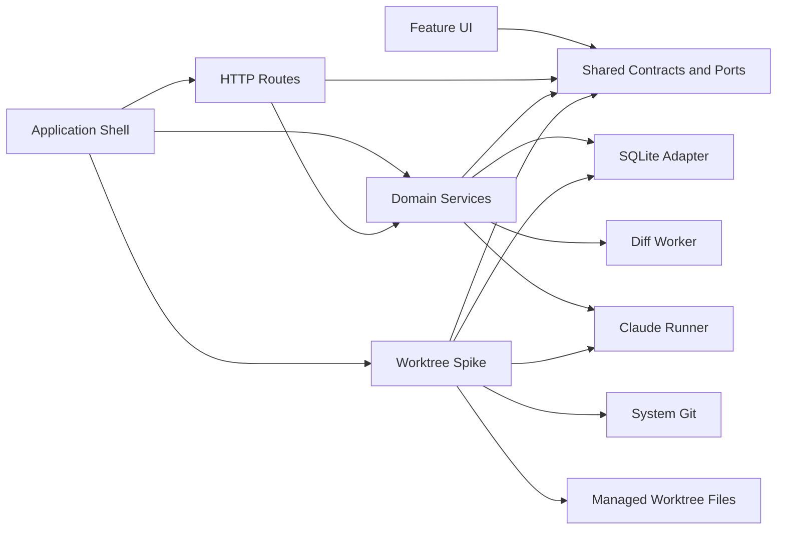

# Dependencies

## Internal Dependencies

Text alternative: the composition root constructs legacy and worktree-spike routes/services. UI and HTTP use shared contracts. Legacy services depend on SQLite, the diff worker, and Claude runner adapters. The worktree spike additionally depends on the SQLite database boundary, system Git, managed worktree files, and a worktree-specific Claude runner.

### Application shell depends on all feature packages

- **Type**: compile and runtime.
- **Reason**: `create-app.ts` is the dependency composition root and mounts every route/service/UI entry.

### Planning depends on the foundation

- **Type**: compile and runtime.
- **Reason**: planning reads/writes via `StorePort`, uses `DocumentService` to prepare generated artifacts, and stores version references in runs/decisions.

### Review depends on the foundation

- **Type**: compile and runtime.
- **Reason**: review validates exact document versions and uses SR workflow/column state.

### Worktree spike depends on shared validation and the foundation database

- **Type**: compile and runtime.
- **Reason**: the feature reuses common result/error/limit validation, mounts through the foundation route composition, and persists schema-v7 worktree state, reviews and document history through the existing database connection. It does not use the legacy `StorePort` transaction algebra for every worktree mutation.

### Worktree spike depends on system process and filesystem services

- **Type**: runtime.
- **Reason**: system Git provisions/reuses the SR worktree; Node filesystem/crypto APIs parse state, capture manifests, and hash-check changed Markdown; Claude Code runs with the worktree as its current directory.

### UI packages depend on shared browser clients

- **Type**: compile and browser runtime.
- **Reason**: common response guards, route builders, operation IDs, and lost-response recovery are reused.

### Tests depend on feature modules

- **Type**: test.
- **Reason**: Vitest imports services/adapters directly and uses temporary databases, HTTP servers, and a fake CLI.

## External Dependencies

| Dependency | Version | Purpose | License |
| --- | ---: | --- | --- |
| `better-sqlite3` | 13.0.3 | Embedded synchronous SQLite access. | MIT |
| `diff` | 9.0.0 | Line diff generation. | BSD-3-Clause |
| `express` | 5.2.1 | Local REST and asset server. | MIT |
| `react` | 19.2.8 | Browser UI. | MIT |
| `react-dom` | 19.2.8 | React browser rendering. | MIT |
| `react-markdown` | 10.1.0 | Markdown rendering. | MIT |
| `react-router-dom` | 7.18.3 | Client routing. | MIT |
| `remark-gfm` | 4.0.1 | GFM Markdown extension. | MIT |
| `typescript` | 7.0.2 | Static compilation/checking. | Apache-2.0 |
| `vite` | 8.2.2 | Browser development/build. | MIT |
| `vitest` | 5.0.0 | Tests. | MIT |
| `fast-check` | 4.9.0 | Property-based manifest tests. | MIT |
| `tsx` | 4.23.13 | Development TypeScript execution. | MIT |
| `@vitejs/plugin-react` | 6.1.1 | Vite React support. | MIT |
| `@types/*` direct packages | pinned | Type declarations for Node, React, Express, and SQLite. | MIT |

License values above were read from the committed lockfile package entries.

## External Runtime Dependency

### Claude Code CLI

- **Version**: not pinned by the application; 2.1.266 was observed during the 2026-09-09 refresh.
- **Purpose**: generate legacy planning results and resume AI-DLC inside a managed worktree.
- **Invocation**: runners spawn subprocesses without shell interpolation; the worktree runner passes the exact resume prompt and worktree current directory.
- **Available local capabilities**: `--session-id` and `--resume` preserve a conversation; print mode supports realtime `stream-json` input/output, partial messages and replayed user messages.
- **Current constraints**: the worktree runner invokes only `claude -p`, ends stdin immediately after the resume prompt, buffers stdout until close, drops stderr text, and persists neither session identity nor transcript. Claude cannot receive a follow-up answer from the browser during a run.

### System Git

- **Version**: environment-provided; not pinned by the application.
- **Purpose**: validate repositories, list worktrees, resolve refs, and create/reuse deterministic SR branches/worktrees.
- **Invocation**: subprocess argument arrays accepted only by `assertGitCommandAllowed`.

## Remaining Missing Abstractions for Full Worktree Integration

- No content-addressed blob/checkpoint store.
- No durable worktree lifecycle/cleanup/recovery store beyond a summarized spike view.
- No AI-DLC profile/parser registry beyond the single legacy state parser.
- No durable Claude session/run/transcript store, redaction adapter, realtime transport, or stdin message command.
- No execution resource scheduler beyond one-running-state checks per SR.
- No repository trust registry or multi-repository authorization model.
