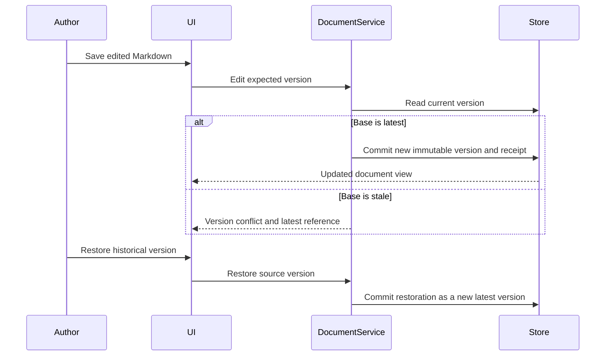
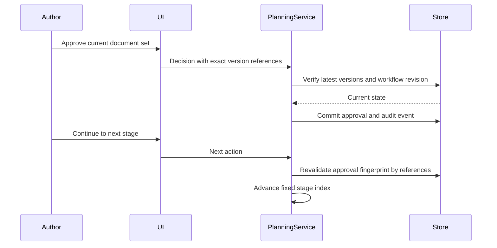
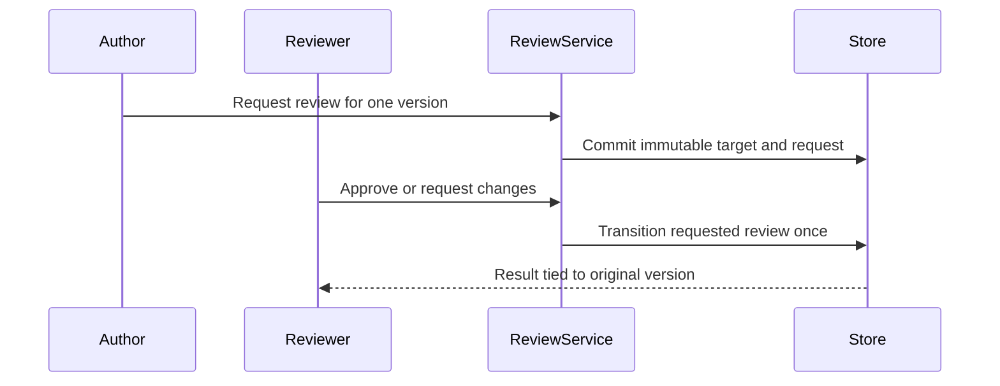

# Business Interaction Diagrams

## Document Edit and Restore



Text alternative: edits use optimistic version checks and preserve the draft on conflict. Restore never deletes newer history; it creates another latest version containing historical content.

## Planning Approval and Progression



Text alternative: approval is bound to exact latest version references. A later document edit makes the approval invalid, and progression is rejected until the new versions are approved.

## Review Lifecycle



Text alternative: an author requests review for an exact version. A reviewer records one terminal outcome. Newer document versions do not move the review target and pending reviews do not block planning.

## Target Worktree Interaction Gap

```mermaid
sequenceDiagram
    participant PlanRepo
    participant Worktree
    participant Claude
    participant CheckpointStore
    Note over PlanRepo,CheckpointStore: Components below do not exist yet
    PlanRepo->>Worktree: Validate profile and create start checkpoint
    PlanRepo->>Claude: Run with worktree as current directory
    Claude->>Worktree: Read state and instructions; change files
    PlanRepo->>Worktree: Reparse state and collect changed files
    PlanRepo->>CheckpointStore: Persist immutable manifest and blobs
```

Text alternative: the requested architecture must validate and checkpoint a worktree, run Claude in that worktree, then reparse AI-DLC state and persist changed files. None of these file/worktree interactions exists in the current code.
