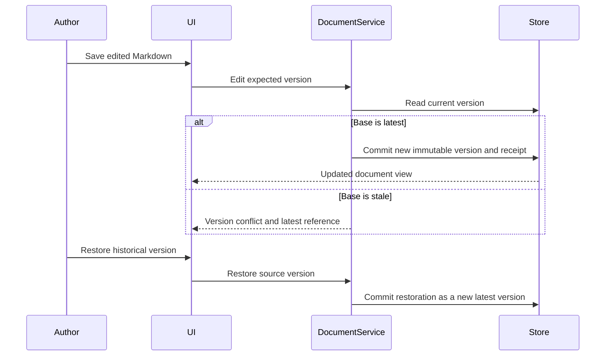
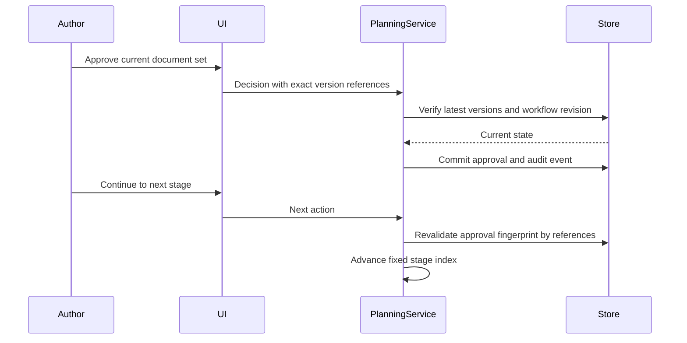
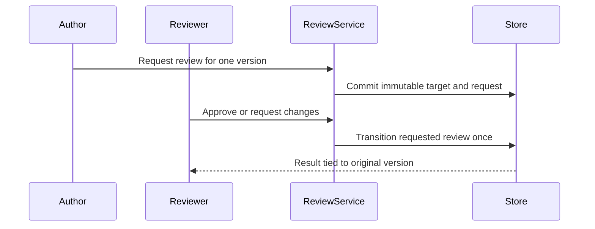
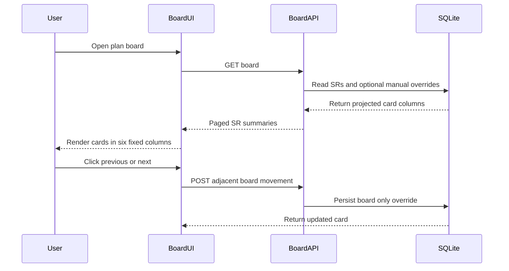

# Business Interaction Diagrams

## Document Edit and Restore



Text alternative: edits use optimistic version checks and preserve the draft on conflict. Restore never deletes newer history; it creates another latest version containing historical content.

## Planning Approval and Progression



Text alternative: approval is bound to exact latest version references. A later document edit makes the approval invalid, and progression is rejected until the new versions are approved.

## Review Lifecycle



Text alternative: an author requests review for an exact version. A reviewer records one terminal outcome. Newer document versions do not move the review target and pending reviews do not block planning.

## Current Worktree Vertical Spike

```mermaid
sequenceDiagram
    participant User
    participant Browser
    participant PlanRepo
    participant Git
    participant Worktree
    participant Claude
    participant SQLite
    User->>Browser: Click AI DLC continuation
    Browser->>PlanRepo: POST resume and wait
    PlanRepo->>Git: Validate repository and provision deterministic SR worktree
    Git-->>PlanRepo: Branch and worktree handle
    PlanRepo->>Worktree: Parse legacy state and capture scoped manifest
    PlanRepo->>Claude: Spawn claude print mode and send one prompt
    PlanRepo->>Claude: Close stdin immediately
    Claude->>Worktree: Read state and instructions; change files
    Note over Browser,Claude: No transcript stream or follow up message path
    PlanRepo->>Worktree: Capture after manifest and reparse state
    PlanRepo->>PlanRepo: Compute created modified and deleted paths
    PlanRepo->>SQLite: Persist worktree view and document versions
    PlanRepo-->>Browser: Return only after Claude exits
```

Text alternative: the browser sends one long-running resume request. PlanRepo provisions the worktree, captures state and a manifest, starts `claude -p`, writes one prompt and immediately closes stdin. Claude output is buffered rather than streamed, so the browser cannot see or answer an approval question. Only after Claude exits does PlanRepo capture the delta, persist the worktree view and immutable document versions, and return the response. The CLI capabilities for session resume and bidirectional stream JSON are unused.

## Current Board Projection and Manual Movement



Text alternative: opening the plan board reads card projections including a nullable manual override. Previous and next buttons submit a guarded adjacent-column movement, which persists only the board projection and does not advance or rewrite AI-DLC workflow state.
